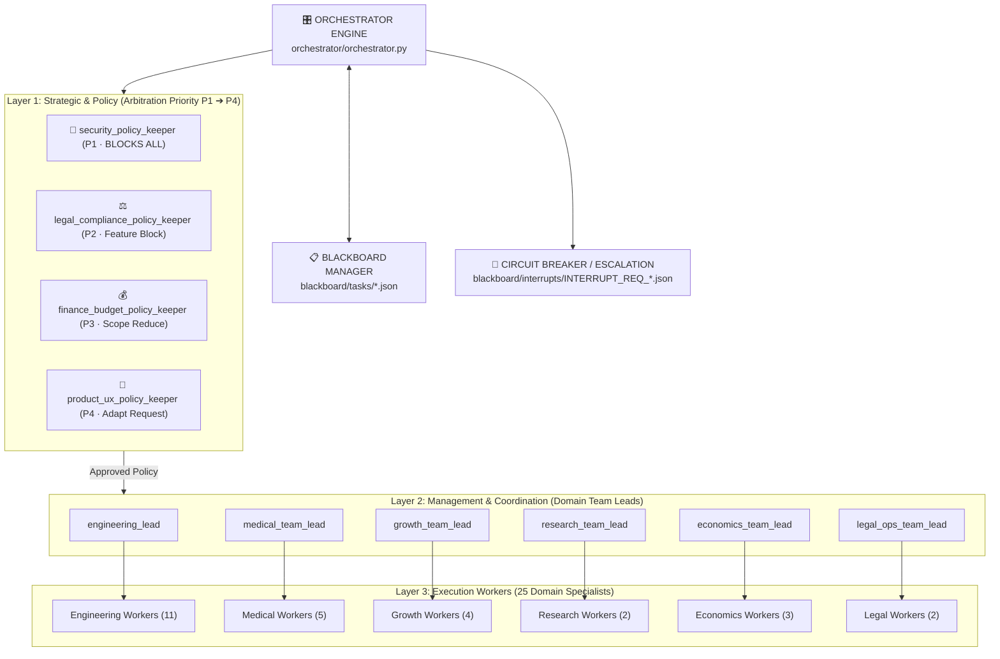

# 📘 Architecture & Agent Onboarding Playbook (SOP)
## AI Adaptive Coach v7.0 — Multi-Agent System (MAS) Operating Guide

> **Версия:** 2.0.0  
> **Дата:** 2026-08-01  
> **Статус:** Действующий регламент (Active SOP)  
> **Основание:** ADR 009 (3-Layer Hierarchical Matrix MAS Architecture)

---

## 1. Обзор 3-слойной Иерархической Матричной Архитектуры

Система управляется Детерминированным Движком Состояний ([`orchestrator/orchestrator.py`](file:///D:/PyCharm_Projects/AI%20Sport/orchestrator/orchestrator.py)), который продвигает задачи через 3 иерархических слоя с четким разделением ответственности (SRP).



---

## 2. Жизненный цикл задачи и Государственная Машина (State Machine)

Каждая задача на Blackboard проходит следующую цепочку статусов:

```
[BACKLOG] ──► [ENRICHING] ──► [READY_FOR_DEV] ──► [IN_PROGRESS] ──► [CODE_REVIEW] ──► [COMPLIANCE_REVIEW] ──► [DONE]
                   │                                     │                  │
                   ▼                                     ▼ (retry ≤3)       ▼
              [BLOCKED] ◄────────────────────────────────┴──────────────────┴─ (Circuit Breaker)
                  │
                  └─ (Human Override) ──► [ENRICHING]
```

### Таблица Переходов Состояний

| Текущий статус | Следующий статус | Ответственный субъект | Действие |
|---|---|---|---|
| `BACKLOG` | `ENRICHING` | `orchestrator_engine` | Инициализация задачи, назначение Policy Keepers (Layer 1) |
| `ENRICHING` | `READY_FOR_DEV` | Policy Keepers (P1-P4) | Проверка политик. Если все `APPROVED` → переход в `READY_FOR_DEV` |
| `ENRICHING` | `BLOCKED` | P1/P2 Policy Keeper | Отклонение при нарушении безопасности (P1) или закона (P2) |
| `READY_FOR_DEV` | `IN_PROGRESS` | Team Lead (Layer 2) | Декомпозиция и назначение Worker-а (Layer 3) |
| `IN_PROGRESS` | `CODE_REVIEW` | Execution Worker | Завершение разработки и прохождение локальных тестов |
| `IN_PROGRESS` | `IN_PROGRESS` | Worker / Team Lead | Цикл самоисправления (до 3 попыток Worker, до 2 реконфигураций Lead) |
| `CODE_REVIEW` | `COMPLIANCE_REVIEW` | `qa_safety_auditor` | Прохождение полного Pytest-сюита |
| `COMPLIANCE_REVIEW` | `DONE` | Policy Keepers | Финальная подпись артефактов и архивация в `blackboard/archive/` |
| `ANY` | `BLOCKED` | Orchestrator / Lead | Превышение попыток самоисправления (Circuit Breaker) или P1/P2 Hard Block |

---

## 3. Матрица Арбитража и Разрешения Конфликтов (Arbitration Hierarchy)

При возникновении противоречивых требований между агентами разных доменов используется строго детерминированная иерархия приоритетов:

$$\text{Priority Matrix: } \mathbf{P1} \gg \mathbf{P2} \gg \mathbf{P3} \gg \mathbf{P4}$$

| Приоритет | Policy Keeper | Тип Полномочий | Действие при Конфликте |
| :---: | :--- | :--- | :--- |
| **P1** | `security_policy_keeper` | **IMPERATIVE HARD BLOCK** | Переводит задачу в `BLOCKED`. Отменяет любые продуктовые, финансовые и юридические требования. |
| **P2** | `legal_compliance_policy_keeper` | **FEATURE BLOCK** | Переводит задачу в `BLOCKED` до получения правового согласия или Human Override. Уступает только P1. |
| **P3** | `finance_budget_policy_keeper` | **SCOPE REDUCTION** | Не блокирует задачу целиком. Сокращает объём реализации до рамок бюджета и возвращает Team Lead-у. |
| **P4** | `product_ux_policy_keeper` | **ADAPTIVE REQUEST** | Запрашивает адаптацию интерфейса/UX. Уступает P1, P2 и P3. |

### Примеры Разрешения Коллизий

1. **Коллизия P1 vs P4 (Безопасность vs UX)**:
   - *Сценарий*: Продукт (P4) требует вход в 1 клик без пароля и SMS. Безопасность (P1) требует 2FA/JWT.
   - *Решение*: Выигрывает P1. Требование 1-клик входа **REJECTED**, задача переводится в `BLOCKED` до адаптации UX под 2FA.

2. **Коллизия P2 vs P3 (Закон vs Бюджет)**:
   - *Сценарий*: Закон (P2 — 152-ФЗ) требует локализации серверов в РФ (Selectel/Yandex Cloud). Финансы (P3) предлагают дешевый зарубежный хостинг.
   - *Решение*: Выигрывает P2. Использование зарубежного хостинга заблокировано. Финансы адаптируют бюджет под тарифы РФ облаков.

3. **Коллизия P3 vs P4 (Бюджет vs Фичи)**:
   - *Сценарий*: Продукт (P4) запрашивает нейросетевой анализ видео движений атлета на дорогом GPU. Финансы (P3) указывают на превышение лимита 15k₽/мес.
   - *Решение*: Выигрывает P3. Режим `SCOPE_REDUCE`: фича переводится на оффлайн-биомеханические эвристики или откладывается до следующего раунда.

---

## 4. Протокол Onboarding Новых Агентов (5-Шаговый Чек-лист)

При добавлении нового агента в роевую систему **обязательно** выполнить 5 шагов для сохранения 100% целостности проекта:

```mermaid
flowchart LR
    S1["1. Состояние\n.agent_context/agents/"] ──► S2["2. Конфиг\nagents_config.json"] ──► S3["3. Маршрут\nrouting_rules.yaml"] ──► S4["4. Манифест\ngovernance_manifest.json"] ──► S5["5. Верификация\nvalidate_governance.py"]
```

### Шаг 1: Создать файл состояния агента
Создать `.agent_context/agents/<new_agent_id>.md` по шаблону:
- Слой (Layer 1, 2 или 3)
- Роль и зона ответственности
- Ограничения доступа к файлам (PoLP)
- История действий (`## Last Significant Actions`)

### Шаг 2: Зарегистрировать в `agents_config.json`
Добавить запись в секцию соответствующего слоя (`layer_1_policy`, `layer_2_management` или `layer_3_execution`):
```json
{
  "id": "new_agent_id",
  "layer": 3,
  "domain": "engineering",
  "role": "New Specialist Role",
  "permissions": {
    "blackboard_read": ["IN_PROGRESS"],
    "blackboard_write": ["execution"],
    "can_block_task": false,
    "max_self_fix_attempts": 3,
    "file_access": {
      "read": ["app/new_module/"],
      "write": ["app/new_module/"]
    }
  },
  "triggers": ["on_assigned_by_engineering_lead:task_type=new_type"]
}
```

### Шаг 3: Настроить маршрутизацию в `routing_rules.yaml`
Если агент выполняет новый тип задач, добавить `task_type` в `orchestrator/routing_rules.yaml`:
```yaml
new_task_type:
  domain: engineering
  policy_gates:
    - security_policy_keeper
    - legal_compliance_policy_keeper
  default_worker: new_agent_id
  timeout_hours: 48
```

### Шаг 4: Обновить `SWARM_STATE.md` и `governance_manifest.json`
- Добавить `new_agent_id` в списки агентов в `.agent_context/SWARM_STATE.md`.
- Добавить `new_agent_id` в `explicit_required` секции `agents` в `.agent_context/governance_manifest.json`.

### Шаг 5: Запустить валидацию целостности
Выполнить команду и убедиться в получении `PASS`:
```bash
python scripts/validate_governance.py --no-pytest
```

---

## 5. Экономия Токенов и Регламент Blackboard (Micro-Communication Protocol)

Для предотвращения неконтролируемого расхода ИИ-токенов при взаимодействии агентов установлены следующие правила:

1. **Прямые вызовы (Micro-Communication)**:
   - Взаимодействие между Team Lead (Layer 2) и Worker (Layer 3) происходит **напрямую в контексте диалога**, без промежуточной записи черновиков на Blackboard.
2. **Только финальные исходы на Blackboard**:
   - На Blackboard фиксируются только изменения статусов (`status_history`), решения Policy Gates и итоговые ссылки на созданные артефакты.
3. **Атомарные записи**:
   - Запись файлов на Blackboard производится через временный файл (`.tmp` → `replace`), гарантируя отсутствие гонок данных и повреждения JSON.

---

## 6. Деплой, Срабатывание Circuit Breaker и Ручная Расблокировка

### Срабатывание Circuit Breaker
Оркестратор автоматически переводит задачу в статус `BLOCKED` и генерирует файл прерывания `blackboard/interrupts/INTERRUPT_REQ_<task_id>.json` в следующих случаях:
- Worker исчерпал 3 попытки самоисправления (`worker_max_attempts: 3`).
- Team Lead исчерпал 2 попытки реконфигурации (`team_lead_max_reconfig_attempts: 2`).
- P1 (Security) или P2 (Legal) выставил `REJECTED`.
- Нарушен SLA выполнения задачи (`escalation_sla_hours: 24`).

### Формат файла прерывания (`INTERRUPT_REQ_*.json`)
```json
{
  "task_id": "TASK-20260801-0001",
  "failure_reason": "P1_SECURITY_HARD_BLOCK",
  "detail": "Detected unencrypted PII field in API response model",
  "proposed_options": [
    "Option A: Add AES-256-GCM encryption wrapper to PII field",
    "Option B: Exclude PII field from public API response schema",
    "Option C: Close task without implementation"
  ],
  "awaiting_human_input": true,
  "human_decision": null
}
```

### Процедура Ручной Расблокировки (Human Override)
1. Человек-оператор изучает `INTERRUPT_REQ_<task_id>.json`.
2. Записывает выбранное решение в поле `"human_decision"` (например `"Option A"`).
3. Изменяет статус задачи в Blackboard с `BLOCKED` на `ENRICHING`.
4. Оркестратор при следующем тике подхватывает задачу и направляет её на повторный цикл рецензирования Policy Gates.

---

## 7. Регламент Предотвращения Простых Ошибок (Entrypoint Verification Standard)

Для исключения ошибок типа «модуль создан и протестирован mock-тестами, но не исполняется как самостоятельный сервис/контейнер»:

1. **Правило Исполняемого Контекста (CLI/Docker Entrypoint Rule)**:
   - Любой файл, запускаемый как главный процесс контейнера (например `python app/telegram_bot/bot.py`, `python app/main.py`), ОБЯЗАН содержать активный блок `if __name__ == '__main__':` с реальным циклом ожидания (`asyncio.run(main())` или `uvicorn.run(...)`).
2. **Двойная Проверка Исполнения (Double Verification)**:
   - Исполнителям (Worker Agents) ЗАПРЕЩЕНО помечать задачи Docker/CLI сервисов как `DONE` без проверки фактического вызова в CLI (`py -3 <file>`) или сквозной валидации родительского процесса.
3. **Автоматический Контроль Валидатором**:
   - `scripts/validate_governance.py` автоматически сканирует все исполняемые точки входа на наличие конструкций `if __name__ == '__main__':` и блокирует коммит при их отсутствии.

