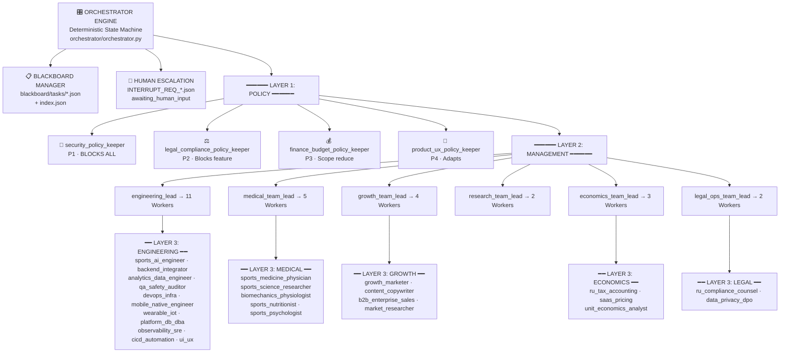

# 🐝 Swarm State & Context Ledger: AI Adaptive Coach v7.0

> **Last Updated:** 2026-08-01 (158/158 Pytest tests passed — Phase 5.3 On-Device Hybrid AI)
> **Current Phase:** Phase 4 COMPLETE + MAS Refactor COMPLETE + Phase 5.1, 5.2, 5.3 COMPLETE
> **Active Workspace:** `D:\PyCharm_Projects\AI Sport`
> **Architecture Version:** 2.0.0 (with Orchestrator Engine)

---

## 📊 Current Project Phase Matrix

| Phase | Description | Status | Core Artifacts |
| :--- | :--- | :---: | :--- |
| **Phase 0** | Research, Medical & RU Legal | ✅ **COMPLETED** | [`docs/legal/`](file:///D:/PyCharm_Projects/AI%20Sport/docs/legal), [`docs/medical/`](file:///D:/PyCharm_Projects/AI%20Sport/docs/medical) |
| **Phase 1** | Architecture & RF Local Backend | ✅ **COMPLETED** | [`app/`](file:///D:/PyCharm_Projects/AI%20Sport/app), FastAPI, SQLAlchemy 2.0 |
| **Phase 2** | AI Engine & Telemetry Analysis | ✅ **COMPLETED** | `AICoachEngine` (Gemini Flash), `.FIT`/GPX, `HeuristicFallbackEngine` |
| **Phase 3** | B2C & B2B Interfaces | ✅ **COMPLETED** | PWA, B2B Coach Cabinet, Telegram Bot v3 |
| **Phase 4** | Deployment, Security & Beta Launch | ✅ **COMPLETED** | [`deploy/`](file:///D:/PyCharm_Projects/AI%20Sport/deploy), **146/146 tests** |
| **MAS Refactor** | 3-Layer Hierarchical MAS Architecture | ✅ **COMPLETED** | [`agents_config.json`](file:///D:/PyCharm_Projects/AI%20Sport/agents_config.json), [`orchestrator/`](file:///D:/PyCharm_Projects/AI%20Sport/orchestrator) |

---

## 🏛️ To-Be Architecture: 3-Layer Hierarchical Matrix (38 Roles)



---

## 🔄 State Machine: Task Lifecycle

```
BACKLOG → ENRICHING → READY_FOR_DEV → IN_PROGRESS → CODE_REVIEW → COMPLIANCE_REVIEW → DONE
                ↓                           ↓ (retry ≤3)          ↓
              BLOCKED ←←←←←←←←←←←←←←←←←←← ←←←←←←←←←←←←←←←←←←←←
                ↑
          Human Override → ENRICHING (re-enter)
```

---

## 🛡️ Arbitration Hierarchy (Conflict Resolution)

| Priority | Policy Keeper | Power | Condition |
| :---: | :--- | :--- | :--- |
| **P1** | `security_policy_keeper` | **BLOCKS ALL** | Any security violation |
| **P2** | `legal_compliance_policy_keeper` | Blocks feature | Legal risk (152-ФЗ, 323-ФЗ, etc.) |
| **P3** | `finance_budget_policy_keeper` | Scope reduce | Budget limit exceeded |
| **P4** | `product_ux_policy_keeper` | Adapt request | UX/product concern |

---

## 🗂️ Agent Registry (38 Roles)

### CORE (3)
- `orchestrator_engine` — Deterministic State Machine Engine
- `blackboard_manager` — Task Artifact Manager
- `human_escalation_handler` — Circuit Breaker & Human-in-the-Loop

### Layer 1 — Policy Keepers (4)
- `security_policy_keeper` (P1) ← merged: cybersecurity_penetration_tester + data_privacy_dpo
- `legal_compliance_policy_keeper` (P2) ← merged: legal_compliance_counsel + ru_compliance_counsel + ip_trademark_counsel
- `finance_budget_policy_keeper` (P3) ← merged: cfo_financial_strategist + cloud_finops_cost_engineer
- `product_ux_policy_keeper` (P4) ← merged: growth_product_lead + product_saas_architect

### Layer 2 — Team Leads (6)
- `engineering_lead` → manages 11 engineering workers
- `medical_team_lead` → manages 5 medical workers
- `growth_team_lead` → manages 4 growth workers
- `research_team_lead` → manages 2 research workers
- `economics_team_lead` → manages 3 economics workers
- `legal_ops_team_lead` → manages 2 legal workers

### Layer 3 — Workers (25)

**Engineering (11):** `sports_ai_engineer`, `backend_integrator`, `analytics_data_engineer`, `qa_safety_auditor`, `devops_infra`, `mobile_native_engineer`, `wearable_iot_hardware_specialist`, `platform_db_dba_expert`, `observability_sre_monitoring`, `cicd_automation_engineer`, `ui_ux_design_system`

**Medical (5):** `sports_medicine_physician`, `sports_science_researcher`, `biomechanics_physiologist`, `sports_nutritionist_dietitian`, `sports_psychologist_mindset`

**Growth (4):** `growth_marketer`, `content_copywriter`, `b2b_enterprise_sales_lead`, `market_user_researcher`

**Research (2):** `market_user_researcher`, `coach_experience_advocate`

**Economics (3):** `ru_tax_accounting_specialist`, `saas_pricing_monetization_expert`, `unit_economics_analyst`

**Legal (2):** `ru_compliance_counsel`, `data_privacy_dpo`

### DEPRECATED & REMOVED (3)
- ~~`product_saas_architect`~~ → поглощён `product_ux_policy_keeper`
- ~~`ip_trademark_counsel`~~ → поглощён `legal_compliance_policy_keeper`
- ~~`cloud_finops_cost_engineer`~~ → поглощён `finance_budget_policy_keeper`

---

## 📁 Key File Index

- **Orchestrator Engine:** [`orchestrator/orchestrator.py`](file:///D:/PyCharm_Projects/AI%20Sport/orchestrator/orchestrator.py)
- **Routing Rules:** [`orchestrator/routing_rules.yaml`](file:///D:/PyCharm_Projects/AI%20Sport/orchestrator/routing_rules.yaml)
- **Blackboard Adapter:** [`orchestrator/blackboard_adapter.py`](file:///D:/PyCharm_Projects/AI%20Sport/orchestrator/blackboard_adapter.py)
- **Agents Config (PoLP):** [`agents_config.json`](file:///D:/PyCharm_Projects/AI%20Sport/agents_config.json)
- **Blackboard:** [`blackboard/`](file:///D:/PyCharm_Projects/AI%20Sport/blackboard/)
- **System Context Ledger:** [`.agent_context/SWARM_STATE.md`](file:///D:/PyCharm_Projects/AI%20Sport/.agent_context/SWARM_STATE.md)
- **Architecture Decisions:** [`.agent_context/ARCHITECTURE_DECISIONS.md`](file:///D:/PyCharm_Projects/AI%20Sport/.agent_context/ARCHITECTURE_DECISIONS.md)
- **Architecture & Onboarding Playbook:** [`.agent_context/ARCHITECTURE_ONBOARDING_PLAYBOOK.md`](file:///D:/PyCharm_Projects/AI%20Sport/.agent_context/ARCHITECTURE_ONBOARDING_PLAYBOOK.md)
- **Layer 1 Policy System Prompts:** [`.agent_context/prompts/layer1_policy_prompts.md`](file:///D:/PyCharm_Projects/AI%20Sport/.agent_context/prompts/layer1_policy_prompts.md)
- **Layer 2 Management System Prompts:** [`.agent_context/prompts/layer2_management_prompts.md`](file:///D:/PyCharm_Projects/AI%20Sport/.agent_context/prompts/layer2_management_prompts.md)
- **Layer 3 Execution System Prompts:** [`.agent_context/prompts/layer3_execution_prompts.md`](file:///D:/PyCharm_Projects/AI%20Sport/.agent_context/prompts/layer3_execution_prompts.md)
- **AI Coach Audit & Roadmap v7.1:** [`docs/product/ai_coach_functional_audit_and_roadmap_v7.1.md`](file:///D:/PyCharm_Projects/AI%20Sport/docs/product/ai_coach_functional_audit_and_roadmap_v7.1.md)
- **Governance Guide:** [`.agent_context/SWARM_GOVERNANCE_GUIDE.md`](file:///D:/PyCharm_Projects/AI%20Sport/.agent_context/SWARM_GOVERNANCE_GUIDE.md)
- **Backend Codebase:** [`app/`](file:///D:/PyCharm_Projects/AI%20Sport/app)
- **Frontend:** [`frontend/`](file:///D:/PyCharm_Projects/AI%20Sport/frontend)
- **Test Suite:** [`tests/`](file:///D:/PyCharm_Projects/AI%20Sport/tests) (**158/158 passed**)
- **Governance Validator:** [`scripts/validate_governance.py`](file:///D:/PyCharm_Projects/AI%20Sport/scripts/validate_governance.py)
- **CHANGELOG:** [`CHANGELOG.md`](file:///D:/PyCharm_Projects/AI%20Sport/CHANGELOG.md)

---

## 🗃️ Legacy / Archived Agent State Files (kept for continuity)

The following agent state files remain on disk from the As-Is architecture. They are superseded by their Policy Keeper counterparts but retained for historical context:

- `cfo_financial_strategist` → superseded by `finance_budget_policy_keeper`
- `cybersecurity_penetration_tester` → superseded by `security_policy_keeper`
- `growth_product_lead` → superseded by `product_ux_policy_keeper`
- `legal_compliance_counsel` → superseded by `legal_compliance_policy_keeper`
- `research_swarm_lead` → superseded by `research_team_lead`
