# 🚀 AI Adaptive Coach v7.0 — Swarm Orchestration & Project Guide

[](CHANGELOG.md)
[]()
[]()
[]()
[](tests/)
[](.agent_context/)
[]()

Добро пожаловать в главную систему управления проектом **AI Adaptive Coach v7.0**.  
Данный файл разработан для **Создателя / Chief Product & Engineering Director (Orchestrator)**, управляющего роем из **34 специализированных ИИ-агентов**.

---

## 🏁 Текущий статус проекта

| Фаза | Описание | Статус | Тестов |
| :--- | :--- | :---: | :---: |
| **Phase 0** | Research, Medical & RU Legal docs | ✅ Complete | — |
| **Phase 1** | Architecture, Backend, 152-ФЗ AES-256 | ✅ Complete | 36/36 |
| **Phase 2** | AI Engine (Gemini Flash) + Telemetry | ✅ Complete | 69/69 |
| **Phase 3** | PWA Athlete + B2B Coach + Telegram Bot | ✅ Complete | 99/99 |
| **Audit** | 34-Agent Alignment: Rate Limiter, BLE, Prometheus | ✅ Complete | 108/108 |
| **Phase 4** | Deploy, Security Audit, Beta Program | ✅ Complete | 146/146 |

> **Проверить синхронизацию управления:** `py -3 scripts/validate_governance.py`  
> **Запустить все тесты:** `py -3 -m pytest`

---

## 🏛️ Архитектура Роя (34 Агента, 6 Крыльев)

```mermaid
flowchart TD
    ORCH[👑 Chief Product & Engineering Director<br/><i>orchestrator</i>]

    ORCH --> MED[🩺 1. Medical & Sports Science Wing]
    ORCH --> LEG[⚖️ 2. Legal & Regulatory Compliance Wing]
    ORCH --> RES[🔍 3. Research & Product Discovery Wing]
    ORCH --> ENG[⚙️ 4. Engineering & Design Wing]
    ORCH --> ECO[💰 5. Economics & Finance Wing]
    ORCH --> MKT[📈 6. Growth & Enterprise Sales Wing]

    subgraph "🩺 1. Медицинское Крыло"
        MED --> MED_DOC[🩺 sports_medicine_physician]
        MED --> PUBMED[🧪 sports_science_researcher]
        MED --> BIOMEC[🦵 biomechanics_physiologist]
        MED --> NUTR[🥗 sports_nutritionist_dietitian]
        MED --> PSY[🧠 sports_psychologist_mindset]
    end

    subgraph "⚖️ 2. Юридическое Крыло"
        LEG --> LAW_GLOBAL[⚖️ legal_compliance_counsel]
        LEG --> LAW_RU[🇷🇺 ru_compliance_counsel]
        LEG --> DPO[🛡️ data_privacy_dpo]
        LEG --> IP[™️ ip_trademark_counsel]
    end

    subgraph "🔍 3. Исследовательское Крыло"
        RES --> RES_LEAD[🔍 research_swarm_lead]
        RES --> MKT_RES[📊 market_user_researcher]
        RES --> COACH_ADV[👨‍🏫 coach_experience_advocate]
    end

    subgraph "⚙️ 4. Инженерное & IoT Крыло"
        ENG --> ENG_LEAD[⚙️ engineering_lead]
        ENG --> UIUX[🎨 ui_ux_design_system]
        ENG --> AI_ENG[🧠 sports_ai_engineer]
        ENG --> BACK[🔌 backend_integrator]
        ENG --> DATA[📈 analytics_data_engineer]
        ENG --> QA[🛡️ qa_safety_auditor]
        ENG --> DEVOPS[🚀 devops_infra]
        ENG --> SEC[🔒 cybersecurity_penetration_tester]
        ENG --> OBS[📡 observability_sre_monitoring]
        ENG --> DBA[🗄️ platform_db_dba_expert]
        ENG --> CICD[⚙️ cicd_automation_engineer]
        ENG --> MOB[📱 mobile_native_engineer]
        ENG --> IOT[⌚ wearable_iot_hardware_specialist]
    end

    subgraph "💰 5. Экономическое Крыло"
        ECO --> CFO[💼 cfo_financial_strategist]
        ECO --> PRICE[📊 saas_pricing_monetization_expert]
        ECO --> UNIT[📈 unit_economics_analyst]
        ECO --> TAX[🧾 ru_tax_accounting_specialist]
        ECO --> FINOPS[☁️ cloud_finops_cost_engineer]
    end

    subgraph "📈 6. Крыло Роста и Продаж"
        MKT --> MKT_LEAD[📈 growth_product_lead]
        MKT --> MKT_MGR[📣 growth_marketer]
        MKT --> PROD_ARCH[🏗️ product_saas_architect]
        MKT --> COPY[✍️ content_copywriter]
        MKT --> B2B_SALES[🤝 b2b_enterprise_sales_lead]
    end
```



---

## 🛠️ Быстрый старт разработки

```bash
# 1. Клонировать репозиторий и перейти в папку
cd "D:\PyCharm_Projects\AI Sport"

# 2. Создать виртуальное окружение и установить зависимости
python -m venv .venv
.venv\Scripts\activate
pip install -r requirements.txt

# 3. Настроить переменные окружения (скопировать и заполнить)
copy .env.example .env

# 4. Запустить Docker Compose (DB + Redis + Nginx)
docker-compose up -d

# 5. Запустить тесты
py -3 -m pytest

# 6. Проверить целостность управления проектом
py -3 scripts/validate_governance.py
```

---

## 📁 Структура ключевых файлов

```
AI Sport/
├── app/                              # FastAPI async backend
│   ├── core/
│   │   ├── config.py                 # Pydantic Settings + Gemini API key masking
│   │   ├── security.py               # AES-256-GCM (152-ФЗ)
│   │   └── rate_limiter.py           # DDoS protection (sliding window)
│   ├── models/                       # SQLAlchemy 2.0 модели
│   ├── services/
│   │   ├── ai_coach_engine.py        # Gemini 1.5 Flash + Red Flag interceptor
│   │   ├── fallback_engine.py        # Offline heuristic fallback engine
│   │   ├── red_flag_service.py       # RedFlagsTriageEngine (Level 0-3)
│   │   └── telemetry_analysis_service.py  # NP, TSS, EWMA ACWR, Z_HRV
│   ├── telegram_bot/bot.py           # Telegram Bot v3 (asyncio)
│   └── main.py                       # FastAPI entry point + /metrics + Sentry
│
├── frontend/
│   ├── pwa_athlete/index.html        # B2C PWA (Dark Mode, BLE, Check-in <45s)
│   └── b2b_coach/index.html          # B2B Coach Dashboard (100+ athletes heatmap)
│
├── deploy/                           # Продакшен конфигурации
│   ├── selectel_yandex_cloud_deploy.sh  # Деплой-скрипт RF облако
│   ├── nginx_production.conf            # Nginx TLS 1.3 + OWASP
│   ├── prometheus.yml                   # Scrape config
│   └── grafana_dashboard.json           # Dashboard JSON
│
├── docs/
│   ├── legal/                        # 152-ФЗ, 323-ФЗ, 38-ФЗ, 54-ФЗ, ToS
│   ├── medical/                      # HRV evidence, Red Flags, Knee rehab
│   ├── economics/                    # P&L, Unit Economics, Pricing, Tax
│   ├── growth/                       # Beta program, GTM playbook
│   └── security/                     # Final security & compliance report
│
├── tests/                            # 146 тестов (100% passed)
│
├── scripts/
│   └── validate_governance.py        # 🔑 Валидатор целостности управления
│
├── .agent_context/                   # 🔑 Система управления роем агентов
│   ├── SWARM_STATE.md                # Матрица фаз, статус, иерархия
│   ├── ARCHITECTURE_DECISIONS.md     # ADR 001-008 (архитектурные решения)
│   ├── SWARM_GOVERNANCE_GUIDE.md     # Протоколы и чеклист изменений
│   └── agents/                       # 34 файла состояний агентов
│
├── CHANGELOG.md                      # 🔑 Хронология изменений по версиям
├── docker-compose.yml                # Docker: web + db + redis + nginx
├── Dockerfile                        # Multi-stage Python 3.11 build
└── requirements.txt                  # Python dependencies
```

---

## 🔑 Система управления проектом (.agent_context/)

Все управляющие файлы проекта находятся в `.agent_context/`:

| Файл | Назначение |
| :--- | :--- |
| [`SWARM_STATE.md`](.agent_context/SWARM_STATE.md) | Матрица всех фаз, статус, иерархия 34 агентов |
| [`ARCHITECTURE_DECISIONS.md`](.agent_context/ARCHITECTURE_DECISIONS.md) | ADR 001-008: все ключевые архитектурные решения |
| [`SWARM_GOVERNANCE_GUIDE.md`](.agent_context/SWARM_GOVERNANCE_GUIDE.md) | Обязательный чеклист + сценарии изменений |
| [`agents/*.md`](.agent_context/agents/) | Файлы состояний 34 агентов (история, артефакты) |
| [`CHANGELOG.md`](CHANGELOG.md) | Хронология всех изменений по версиям |
| [`scripts/validate_governance.py`](scripts/validate_governance.py) | Автоматическая проверка синхронизации |

> [!IMPORTANT]
> После **каждого** изменения запускай: `py -3 scripts/validate_governance.py`

---

## 🔒 Безопасность и соответствие законодательству РФ

| Закон | Статус | Реализация |
| :--- | :---: | :--- |
| **152-ФЗ** (Персональные данные) | ✅ | AES-256-GCM, PostgreSQL ЦОД РФ, ConsentLog |
| **323-ФЗ** (Охрана здоровья) | ✅ | RedFlagsTriageEngine (Level 0-3), медицинские дисклеймеры |
| **38-ФЗ** (Реклама) | ✅ | Маркировка erid, запрет гарантий результата |
| **54-ФЗ** (Онлайн-кассы) | ✅ | ФФД 1.2, теги 1054/1214/1212/1030 |
| **OWASP Top 10** | ✅ | Покрытие 10/10 рисков |

---

## 📜 Лицензия

Проприетарная. Все права защищены. © 2026 AI Sport / AI Adaptive Coach v7.0
