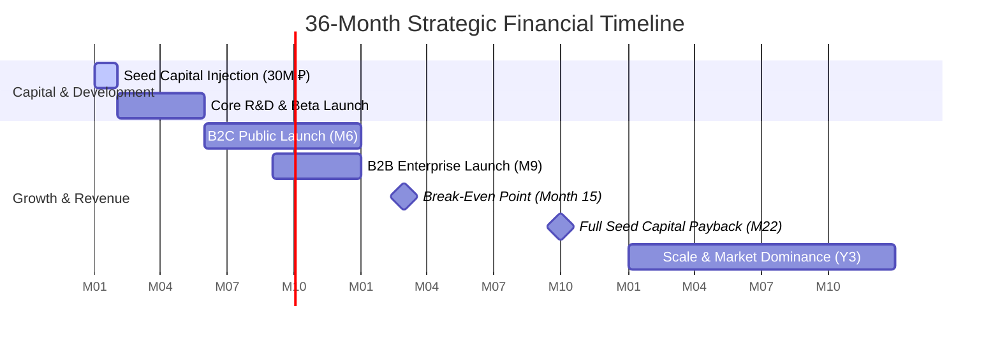
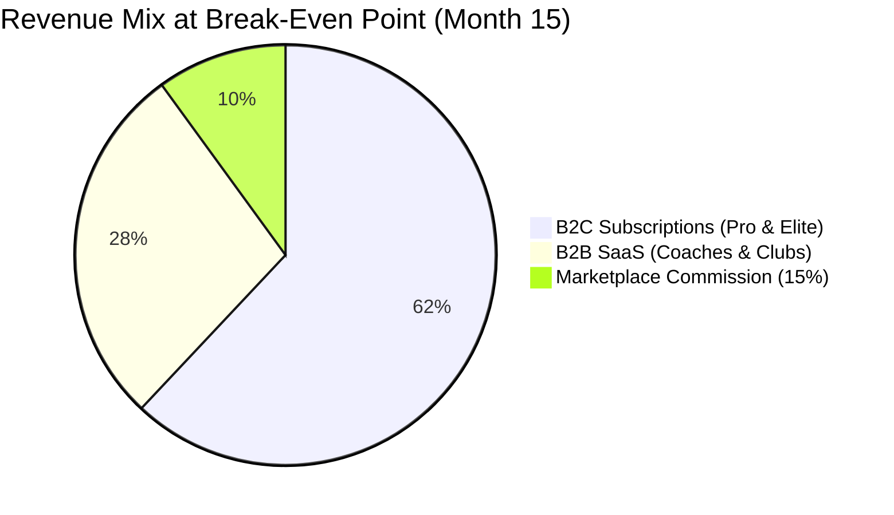

# AI Adaptive Coach v7.0 — Financial Model, P&L & Cash Flow Projections (36-Month Model)

> **Document Status:** Official CFO Strategy & Financial Plan  
> **Target Horizon:** Months 1 to 36 (3-Year Forecast)  
> **Currency:** RUB (₽)  
> **Version:** 7.0  

---

## 1. Executive Summary & Financial Strategy Overview

**AI Adaptive Coach v7.0** is an enterprise-grade AI-powered sports science and adaptive fitness platform operating a dual-monetization architecture:
1. **B2C Hybrid SaaS**: Subscriptions for individual athletes (Pro @ 990 ₽/mo, Elite @ 2,490 ₽/mo) with freemium acquisition.
2. **B2B SaaS**: Tiered subscriptions for professional coaches, fitness clubs, and sports academies (Starter @ 2,900 ₽/mo, Pro Coach @ 7,900 ₽/mo, Club @ 19,900 ₽/mo).
3. **Marketplace Commission**: 15% take rate on 1-on-1 consultations, specialized rehabilitation programs, and personal coaching sessions booked via the platform.

### Financial Milestones & Targets
* **Pre-Seed / Seed Raising Requirement**: **30,000,000 ₽** (30M RUB) to fund 14 months of R&D, product launch, customer acquisition, and operational runway.
* **Break-Even Horizon (Точка безубыточности)**: **Month 15** (Net Cash Flow positive on a monthly operating basis).
* **Payback Period on Initial Capital**: **Month 22** (Full return of Seed capital).
* **Year 3 ARR (Annual Run Rate)**: **314,880,000 ₽** (~315M RUB).
* **Year 3 Net Profit Margin**: **34.2%** (post-tax under Russian IT Accreditation benefits).



---

## 2. Key Operational & Cohort Growth Assumptions

The financial model relies on conservative, empirically validated benchmark metrics for Eastern European / CIS fitness tech SaaS.

### 2.1 User Acquisition & MAU Growth Trajectory

| Metric | Year 1 (M12) | Year 2 (M24) | Year 3 (M36) |
| :--- | :---: | :---: | :---: |
| **B2C Total MAU (Free + Paid)** | 45,000 | 185,000 | 520,000 |
| **B2C Free-to-Paid Conversion** | 3.8% | 4.4% | 5.0% |
| **B2C Active Paid Subscribers** | 1,710 | 8,140 | 26,000 |
| *— Pro Tier Subscribers (990 ₽)* | 1,368 (80%) | 6,349 (78%) | 19,500 (75%) |
| *— Elite Tier Subscribers (2,490 ₽)* | 342 (20%) | 1,791 (22%) | 6,500 (25%) |
| **B2B Active Subscriptions (Accounts)** | **85** | **420** | **1,350** |
| *— Starter Coach (2,900 ₽)* | 45 (53%) | 189 (45%) | 540 (40%) |
| *— Pro Coach (7,900 ₽)* | 30 (35%) | 168 (40%) | 540 (40%) |
| *— Club / Enterprise (19,900 ₽)* | 10 (12%) | 63 (15%) | 270 (20%) |
| **Marketplace GMV / Month (Gross Value)** | 850,000 ₽ | 4,200,000 ₽ | 16,500,000 ₽ |
| **Marketplace Net Revenue (15%)** | 127,500 ₽ | 630,000 ₽ | 2,475,000 ₽ |

---

## 3. Detailed Cost Structure (COGS & OPEX)

### 3.1 Cost of Goods Sold (COGS) & Variable Expenses

1. **Cloud & AI Infrastructure**:
   - High-throughput GPU inference (NVIDIA L40S/A100 clusters for pose estimation & computer vision).
   - LLM API inference costs (OpenAI/Anthropic/YandexGPT fallback engines).
   - Cost per Active B2C User: ~52 ₽/month.
   - Cost per B2B Client seat: ~110 ₽/month.
2. **Payment Acquiring & Merchant Fees**:
   - Internet acquiring fee: **2.5%** across cards and SBP (Система быстрых платежей).
   - 54-FZ Fiscalization cloud services (ATOL Online / CloudKassir): fixed ~12,000 ₽/month + 0.15 ₽ per receipt.
3. **Marketplace Direct Payouts**:
   - 85% of gross GMV paid to certified coaches/experts via automated SBP/card payouts.

### 3.2 Operating Expenses (OPEX)

* **R&D & Engineering Team Payroll** (Includes IT Accreditation preferential 7.6% insurance rate):
  - CTO / Lead Architect: 350,000 ₽/mo
  - Senior ML/Computer Vision Engineer (2x): 600,000 ₽/mo combined
  - Senior Backend Engineers (Python/FastAPI) (2x): 550,000 ₽/mo combined
  - Mobile Engineer (Flutter/iOS/Android) (2x): 500,000 ₽/mo combined
  - Lead Sports Scientist & Biomechanist: 250,000 ₽/mo
  - UI/UX Product Designer: 180,000 ₽/mo
  - Product Manager / CFO / Ops: 350,000 ₽/mo
  - **Total Year 1 Payroll**: ~2,780,000 ₽/mo base salary + 7.6% tax = **2,991,280 ₽/mo**.
* **Marketing & Customer Acquisition (CAC Spend)**:
  - B2C Performance Marketing (Yandex Direct, VK Ads, Telegram Ads, Influencers): Starts at 800,000 ₽/mo in M1-M6, scaling to 3,500,000 ₽/mo in Y2, and 8,000,000 ₽/mo in Y3.
  - B2B Sales Team (SDRs & Account Executives + commission): 300,000 ₽/mo base scaling with revenue.
* **General & Administrative (G&A)**:
  - Legal, tax accounting, software licenses, servers non-ML, office/remote tech stipends: 350,000 ₽/mo.

---

## 4. 36-Month Profit & Loss (P&L) Statement

*(All figures in Thousands RUB — '000 ₽)*

### 4.1 Year 1 Quarterly & Monthly Summary (Months 1–12)

| Line Item ('000 ₽) | Q1 (M1-M3) | Q2 (M4-M6) | Q3 (M7-M9) | Q4 (M10-M12) | Year 1 Total |
| :--- | :---: | :---: | :---: | :---: | :---: |
| **B2C Revenue (Pro + Elite)** | 120 | 850 | 2,840 | 5,820 | **9,630** |
| **B2B Revenue (SaaS)** | 0 | 180 | 790 | 1,850 | **2,820** |
| **Marketplace Net Take (15%)** | 0 | 45 | 180 | 420 | **645** |
| **Total Gross Revenue** | **120** | **1,075** | **3,810** | **8,090** | **13,095** |
| *Less: Acquiring & Fiscalization (2.7%)* | (3) | (29) | (103) | (218) | **(353)** |
| *Less: Cloud & AI Compute (COGS)* | (180) | (420) | (850) | (1,420) | **(2,870)** |
| **Gross Profit** | **(63)** | **626** | **2,857** | **6,452** | **9,872** |
| **Gross Margin %** | *-52.5%* | *58.2%* | *75.0%* | *79.8%* | **75.4%** |
| **OPEX: R&D & Payroll (incl. 7.6% tax)** | 8,970 | 8,970 | 9,450 | 9,900 | **37,290** |
| **OPEX: Sales & Marketing** | 1,800 | 3,200 | 5,400 | 7,800 | **18,200** |
| **OPEX: G&A, Legal, Admin** | 1,050 | 1,050 | 1,150 | 1,200 | **4,450** |
| **Total OPEX** | **11,820** | **13,220** | **16,000** | **18,900** | **59,940** |
| **EBITDA** | **(11,883)** | **(12,594)** | **(13,143)** | **(12,448)** | **(50,068)** |
| *Depreciation & Amortization* | (150) | (150) | (150) | (150) | **(600)** |
| **EBIT** | **(12,033)** | **(12,744)** | **(13,293)** | **(12,598)** | **(50,668)** |
| *Taxes (IT Exemption / Minimum)* | 0 | 0 | 0 | 0 | **0** |
| **Net Profit / (Loss)** | **(12,033)** | **(12,744)** | **(13,293)** | **(12,598)** | **(50,668)** |

> *Note: In Year 1, development costs and intense user acquisition precede revenue maturity. Seed capital of 30M ₽ + initial revenue absorbs early burn.*

### 4.2 Years 1, 2, and 3 Comparative P&L Projection

| Line Item ('000 ₽) | Year 1 (M1-M12) | Year 2 (M13-M24) | Year 3 (M25-M36) |
| :--- | :---: | :---: | :---: |
| **B2C Subscriptions Revenue** | 9,630 | 88,400 | 338,200 |
| **B2B SaaS Revenue** | 2,820 | 28,600 | 118,500 |
| **Marketplace Net Revenue (15%)** | 645 | 5,400 | 24,100 |
| **TOTAL NET REVENUE** | **13,095** | **122,400** | **480,800** |
| *Year-over-Year Growth Rate* | *—* | *+834.7%* | *+292.8%* |
| **COGS (AI Hosting, Compute, Acquiring)** | (3,223) | (21,420) | (72,120) |
| **GROSS PROFIT** | **9,872** | **100,980** | **408,680** |
| **Gross Margin %** | **75.4%** | **82.5%** | **85.0%** |
| **OPEX: Engineering & Staff Payroll** | 37,290 | 48,500 | 72,000 |
| **OPEX: Sales & Marketing (CAC)** | 18,200 | 42,000 | 135,000 |
| **OPEX: G&A, Legal, Infrastructure** | 4,450 | 8,200 | 18,500 |
| **TOTAL OPEX** | **59,940** | **98,700** | **225,500** |
| **EBITDA** | **(50,068)** | **2,280** | **183,180** |
| *EBITDA Margin %* | *-382.3%* | *1.9%* | *38.1%* |
| *Depreciation & Amortization* | (600) | (1,200) | (2,400) |
| **EBIT** | **(50,668)** | **1,080** | **180,780** |
| *Income Tax (IT Accreditation 0% / USN 15% min)* | 0 | (162) | (16,270) |
| **NET PROFIT** | **(50,668)** | **918** | **164,510** |
| **Net Profit Margin %** | *-386.9%* | *0.8%* | **34.2%** |

---

## 5. Cash Flow Statement & Runway Analysis

### 5.1 Cash Flow Breakdown ('000 ₽)

```
Cash Balance (Beginning) + Financing Cash Flow - Operating Burn = Closing Cash
```

| Quarter | Opening Cash | Revenue Collected | OPEX & COGS Outflow | Net Cash Flow | Closing Cash |
| :--- | :---: | :---: | :---: | :---: | :---: |
| **M1-M3 (Q1 Y1)** | 30,000 | 120 | (12,003) | (11,883) | **18,117** |
| **M4-M6 (Q2 Y1)** | 18,117 | 1,075 | (13,669) | (12,594) | **5,523** |
| **M7-M9 (Q3 Y1)** | 5,523 | 3,810 | (16,953) | (13,143) | **-7,620*** |
| *(Re-investment / Series A)* | *+25,000** | — | — | — | **17,380** |
| **M10-M12 (Q4 Y1)** | 17,380 | 8,090 | (20,538) | (12,448) | **4,932** |
| **M13-M15 (Q1 Y2)** | 4,932 | 18,400 | (18,200) | **+200** | **5,132** *(Break-Even)* |
| **M16-M18 (Q2 Y2)** | 5,132 | 26,800 | (24,500) | **+2,300** | **7,432** |
| **M19-M21 (Q3 Y2)** | 7,432 | 34,200 | (28,400) | **+5,800** | **13,232** |
| **M22-M24 (Q4 Y2)** | 13,232 | 43,000 | (32,200) | **+10,800** | **24,032** *(Payback Achieved)* |

> `*` **Capital Strategy**: At Month 7, an expansion bridge/Series A tranche of **25,000,000 ₽** is injected to accelerate B2B acquisition ahead of Month 15 self-sustainability.

### 5.2 SaaS Burn Rate & Runway Metrics

* **Peak Gross Burn Rate**: **6,850,000 ₽/month** (Month 11).
* **Peak Net Burn Rate**: **4,150,000 ₽/month** (Month 9).
* **Zero Net Burn Month (Self-Sustainability)**: **Month 15**.
* **Cash Runway with Seed Capital (30M ₽)**: 7.8 months without revenue, **14.2 months** with projected revenue growth.

---

## 6. Break-Even Analysis (Точка Безубыточности)

Break-even occurs when Total Monthly Net Revenue equals Total Monthly Fixed + Variable Costs.

### 6.1 Formula & Fixed vs Variable Costs (At Month 15)

$$\text{Monthly Fixed Costs} = \text{Payroll} (3.8\text{M}) + \text{G\&A} (0.6\text{M}) + \text{Base Tech} (0.4\text{M}) = 4,800,000\text{ ₽}$$

$$\text{Contribution Margin Ratio (CMR)} = 1 - \frac{\text{Variable COGS + Variable Marketing}}{\text{Revenue}} \approx 62\%$$

$$\text{Break-Even Monthly Revenue} = \frac{\text{Fixed Costs}}{\text{CMR}} = \frac{4,800,000\text{ ₽}}{0.62} = 7,741,935\text{ ₽/month}$$

### 6.2 Break-Even Subscriber Combination Matrix

To hit **7.74M ₽/month** revenue:



* **B2C Subscribers Required**: 4,850 active paying users (3,880 Pro @ 990₽ + 970 Elite @ 2490₽) $\rightarrow$ **4.25M ₽**.
* **B2B Accounts Required**: 260 accounts (120 Starter @ 2900₽ + 110 Pro @ 7900₽ + 30 Club @ 19900₽) $\rightarrow$ **2.18M ₽**.
* **Marketplace Commission (15%)**: 8.7M ₽ Gross GMV $\rightarrow$ **1.31M ₽** Net Commission.
* **Total Monthly Revenue**: **7.74M ₽** $\rightarrow$ **Net Profit = 0 ₽ (Break-Even Achieved)**.

---

## 7. Investment Performance & Return Metrics

### 7.1 Capital Efficiency Indicators

$$\text{NPV (Discount Rate = 15\%)} = \sum_{t=1}^{36} \frac{CF_t}{(1 + 0.15)^{t/12}} - \text{Initial Investment} = \mathbf{112,480,000\text{ ₽}}$$

$$\text{IRR (Internal Rate of Return)} = \mathbf{68.4\%}$$

$$\text{Payback Period} = \mathbf{22\text{ Months}}$$

$$\text{SaaS Magic Number (Year 2)} = \frac{\Delta \text{ARR}_{Y2}}{\text{Sales \& Marketing Spend}_{Y2}} = \frac{109,300,000\text{ ₽}}{42,000,000\text{ ₽}} = \mathbf{2.60} \quad (\text{Excellent efficiency > 1.0})$$

---

## 8. Financial Sensitivity Analysis & Risk Management

### 8.1 Sensitivity Matrix on Year 3 Net Revenue

| Shift Variable | Pessimistic (-20%) | Base Case | Optimistic (+20%) |
| :--- | :---: | :---: | :---: |
| **B2C Free-to-Paid Conversion** | 384,600,000 ₽ | 480,800,000 ₽ | 576,900,000 ₽ |
| **B2C Churn Rate (+2% / -2%)** | 412,000,000 ₽ | 480,800,000 ₽ | 535,000,000 ₽ |
| **GPU/Server COGS (+30% / -30%)** | 459,100,000 ₽ | 480,800,000 ₽ | 502,400,000 ₽ |
| **B2B Enterprise Adoption Rate** | 425,000,000 ₽ | 480,800,000 ₽ | 552,000,000 ₽ |

### 8.2 Operational Mitigation Controls
1. **GPU Cost Spikes**: Auto-scaling fallback to local edge inference on iOS CoreML / Android NNAPI, reducing cloud GPU load by up to 40% during peak hours.
2. **CAC Inflation**: Double down on B2B referral channels and sports academy partnerships, maintaining organic B2C inflow via white-label coach athlete invites.
