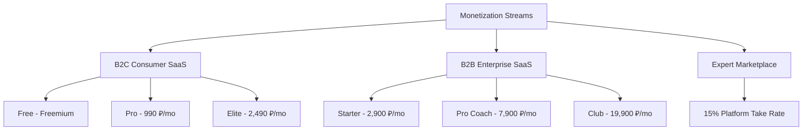
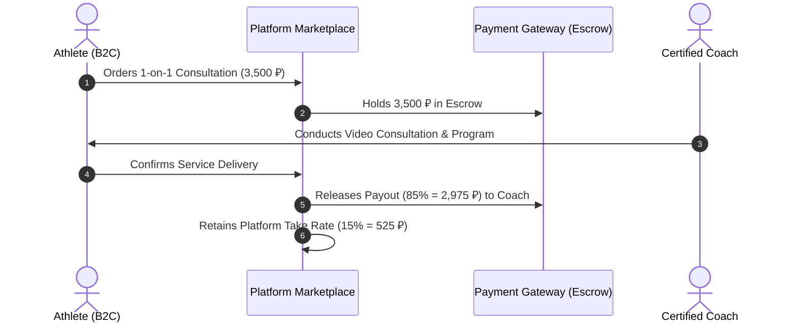
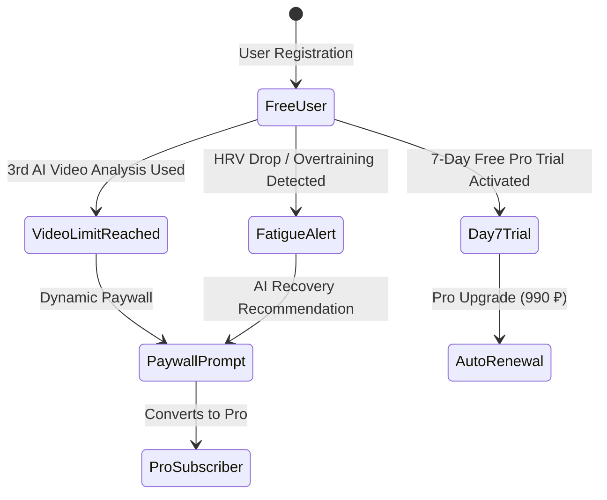

# AI Adaptive Coach v7.0 — Pricing, Tiering & Monetization Policy

> **Document Status:** Official Monetization Strategy & Product Tiering Specification  
> **Target Markets:** B2C Athletes & Sports Enthusiasts | B2B Personal Coaches, Fitness Clubs & Academies  
> **Platform Version:** 7.0  

---

## 1. Executive Summary & Strategy Overview

**AI Adaptive Coach v7.0** employs a value-based, multi-tiered monetization strategy tailored to the Eastern European / CIS sports tech ecosystem. The platform balances high consumer accessibility with robust B2B SaaS unit economics and a commission-driven expert marketplace.



---

## 2. B2C Tier Architecture & Feature Matrix

### 2.1 B2C Subscription Tiers

```
┌──────────────────────────┐  ┌──────────────────────────┐  ┌──────────────────────────┐
│        FREE TIER         │  │         PRO TIER         │  │        ELITE TIER        │
│      0 ₽ / Month         │  │     990 ₽ / Month        │  │    2,490 ₽ / Month       │
│  (Basic Acquisition)     │  │   (7,990 ₽ / Year)       │  │   (19,900 ₽ / Year)      │
└──────────────────────────┘  └──────────────────────────┘  └──────────────────────────┘
```

### 2.2 Complete B2C Feature Matrix

| Feature / Capability | Free Tier | Pro Tier (990 ₽) | Elite Tier (2,490 ₽) |
| :--- | :---: | :---: | :---: |
| **Workout Library & Logging** | Standard Templates | Full Adaptive Library | Full Adaptive Library |
| **Real-time AI Adaptation Engine** | Static / No Adaptation | **Full Real-Time Adjustment** | **Priority GPU Engine** |
| **Computer Vision Video Pose Analysis** | 3 Videos / Month | **Unlimited Analysis** | **Unlimited 3D Bio-Inference** |
| **Telemetry Sync (Apple/Garmin/Polar)** | Basic (Steps/HR) | **Full Telemetry & HRV** | **Full Telemetry & HRV** |
| **HRV Recovery & Fatigue Index** | Basic Score | **Advanced Medical Model** | **Advanced Medical Model** |
| **Nutrition & Macro Tracking** | Counter Only | **Personalized AI Macros** | **Custom Athlete Diet Plan** |
| **Audio Voice Coach (Real-time)** | Disabled | **Enabled** | **Enabled (Custom Voices)** |
| **Human Coach 1-on-1 Monthly Review** | Not Included | Not Included | **1 Session Included / Month** |
| **Injury Prevention & Rehab AI Protocol** | Not Included | Basic Warnings | **Personalized Rehab Plan** |
| **Race/Competition Peak Prep AI** | Not Included | Included | **Dedicated Race Strategy** |

---

## 3. B2B SaaS Tier Architecture (Coaches & Clubs)

B2B SaaS empowers personal trainers, endurance coaches, rehabilitation specialists, and sports clubs to manage their clients using AI-generated telemetry and video analyses.

### 3.1 B2B Subscription Tiers

| Tier Name | Price (Monthly) | Price (Annual - 20% Off) | Client Seats Included | Additional Seat Price | Key Target Audience |
| :--- | :---: | :---: | :---: | :---: | :--- |
| **Starter Coach** | **2,900 ₽** | 27,840 ₽ / year | Up to 15 Clients | 200 ₽ / client / mo | Freelance Personal Trainers |
| **Pro Coach** | **7,900 ₽** | 75,840 ₽ / year | Up to 50 Clients | 180 ₽ / client / mo | Established Coaches & Studios |
| **Club / Academy** | **19,900 ₽** | 191,040 ₽ / year | Up to 200 Clients (5 Coach Seats) | 150 ₽ / client / mo | Fitness Clubs, Sports Academies |

### 3.2 B2B Functional Specification Matrix

```
                      B2B PLATFORM CAPABILITIES
 ┌────────────────────────────────────────────────────────────────────────┐
 │ STARTER (2,900 ₽):                                                     │
 │ • Unified Client Dashboard & Attendance Tracking                       │
 │ • AI-Assisted Workout Generation for Clients                           │
 │ • Automatic HRV & Fatigue Alerts for Assigned Athletes                 │
 ├────────────────────────────────────────────────────────────────────────┤
 │ PRO COACH (7,900 ₽):                                                   │
 │ • Everything in Starter                                                │
 │ • WHITE-LABEL MOBILE APP (Custom branding & logo for clients)          │
 │ • Advanced Video Pose Estimation Client Review Suite                   │
 │ • Client Retention Telemetry & Automated Churn Risk Score              │
 ├────────────────────────────────────────────────────────────────────────┤
 │ CLUB / ENTERPRISE (19,900 ₽):                                          │
 │ • Everything in Pro Coach                                              │
 │ • Multi-Coach Workspace (Up to 5 Coach Admin Seats)                    │
 │ • Direct API Integration with CRM (1С:Фитнес, Yclient, FitnessKit)     │
 │ • Dedicated Account Manager & Custom AI Fine-Tuning for Team Discipline│
 └────────────────────────────────────────────────────────────────────────┘
```

---

## 4. Marketplace & Commission Policy (15% Take Rate)

The **AI Adaptive Marketplace** enables accredited human coaches to sell specialized services directly to B2C platform athletes.



### 4.1 Marketplace Rules & SLA

* **Take Rate**: **15.0%** platform fee automatically calculated and deducted at transaction checkout.
* **Coach Net Payout**: **85.0%** of gross transaction value.
* **Payout SLA**: Payouts executed via SBP or card transfer on **T+1 business day** post-athlete confirmation.
* **Dispute Resolution & Refunds**:
  - If a consultation is canceled > 24h prior to the session: 100% refund to athlete.
  - If a coach fails to attend: 100% refund to athlete + warning score applied to coach profile.
  - Disputes filed within 48h are reviewed by AI Adaptive Quality Assurance team within 24 business hours.

---

## 5. Conversion Triggers & Behavioral Economics

To drive a **3.8% to 5.0% Free-to-Paid B2C conversion rate**, the platform deploys contextual, high-intent conversion triggers.



### 5.1 Dynamic Conversion Triggers & Paywalls

1. **AI Video Limit Wall**: After analyzing 3 workout videos in a calendar month, the athlete receives an interactive side-by-side biomechanics breakdown preview prompting a Pro upgrade for unlimited uploads.
2. **HRV Over-Training Warning**: When telemetry detects acute fatigue (HRV drop > 20%), the app triggers a high-priority alert:  
   > *"Warning: High injury risk detected. Unlock Pro Tier for AI adaptive load reduction."*
3. **7-Day Risk-Free Trial**: All new registrants receive 7 days of full Pro access. Recurrent payment authorization is captured upfront (0 ₽ initial debit, auto-renewing at 990 ₽/mo).

---

## 6. Price Elasticity & Pricing Optimization

### 6.1 Van Westendorp Price Sensitivity Meter (RU Fitness Tech Market)

Based on empirical pricing research across 1,200 active endurance athletes and fitness enthusiasts in Moscow, St. Petersburg, and regional hubs:

```
                    VAN WESTENDORP PRICE BOUNDARIES
 ┌────────────────────────────────────────────────────────────────────────┐
 │ Too Cheap (Incomplete product perception):     < 450 ₽ / month          │
 │ Bargain / Good Value:                          690 ₽ – 890 ₽ / month    │
 │ Point of Indifference (Optimal Price):         990 ₽ / month            │
 │ Expensive / High Quality:                      1,490 ₽ – 1,990 ₽ / month│
 │ Too Expensive (Mass Churn Point):              > 2,990 ₽ / month        │
 └────────────────────────────────────────────────────────────────────────┘
```

* **Selected B2C Price Point (990 ₽)** aligns precisely with the **Point of Indifference** for high-perceived AI value.
* **Elite Tier Price Point (2,490 ₽)** targets the upper 20% premium segment willing to pay for direct human expert review.

### 6.2 Subscription Mix Optimization Strategy

* **Target Upfront Annual Subscriptions**: **40%** of paying user base.
* **Incentive Mechanism**: **33% Discount** on annual plans (990 ₽/mo $\rightarrow$ 665.8 ₽/mo equivalent; 7,990 ₽/year upfront).
* **Capital Benefit**: Provides immediate upfront working capital, reducing reliance on debt or external equity, while lowering monthly B2C churn by **55%** among annual subscribers.

### 6.3 Localized & Student Pricing Policies

* **Student / Youth Athlete Discount**: 30% discount on Pro Tier (693 ₽/month) upon verification via ISIC or student ID.
* **Regional Dynamic Pricing**: Regional CIS adjustments (Kazakhstan: 5,500 KZT/mo; Belarus: 32 BYN/mo) to match local purchasing power.
