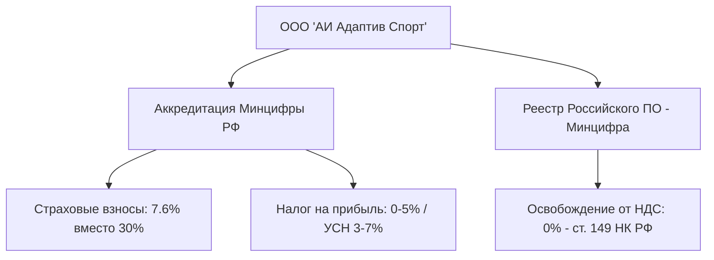
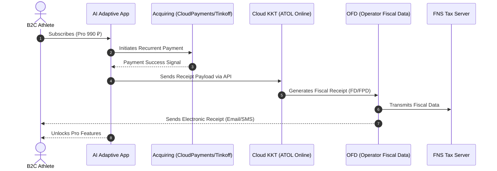

# AI Adaptive Coach v7.0 — Russian Federation Tax & Accounting Compliance Framework

> **Legal Entity**: ООО «АИ Адаптив Спорт» (LLC "AI Adaptive Sport")  
> **Tax Regime**: УСН (Упрощенная система налогообложения) / переход на ОСНО с льготами Минцифры  
> **IT Accreditation Status**: Аккредитованная ИТ-организация Минцифры РФ (Запись в реестре ИТ-компаний)  
> **Document Version**: 7.0  

---

## 1. Executive Summary & Legal Entity Setup

To optimize fiscal efficiency while maintaining 100% legal compliance under Russian legislation, **AI Adaptive Coach v7.0** operates under a Russian Limited Liability Company (ООО) structured to leverage state support for the technology sector.



### Core Corporate & Regulatory Identity

* **Form of Incorporation**: Общество с ограниченной ответственностью (ООО).
* **Main OKVED Codes**:
  - `62.01` — Разработка компьютерного программного обеспечения (Primary IT activity).
  - `62.02` — Деятельность консультативная и работы в области компьютерных технологий.
  - `63.11` — Деятельность по обработке данных, предоставление услуг по размещению информации.
  - `93.19` — Деятельность в области спорта прочая.

---

## 2. State Benefits for Accredited IT Companies

### 2.1 Requirements for Maintaining IT Accreditation (Минцифры РФ)

Under Russian Federal Law and Resolutions of the Government of the Russian Federation (№ 1729):
1. **IT Revenue Threshold**: At least **70%** of total corporate revenue must originate from qualifying IT activities (SaaS subscriptions, software licensing, AI platform algorithms).
2. **Salary Level Compliance**: Average salary of employees must not be lower than the regional or federal average salary (or software copyright registration owned by the company).
3. **Official Software Registry Inclusion**: Platform codebase listed in the **Реестр российского программного обеспечения** (MinCifry Registry).

### 2.2 Summary of Primary Tax & Insurance Benefits

| Fiscal Category | Standard Business Rate | Accredited IT Company Rate | Annual Tax Savings (based on 30M ₽ Payroll) |
| :--- | :---: | :---: | :---: |
| **Insurance Contributions (Страховые взносы)** | **30.0%** | **7.6%** | **6,720,000 ₽ / year** |
| *— PFR (Пенсионный фонд)* | 22.0% | 4.9% | Included above |
| *— FSS (Соцстрах)* | 2.9% | 0.6% | Included above |
| *— FFOMS (Медстрах)* | 5.1% | 2.1% | Included above |
| **Corporate Income Tax (Налог на прибыль - ОСНО)** | **20.0%** | **0% (2022-2024) / 5% (2025-2030)** | **15,000,000 ₽ / 100M Profit** |
| **VAT Exemption (НДС - ст. 149 НК РФ п.2 пп.26)** | **20.0%** | **0% (Exempt)** | **20% on all domestic B2C/B2B SaaS** |

---

## 3. Tax Regime Evaluation: USN vs OSNO

### 3.1 Comparative Analysis Matrix

```
  USN 6% ("Доходы")       USN 15% ("Доходы-Расходы")      OSNO + IT Benefits
 ┌──────────────────────┐ ┌─────────────────────────────┐ ┌───────────────────────────┐
 │ 6% on Gross Revenue  │ │ 15% on Net Margin           │ │ 5% Income Tax             │
 │ Minimal accounting   │ │ Reduced to 3-7% regional    │ │ 0% VAT (Reestr PO)        │
 │ Cap: 265.8M ₽ Rev    │ │ Cap: 265.8M ₽ Rev           │ │ 7.6% Insurance            │
 └──────────────────────┘ └─────────────────────────────┘ └───────────────────────────┘
```

| Criteria | УСН 6% («Доходы») | УСН 15% («Доходы минус расходы») | ОСНО + ИТ-льготы |
| :--- | :---: | :---: | :---: |
| **Tax Base** | Gross Revenue | Revenue minus Documented Expenses | Taxable Net Income |
| **Nominal Rate** | 6.0% | 15.0% (Reduced to 3-7% in target IT regions) | 5.0% (Profit) + 0% VAT |
| **Minimum Tax Rule** | None | 1% of gross revenue if expenses > income | None |
| **Revenue Limit (2026)** | 265.8 Million RUB | 265.8 Million RUB | **No Limit** |
| **Headcount Limit** | 130 Employees | 130 Employees | **No Limit** |
| **Optimal Phase** | **Years 1 & 2** | Alternative if expenses > 80% | **Year 3+ (Post 265M ₽ ARR)** |

### 3.2 Strategy & Transition Roadmap

1. **Phase 1 (Months 1–18)**: Apply **УСН 6% (Доходы)** or regional **УСН 5% (Доходы минус расходы)**.
   - Year 1 revenue is under 265.8M RUB limit.
   - High administrative simplicity; minimum hassle with document verification for cloud GPU operational spend.
2. **Phase 2 (Months 19–36)**: Transition to **ОСНО + IT Benefits**.
   - As ARR exceeds 265.8M RUB in Year 3, automated transition to OSNO occurs.
   - Zero VAT applies under Art. 149, Cl. 2, Subcl. 26 Tax Code RF due to inclusion in Russian Software Registry.
   - Income tax rate remains at preferential **5%**.

---

## 4. 54-FZ Fiscalization & Acquiring Architecture

Federal Law No. 54-FZ mandates real-time fiscal receipt generation for all electronic payments made by Russian individuals (B2C).



### 4.1 Fiscalization Technical Stack

* **Acquiring Gateway**: Tinkoff Acquiring / CloudPayments / Yookassa (Supports SBP, Mir Pay, Recurrent Webhooks).
* **Cloud Cash Register (Облачная ККТ)**: **ATOL Online** or **Ferma by ORdataset**.
* **Fiscal Data Operator (ОФД)**: Платформа ОФД / Первый ОФД.
* **Fiscal Receipt Metadata**:
  - Service Name: `Подписка "AI Adaptive Coach Pro" (1 месяц)`
  - Tax Rate: `Без НДС` (under Art. 149 Tax Code RF) or `УСН 0%`.
  - Payment Type: `Полный расчет` / `Электронные`.

---

## 5. Coach Payouts & Self-Employed (НПД) / IP Compliance

The platform employs certified individual human coaches for marketplace consultations. Payments are made to **Самозанятые (НПД — Налог на профессиональный доход)** or **ИП (Индивидуальные предприниматели)**.

### 5.1 Contractual Architecture: Civil Law Agreement (Договор ГПХ)

To avoid legal reclassification of contracts from NPD to standard employment agreements under **Article 15 of the Labor Code of the Russian Federation (ТК РФ)**, the following rules are strictly embedded in our legal contracts:

```
                      ANTI-RECLASSIFICATION GUARDRAILS
 ┌────────────────────────────────────────────────────────────────────────┐
 │ 1. NO FIXED WORKING HOURS: Coach determines availability independently │
 │ 2. NO MONTHLY FIXED SALARY: Payment strictly per completed service     │
 │ 3. NON-EXCLUSIVE RELATIONSHIP: Coach may work with third-party apps    │
 │ 4. OWN EQUIPMENT: Coach uses personal devices and sports tools          │
 │ 5. AUTOMATED RECEIPT VALIDATION: Receipt must be registered in FNS     │
 └────────────────────────────────────────────────────────────────────────┘
```

### 5.2 Automated Payout & Receipt Validation Flow

1. **Coach Onboarding**: Coach verifies status via **My Tax API (Мой Налог)** integration.
2. **Automated Payout**: Upon completed athlete consultation, **Tinkoff AnyPayout** or **Yandex Pay API** executes instant payment to coach's card or SBP.
3. **Fiscal Receipt Generation**:
   - The platform API triggers automated receipt generation in the FNS "My Tax" service via official Partner API.
   - Tax rate: **4%** (if payout from individual) or **6%** (if payout from company). The coach bears the tax obligation.
   - Platform archives the receipt link for corporate expense validation.

---

## 6. Accounting for Intangible Assets (НМА - Codebase & AI Models)

Under Russian Accounting Standards (**ПБУ 14/2007** and **ФСБУ 14/2022 «Нематериальные активы»**), proprietary software and machine learning models are capitalized as Intangible Assets (НМА).

### 6.1 Capitalization & Amortization Rules

* **Capitalized Costs**: Salaries of R&D engineers, ML developers, direct GPU training cloud costs associated with creating proprietary computer vision models.
* **Accounting Entry**:
  - `Dt 08.05` (Acquisition/Creation of Intangible Assets) $\rightarrow$ `Kt 70, 69, 60`.
  - Upon completion: `Dt 04` (Intangible Assets) $\rightarrow$ `Kt 08.05`.
* **Useful Life (Срок полезного использования)**: Set at **3 years** (36 months).
* **Amortization Method**: Straight-line amortization (`Dt 26/44` $\rightarrow$ `Kt 05`).

---

## 7. Tax & Reporting Compliance Calendar

| Deadline | Tax / Regulatory Report | Recipient Body | Platform Obligation |
| :--- | :--- | :---: | :--- |
| **Monthly (by 25th)** | EFS-1 (ЕФС-1 Сведения о трудовой деятельности) | SFR (Соцфонд) | Employee status updates |
| **Monthly (by 28th)** | Notification on Insurance Contributions & Personal Tax (6-НДФЛ) | FNS (ФНС) | Payroll tax payments |
| **Quarterly (by 25th)** | 6-NDFL, RSB (Расчет по страховым взносам) | FNS (ФНС) | Consolidated payroll tax report |
| **Quarterly (by 28th)** | Advance USN Tax Payment | FNS (ФНС) | 6% / 15% quarterly tax payment |
| **Annual (by March 25)** | USN Declaration (Декларация по УСН) | FNS (ФНС) | Annual corporate tax return |
| **Annual (by April 15)** | Confirmation of Main Activity OKVED | SFR (Соцфонд) | Confirmation of IT status |
| **Annual (by June 1)** | Confirmation of IT Accreditation Revenues (70% IT limit) | MinCifry (Минцифра) | Annual IT audit submission |
