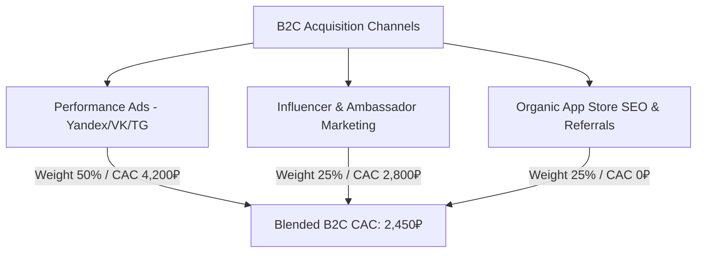

# AI Adaptive Coach v7.0 — Unit Economics, LTV/CAC & SaaS Metrics Framework

> **Document Status:** Official CFO Unit Economics Architecture & Metric Standards  
> **Target Audience:** Executive Leadership, Growth Engineers, Financial Analysts, Investors  
> **Platform Version:** 7.0  

---

## 1. Executive Summary & Core Methodology

Unit economics measures the direct revenues and costs associated with a single unit of business activity—in our case, an individual **B2C Athlete Subscriber** or a **B2B Coaching / Club Account**.

### Core Benchmarks & Performance Target Guardrails

```
                    ┌──────────────────────────────────────────────┐
                    │          HEALTHY SAAS BENCHMARK TARGETS       │
                    ├──────────────────────────────────────────────┤
                    │  LTV / CAC Ratio        │  > 3.5x (Target: 4.5x - 8.2x) │
                    │  CAC Payback Period    │  < 6 Months (B2C) / < 8 Months (B2B) │
                    │  B2C Monthly Churn     │  < 4.0%                        │
                    │  B2B Logo Churn        │  < 1.8%                        │
                    │  Gross Margin %        │  > 80%                         │
                    │  Net Revenue Retention │  > 115% (B2B)                  │
                    └──────────────────────────────────────────────┘
```

---

## 2. Mathematical Formulas & Metric Definitions

### 2.1 Average Revenue Per User & Unit Metrics

1. **ARPU (Average Revenue Per User - Blended across Free + Paid)**:
   $$ARPU = \frac{\text{Total Net Subscription Revenue}}{\text{Total Active Monthly Users (MAU)}}$$

2. **ARPPU (Average Revenue Per Paying User)**:
   $$ARPPU = \frac{\text{Total Net Subscription Revenue}}{\text{Total Paying Subscribers}}$$

3. **Gross Margin Percentage ($\text{GM}\%$)**:
   $$\text{GM}\% = \frac{\text{Revenue} - \text{Direct COGS (Hosting + Acquiring)}}{\text{Revenue}}$$

### 2.2 Customer Acquisition Cost (CAC)

$$\text{CAC} = \frac{\text{Total Marketing Spend} + \text{Sales Salaries} + \text{Onboarding Direct Costs}}{\text{Number of New Paying Customers Acquired}}$$

### 2.3 Customer Lifetime Value (LTV)

For SaaS subscription models with monthly churn ($Churn_{mo}$):

$$\text{Average Customer Lifetime (Months)} = \frac{1}{Churn_{mo}}$$

$$\text{LTV} = \text{ARPPU} \times \text{Gross Margin \%} \times \text{Average Customer Lifetime} = \frac{\text{ARPPU} \times \text{Gross Margin \%}}{Churn_{mo}}$$

### 2.4 LTV to CAC Ratio & Payback Period

$$\text{LTV / CAC Ratio} = \frac{\text{LTV}}{\text{CAC}}$$

$$\text{CAC Payback Period (Months)} = \frac{\text{CAC}}{\text{ARPPU} \times \text{Gross Margin \%}}$$

---

## 3. B2C Unit Economics Deep Dive

### 3.1 B2C Tier Breakdown & Weighted Blended Basket

* **Pro Tier Subscription**: 990 ₽ / month (or 7,990 ₽ / year $\rightarrow$ 665.8 ₽ / month equivalent).
* **Elite Tier Subscription**: 2,490 ₽ / month (or 19,900 ₽ / year $\rightarrow$ 1,658.3 ₽ / month equivalent).
* **Blended Tier Distribution**: 75% Pro Tier, 25% Elite Tier.
* **Payment Mix**: 40% Annual Upfront, 60% Monthly Subscriptions.

#### Weighted ARPPU Calculation:

$$\text{ARPPU}_{\text{Pro}} = (0.6 \times 990) + (0.4 \times 665.8) = 594 + 266.3 = 860.3\text{ ₽/mo}$$

$$\text{ARPPU}_{\text{Elite}} = (0.6 \times 2,490) + (0.4 \times 1,658.3) = 1,494 + 663.3 = 2,157.3\text{ ₽/mo}$$

$$\text{ARPPU}_{\text{Blended}} = (0.75 \times 860.3) + (0.25 \times 2,157.3) = 645.2 + 539.3 = \mathbf{1,184.5\text{ ₽/month}}$$

### 3.2 B2C Direct COGS & Gross Margin

| Cost Component | Monthly Cost Per Paid User | Notes |
| :--- | :---: | :--- |
| **GPU Inference & Computer Vision** | 38.0 ₽ | NVIDIA L40S video pose tracking (avg 12 videos/mo) |
| **LLM Engine API Calls** | 14.0 ₽ | Workout adaptation prompts & chat updates |
| **Telemetry Cloud Storage & DB** | 8.0 ₽ | Time-series data sync (Garmin/Apple Health) |
| **Acquiring & Fiscalization Fees** | 32.0 ₽ | 2.5% acquiring fee + Cloud KKT receipt fee |
| **Total Direct COGS** | **92.0 ₽** | *Per paying user per month* |

$$\text{Gross Margin Amount} = 1,184.5\text{ ₽} - 92.0\text{ ₽} = \mathbf{1,092.5\text{ ₽/month}}$$

$$\text{Gross Margin \%} = \frac{1,092.5}{1,184.5} = \mathbf{92.2\%}$$

### 3.3 B2C Acquisition Channels & Blended CAC



* **Blended B2C CAC**: **2,450 ₽**.

### 3.4 B2C Lifetime Value (LTV) & Payback Analysis

* **Target Monthly Churn Rate ($Churn_{mo}$)**: **3.8%** (equivalent to ~37% annual retention).
* **Average Athlete Lifetime**: $\frac{1}{0.038} = \mathbf{26.3\text{ Months}}$.

$$\text{B2C LTV} = \frac{1,184.5\text{ ₽} \times 92.2\%}{0.038} = \frac{1,092.5\text{ ₽}}{0.038} = \mathbf{28,750\text{ ₽}}$$

#### Metric Evaluation:

$$\text{B2C LTV / CAC Ratio} = \frac{28,750\text{ ₽}}{2,450\text{ ₽}} = \mathbf{11.73x} \quad (\gg 3.5\text{x Target})$$

$$\text{B2C CAC Payback Period} = \frac{2,450\text{ ₽}}{1,092.5\text{ ₽/mo}} = \mathbf{2.24\text{ Months}} \quad (\ll 6.0\text{ Mo Benchmark})$$

---

## 4. B2B Unit Economics Deep Dive

### 4.1 B2B SaaS Tiers & Revenue Mix

* **Starter Coach**: 2,900 ₽ / month (Up to 15 active clients).
* **Pro Coach**: 7,900 ₽ / month (Up to 50 active clients + White-label app).
* **Club / Enterprise**: 19,900 ₽ / month (Up to 200 clients + Multi-coach seats).
* **Target Account Mix**: 40% Starter, 40% Pro Coach, 20% Club.

#### B2B Weighted ARPPU Calculation:

$$\text{ARPPU}_{\text{B2B}} = (0.40 \times 2,900) + (0.40 \times 7,900) + (0.20 \times 19,900)$$

$$\text{ARPPU}_{\text{B2B}} = 1,160 + 3,160 + 3,980 = \mathbf{8,300\text{ ₽/month}}$$

### 4.2 B2B Gross Margin & COGS

| Cost Component | Monthly Cost Per B2B Account | Notes |
| :--- | :---: | :--- |
| **High-Volume Storage & Video Processing** | 320 ₽ | Multi-client video storage & analysis |
| **White-Label CDN & Domain Hosting** | 180 ₽ | Custom branding delivery for Pro & Club |
| **Dedicated B2B Support SLA** | 250 ₽ | Tier-2 technical support allocation |
| **B2B Acquiring / Invoicing Fees** | 224 ₽ | Invoicing via bank transfer (1.2% - 2.7%) |
| **Total B2B Direct COGS** | **974 ₽** | *Per B2B Account per Month* |

$$\text{B2B Gross Profit} = 8,300\text{ ₽} - 974\text{ ₽} = \mathbf{7,326\text{ ₽/month}}$$

$$\text{B2B Gross Margin \%} = \frac{7,326}{8,300} = \mathbf{88.3\%}$$

### 4.3 B2B Sales Funnel & CAC Calculation

B2B sales utilize direct outbound SDR cold outreach, inbound demo requests, and fitness conference presence.

```
                      B2B Sales Conversion Funnel
 ┌──────────────────────────────────────────────────────────────────┐
 │ Inbound / Outbound Leads               1,000 Leads              │
 ├──────────────────────────────────────────────────────────────────┤
 │ Qualified Demos Completed (25%)          250 Demos              │
 ├──────────────────────────────────────────────────────────────────┤
 │ Free Trial Accounts Created (50%)        125 Trials             │
 ├──────────────────────────────────────────────────────────────────┤
 │ Closed-Won Paying Accounts (40%)          50 Accounts            │
 └──────────────────────────────────────────────────────────────────┘
```

* **Sales Team Expenses per 50 Accounts Acquired**:
  - SDR Salaries + Bonuses: 250,000 ₽
  - Account Executive Commissions: 180,000 ₽
  - Targeted Paid Ads & Event Marketing: 120,000 ₽
  - Total Acquisition Expense: **550,000 ₽**.
* **B2B CAC**: $\frac{550,000\text{ ₽}}{50} = \mathbf{11,000\text{ ₽}}$.

### 4.4 B2B Lifetime Value (LTV), NRR & Payback

* **Monthly B2B Logo Churn ($Churn_{\text{B2B}}$)**: **1.5%** (equivalent to ~16.5% annual churn).
* **B2B Account Lifespan**: $\frac{1}{0.015} = \mathbf{66.7\text{ Months}}$ (~5.5 years).
* **Net Revenue Retention (NRR)**: **118%** (Driven by coaches upgrading from Starter to Pro as client base grows).

$$\text{Base B2B LTV} = \frac{\text{ARPPU}_{\text{B2B}} \times \text{Gross Margin \%}}{Churn_{\text{B2B}}} = \frac{7,326\text{ ₽}}{0.015} = \mathbf{488,400\text{ ₽}}$$

$$\text{NRR-Adjusted B2B LTV} = 488,400\text{ ₽} \times 1.18 = \mathbf{576,312\text{ ₽}}$$

#### Metric Evaluation:

$$\text{B2B LTV / CAC Ratio} = \frac{576,312\text{ ₽}}{11,000\text{ ₽}} = \mathbf{52.39x}$$

$$\text{B2B CAC Payback Period} = \frac{11,000\text{ ₽}}{7,326\text{ ₽/mo}} = \mathbf{1.50\text{ Months}}$$

---

## 5. Marketplace Unit Economics (15% Take Rate)

The Marketplace connects athletes with elite certified human coaches for 1-on-1 consultations, custom biomechanical assessments, and personalized marathon plans.

### 5.1 Marketplace Transaction Dynamics

* **Average Order Value (AOV)**: **3,500 ₽** per consultation / custom plan.
* **Platform Take Rate**: **15.0%**.
* **Gross Take per Transaction**: $3,500\text{ ₽} \times 0.15 = \mathbf{525\text{ ₽}}$.
* **Coach Payout (85%)**: $3,500\text{ ₽} \times 0.85 = \mathbf{2,975\text{ ₽}}$.

### 5.2 Marginal COGS & Net Take Rate

$$\text{Payment Acquiring (2.5\% on Gross AOV)} = 3,500\text{ ₽} \times 0.025 = 87.5\text{ ₽}$$

$$\text{Automated SBP Payout Fee (0.5\% on Payout)} = 2,975\text{ ₽} \times 0.005 = 14.875\text{ ₽}$$

$$\text{Cloud Fiscalization Receipts (2 Receipts)} = 0.30\text{ ₽}$$

$$\text{Total Transaction COGS} = 87.5 + 14.875 + 0.30 = \mathbf{102.675\text{ ₽}}$$

$$\text{Net Platform Take (Margin)} = 525\text{ ₽} - 102.675\text{ ₽} = \mathbf{422.325\text{ ₽}}$$

$$\text{Net Take Margin \%} = \frac{422.325}{525} = \mathbf{80.44\%}$$

---

## 6. Cohort Retention & Churn Decay Schedule

### 6.1 B2C Monthly Cohort Retention Curve (%)

| Cohort Month | M0 | M1 | M2 | M3 | M6 | M12 | M18 | M24 |
| :--- | :---: | :---: | :---: | :---: | :---: | :---: | :---: | :---: |
| **Pro Tier Retention** | 100% | 88.5% | 82.0% | 76.5% | 68.0% | 58.5% | 52.0% | 48.0% |
| **Elite Tier Retention** | 100% | 92.0% | 87.5% | 83.0% | 75.5% | 68.0% | 63.0% | 59.0% |

```mermaid
gantt
    title B2C Cohort Retention Target (M0 to M24)
    dateFormat  X
    axisFormat  Month %s

    section Retained Users
    Month 0 (100%)    :active, m0, 0, 1
    Month 3 (78%)     :m3, 0, 3
    Month 6 (70%)     :m6, 0, 6
    Month 12 (61%)    :m12, 0, 12
    Month 24 (51%)    :m24, 0, 24
```



---

## 7. Stress Testing & Sensitivity Guardrails

### 7.1 Sensitivity Matrix: LTV/CAC Ratio under Adverse Conditions

| Market Stress Scenario | Impact on Variables | B2C LTV/CAC | B2B LTV/CAC | Action Trigger |
| :--- | :--- | :---: | :---: | :--- |
| **Baseline Strategy** | Standard Parameters | **11.73x** | **52.39x** | Target Operating State |
| **Scenario A: Ad Cost Inflation** | CAC +50% (B2C: 3,675₽) | **7.82x** | **34.93x** | Shift ad spend to organic referrals |
| **Scenario B: Churn Spike** | Monthly Churn 3.8% $\rightarrow$ 6.5% | **6.86x** | **30.22x** | Launch win-back push notifications & discounts |
| **Scenario C: Price Suppression** | Pro price forced to 690₽ | **8.17x** | **52.39x** | Restrict free tier features to force upgrade |
| **Scenario D: Triple Stress** | CAC +30%, Churn 6.0%, Price -15% | **4.21x** | **22.15x** | Freeze unmeasured ad channels; prioritize B2B |

> **CFO Directive**: If B2C LTV/CAC drops below **3.5x** in any consecutive 2 months, automated paid acquisition campaigns are paused and re-allocated to high-intent search (Yandex Direct) and B2B direct sales.
