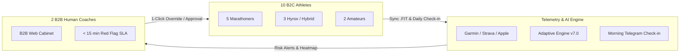
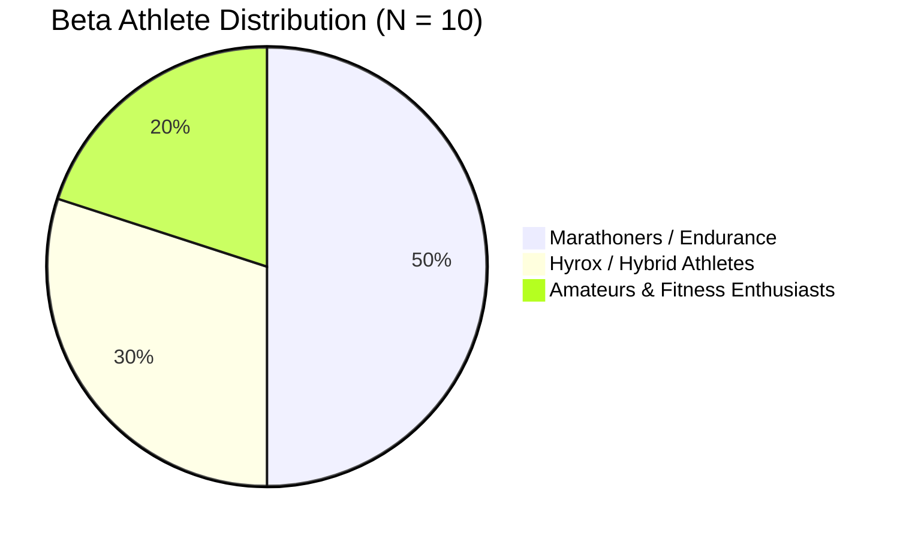
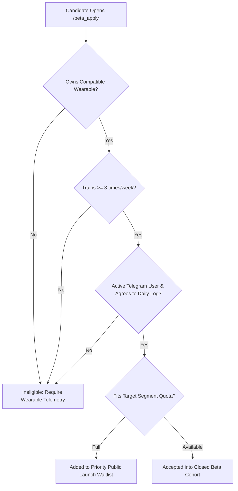
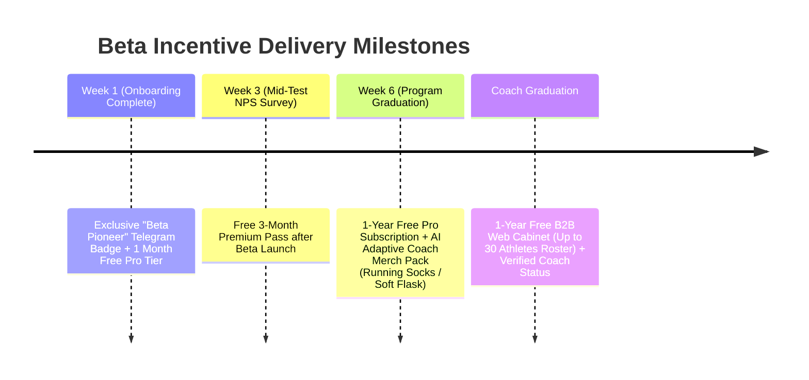
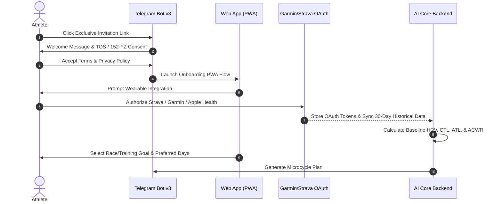
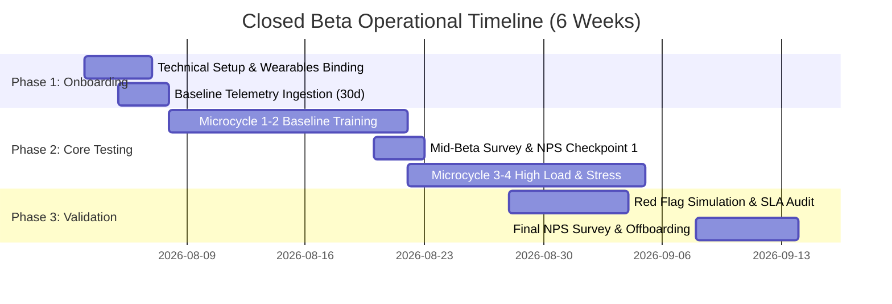
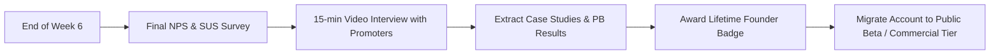

# 🧪 Closed Beta Test Recruitment & Operational Protocol

**AI Adaptive Coach v7.0 — Growth & Operations Specification**  
**Document Version:** 2.0.0 (MAS Orchestrated)  
**Target Audience:** Product Managers, Growth Team, Community Managers, Sports Scientists, Lead Engineers, B2B Operations  
**Governance:** Managed by `growth_team_lead` (Layer 2) & `product_ux_policy_keeper` (P4)  

---

## 1. Executive Summary & Beta Program Vision

The **Closed Beta Program** for **AI Adaptive Coach v7.0** is designed to validate core telemetry-driven adaptive training algorithms, user engagement loops, and safety triaging protocols under real-world conditions prior to public GTM launch.

### 1.1 Core Objectives & Hypotheses
1. **Algorithm & Telemetry Validation:** Prove that dynamic micro-periodization based on HRV (rMSSD), sleep, and ACWR (Acute:Chronic Workload Ratio) reduces injury risk indicators and improves workout compliance across endurance and hybrid sports.
2. **B2B Copilot Efficiency:** Verify that 2 professional Human Coaches using the B2B Web Cabinet can manage combined cohorts of 5 athletes each (10 athletes total) with zero safety oversight failures and an alert response SLA under 15 minutes.
3. **Product-Market Fit & Satisfaction:** Achieve an overall **Net Promoter Score (NPS) > 60** across both B2C Athletes and B2B Coaches.



---

## 2. Target Cohorts & Recruitment Criteria

The beta cohort consists of exactly **10 Athletes** divided into 3 distinct functional segments and **2 B2B Human Coaches**.



### 2.1 Cohort Segmentation & Persona Profiles

| Cohort Segment | Count | Target Persona | Hardware & Software Requirements | Primary Selection Criteria |
| :--- | :--- | :--- | :--- | :--- |
| **Cohort 1: Marathoners & Endurance** | 5 | Advanced/Intermediate runners preparing for Half/Full Marathon (Target: Sub-3:00 to Sub-4:00). | Garmin / COROS / Suunto watch + HR strap, Strava Premium / TrainingPeaks. | Minimum 40 km/week volume, 4+ workouts/week, active Telegram user. |
| **Cohort 2: Hyrox & Hybrid Athletes** | 3 | Athletes competing in Hyrox, CrossFit, or heavy functional strength + running. | Apple Watch / Oura Ring / Garmin + Gym access (Barbell, Ergometers). | 3+ strength workouts + 2 running sessions/week, logs RPE & DOMS. |
| **Cohort 3: Fitness Amateurs** | 2 | Novice runners and fitness enthusiasts seeking safe progression & recovery. | Smartphone (iOS/Android) + Smartwatch or Fitness Band (Xiaomi, Apple Watch). | 2–3 workouts/week, primary goal: health, weight management, injury prevention. |
| **B2B Human Coaches** | 2 | Certified endurance/strength coaches managing private client squads. | PC/Mac for Web Cabinet + Active Telegram account. | 5+ active personal clients, minimum 3 years coaching experience. |

---

### 2.2 Screening Questionnaire & Selection Filter

Selection is managed via a dedicated Telegram Mini App application form (`/beta_apply`). Candidates are scored automatically based on the following weighted filter:



#### Scoring & Exclusion Rules:
* **Inclusion Criteria:**
  * Must possess a compatible telemetry device (Garmin Connect, Apple Health, Polar, Suunto, Oura, or Strava sync).
  * Must commit to 100% morning Telegram check-ins (15-second questionnaire) for 6 consecutive weeks.
  * Agrees to submit weekly qualitative feedback and participate in a 15-minute mid-beta interview.
* **Exclusion Criteria:**
  * Active acute medical contraindications (cardiovascular pathologies, unmanaged acute joint trauma).
  * Inability to sync workout data within 12 hours of session completion.

---

### 2.3 Athlete & Coach Incentive Structure

To ensure a high retention rate (>80% active at Week 6) and complete survey responses, incentives are structured as milestone-gated rewards:



---

## 3. Onboarding & Technical Provisioning Process

### 3.1 Athlete Onboarding Journey (Telegram Bot + PWA)



---

### 3.2 B2B Coach Provisioning (Web Cabinet)

1. **Account Provisioning:** Admin generates authenticated credentials and invites the 5 coaches via email/Telegram link to `https://coach.ai-adaptive-coach.ru`.
2. **Squad Setup:** Each coach creates their squad workspace (e.g., *"Marathon Sub-3 Squad"*, *"Hyrox Pro Roster"*).
3. **Athlete Assignment:** 10 beta athletes are linked to each coach via unique Squad Join Codes.
4. **Webhook & Alert Configuration:** Coaches configure high-priority Telegram bot alerts for immediate push notifications on Level 3 (Orange) and Level 4 (Red) risk events.

---

## 4. Operational Protocol & Daily Feedback Loops

### 4.1 6-Week Beta Sprint Roadmap



---

### 4.2 Feedback Channels & Bug Triage

* **Community Hub:** Closed private Telegram channel `AI Coach v7.0 — Closed Beta Crew`.
* **Instant Bug Reporting:** In-bot command `/bug` triggers an interactive modal allowing athletes to record screenshots, logs, and unexpected plan modifications.
* **Weekly Office Hours:** Live 45-minute Telegram Voice Chat every Thursday at 19:00 MSK with Head of Product and Lead Sports Scientist.

---

## 5. Red Flag Triage & Safety SLA Protocol (<15 min Response)

Safety is the single non-negotiable metric during beta testing. The system must process physiological anomalies and escalate them to human coaches rapidly.

```mermaid
flowchart TD
    Data[Telemetry / Morning Check-in] --> Evaluator{Red Flag Rule Triggered?}
    Evaluator -- Level 1/2 (Green/Yellow) --> Auto[AI Auto-Adjustment & Micro-periodization]
    Evaluator -- Level 3/4 (Orange/Red) --> RedFlagTrigger[System Generates Red Flag Alert]

    subgraph Red Flag Protocol (< 15 min SLA)
        RedFlagTrigger --> Timestamp1[Log T0: Alert Created]
        RedFlagTrigger --> PausePlan[Auto-Pause Athlete Plan + Send Warning to Athlete]
        RedFlagTrigger --> TeleAlert[Send Priority Telegram Push to B2B Coach]
        TeleAlert --> Timestamp2[Log T1: Coach Notified]
        
        TeleAlert --> CoachAction{Coach Responds within 15 mins?}
        CoachAction -- Yes --> CoachResolve[Coach Override / Manual Adjustment in Cabinet]
        CoachResolve --> Timestamp3[Log T2: SLA Satisfied - Response Time = T2 - T0]
        
        CoachAction -- No (T > 15m) --> Fallback[Trigger System Fallback: Duty Medical/Sports Specialist Notified]
        Fallback --> AuditFail[Log SLA Breach & Ping System Admin]
    end
```

### 5.1 Red Flag Trigger Thresholds

| Alert Level | Trigger Condition | Automated System Action | Coach SLA Requirement |
| :--- | :--- | :--- | :--- |
| **Level 3 (Orange)** | ACWR $> 1.5$ OR 3-day HRV drop $> 2.0 \text{ SD}$ OR Joint Pain $= 5/10$. | Suggest 30% volume reduction; request coach confirmation. | Review within **60 minutes**. |
| **Level 4 (Red Critical)** | Joint/Tendon Pain $\ge 6/10$ OR Chest Pain/Dizziness OR ACWR $> 1.75$ with HRV suppression. | **IMMEDIATE LOCK:** Cancel current workout, set rest day, trigger medical triage survey. | **MANDATORY SLA < 15 minutes** (Review, contact athlete, approve plan change). |

---

### 5.2 SLA Measurement Engine & Telemetry Schema

Every Red Flag event creates an immutable audit record in PostgreSQL (`red_flag_logs` table):

```sql
CREATE TABLE red_flag_logs (
    id UUID PRIMARY KEY DEFAULT gen_random_uuid(),
    athlete_id UUID NOT NULL REFERENCES athletes(id),
    coach_id UUID NOT NULL REFERENCES coaches(id),
    severity_level VARCHAR(10) NOT NULL, -- 'ORANGE', 'RED'
    trigger_reason TEXT NOT NULL,
    created_at TIMESTAMP WITH TIME ZONE DEFAULT NOW(),
    notified_at TIMESTAMP WITH TIME ZONE,
    acknowledged_at TIMESTAMP WITH TIME ZONE,
    resolved_at TIMESTAMP WITH TIME ZONE,
    response_time_seconds INTEGER GENERATED ALWAYS AS (
        EXTRACT(EPOCH FROM (acknowledged_at - created_at))
    ) STORED,
    sla_breached BOOLEAN DEFAULT FALSE
);
```

---

## 6. Key Performance Indicators (KPIs) & Target Metrics

The success of the closed beta program is evaluated against strict quantitative thresholds:

```mermaid
quadrantChart
    title Beta Success Criteria Matrix
    x-axis Low Technical Quality --> High Technical Quality
    y-axis Low User Satisfaction --> High User Satisfaction
    quadrant-1 Target Zone (Launch Approved)
    quadrant-2 High NPS / High Bugs (Fix Backend)
    quadrant-3 Critical Fail (Block Launch)
    quadrant-4 Stable Tech / Low NPS (Rethink Product)
    "Target Goal": [0.85, 0.88]
```

### 6.1 Core Operational Metrics Table

| Metric Category | Specific Indicator | Target Baseline | Minimum Acceptance Threshold | Measurement Method |
| :--- | :--- | :--- | :--- | :--- |
| **User Satisfaction** | Athlete Net Promoter Score (NPS) | **NPS > 65** | **NPS $\ge$ 60** | Automated survey at W3 and W6. |
| **Coach Satisfaction** | B2B Coach NPS | **NPS > 75** | **NPS $\ge$ 60** | 1-on-1 interview & survey at W6. |
| **Safety SLA** | Red Flag Response Time (<15 min) | **$< 8 \text{ min average}$** | **$100\%$ alerts $< 15 \text{ min}$** | Database telemetry timestamp audit. |
| **Engagement** | Morning Check-in Completion | **$> 90\%$** | **$> 85\%$** | Daily bot response tracking. |
| **Telemetry Sync** | Sync Success Rate (.FIT / API) | **$> 99\%$** | **$> 95\%$** | Automated ingestion pipeline logs. |
| **Plan Compliance** | Prescribed vs Completed Workouts | **$> 85\%$** | **$> 80\%$** | Telemetry vs plan matching algorithm. |
| **Retention** | W6 Active User Rate | **$> 90\%$** | **$> 80\%$** (40+ active athletes) | Weekly active user (WAU) analytics. |

---

### 6.2 NPS Calculation Methodology

NPS is measured using the standard formula:

$$\text{NPS} = \% \text{ Promoters (Score 9-10)} - \% \text{ Detractors (Score 0-6)}$$

* **Promoters (9-10):** Athletes who state they would actively recommend AI Adaptive Coach to running clubs or training partners.
* **Passives (7-8):** Satisfied athletes who do not actively promote.
* **Detractors (0-6):** Users experiencing friction, bugs, or unhelpful advice.

---

## 7. Beta Offboarding, Transition & Launch Readiness

### 7.1 Offboarding & Testimonial Harvesting Flow



### 7.2 Launch Gate Criteria
Public Go-To-Market is granted **ONLY** when all 4 conditions are met:
1. Overall Athlete NPS $\ge 60$ and B2B Coach NPS $\ge 60$.
2. Zero unacknowledged Level 4 Red Flags exceeding the 15-minute SLA limit.
3. Automated .FIT workout parsing error rate $< 1.5\%$.
4. At least 10 documented qualitative case studies (e.g., *"Reduced ACWR spike before marathon"*, *"Improved Hyrox station recovery"*).

---

> [!IMPORTANT]
> All athlete telemetry data collected during the Closed Beta program is stored in strict compliance with **152-FZ** (Russian Personal Data Law) on servers physically located within the Russian Federation, using AES-256 encryption at rest.

> [!TIP]
> Use the `/beta_admin` dashboard inside Telegram to monitor real-time SLA compliance and morning check-in rates across all 50 active beta testers daily.
