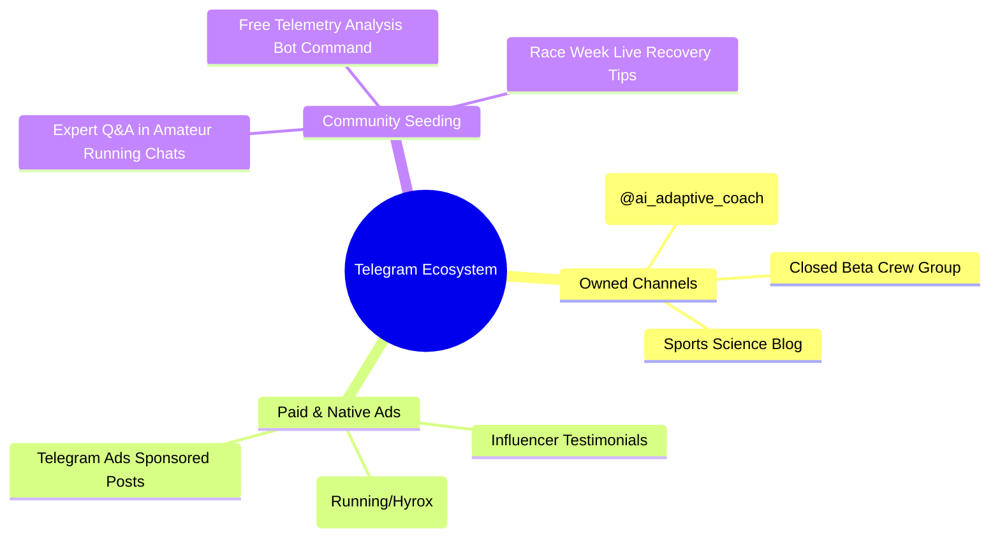
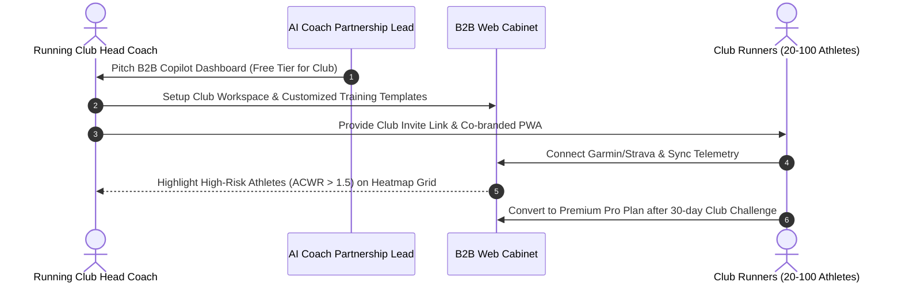
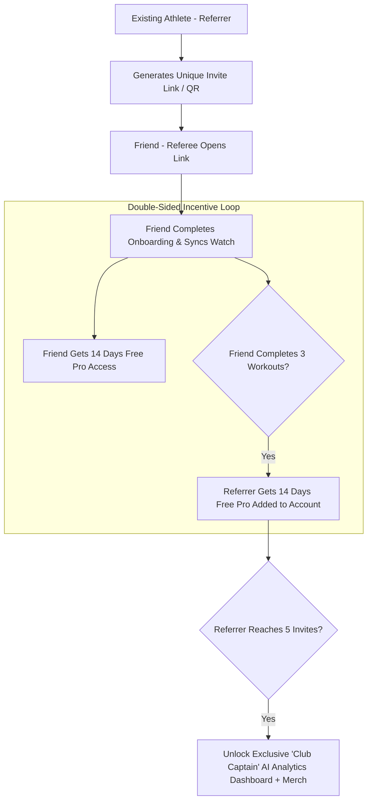
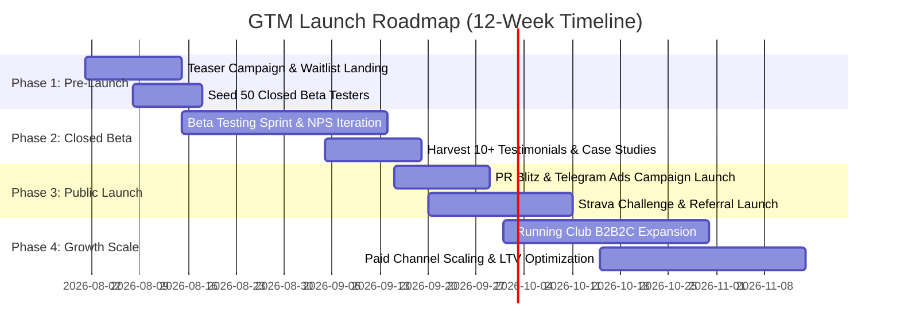

# 🚀 Go-To-Market & Marketing Launch Playbook

**AI Adaptive Coach v7.0 — Growth & Marketing Specification**  
**Document Version:** 1.0.0  
**Target Audience:** CMO, Growth Lead, Community Managers, Content Marketers, Partnership Managers, Product Leads  

---

## 1. Executive Summary & GTM Strategy Overview

This playbook details the Go-To-Market (GTM) strategy for **AI Adaptive Coach v7.0**. The platform combines an AI-driven Telegram Bot/PWA for athletes with a high-performance Web Cabinet for human coaches.

### 1.1 Core Growth Positioning & Value Proposition
* **Positioning:** The world's first micro-adaptive AI training copilot that syncs hardware telemetry (Garmin, Strava, Apple Watch, Oura) to prevent overtraining injuries, optimize race readiness, and bridge the gap between static PDF plans and $200/mo human coaches.
* **Target Segments:**
  1. **Endurance Runners & Marathoners** (Sub-3:00 / Sub-4:00 goal seekers).
  2. **Hyrox & Hybrid Strength/Cardio Athletes**.
  3. **Running Clubs & Independent Endurance Coaches** (B2B Copilot channel).
* **Primary Acquisition Engines:** Telegram Ecosystem & Community Seeding, Local Running Club Partnerships (B2B2C), Strava Organic Virality, and the "Bring a Friend" Referral Mechanic.

```mermaid
flowchart TD
    subgraph Acquisition [Acquisition Channels]
        TG[Telegram Ads & Content Channels]
        Clubs[Running Club Partnerships - B2B2C]
        Strava[Strava Organic Activity Feed]
    end

    subgraph Conversion [Telegram Bot & PWA Onboarding]
        Waitlist[Interactive Telemetry Assessment]
        Trial[14-Day Free Pro Access]
    end

    subgraph Retention & Growth [Viral Loop & Monetization]
        Referral["Bring a Friend" Referral Loop (K > 0.35)]
        PaidB2C[B2C Subscription - 1,490 ₽/mo]
        PaidB2B[B2B Club Cabinet - 9,900 ₽/mo]
    end

    Acquisition --> Conversion
    Conversion --> Trial
    Trial --> PaidB2C
    Trial --> PaidB2B
    PaidB2C --> Referral
    Referral --> Conversion
```

---

## 2. Channel Strategy 1: Telegram Ecosystem Strategy

Telegram is the primary operating environment for AI Adaptive Coach v7.0. Growth in Telegram leverages organic community engagement, expert content teardowns, and targeted Telegram Ads.



---

### 2.1 Content Strategy & Sports Science Teardowns

Content must avoid standard motivational generic quotes and focus heavily on **data-driven sports science teardowns**:

* **Format A: HRV & ACWR Case Studies:** *"How Alexey avoided Achilles tendinopathy 2 weeks before the Moscow Marathon using 3-day rMSSD suppression monitoring."*
* **Format B: Telemetry Math Decoded:** Explaining $ACWR = \frac{\text{ATL (7d)}}{\text{CTL (42d)}}$ and why static 10% volume increases lead to stress fractures.
* **Format C: Hyrox Station Science:** *"Optimizing compromise running pace after Sled Push using heart rate recovery telemetry."*

---

### 2.2 Telegram Ads Campaign Architecture

Campaigns run via Telegram Ads platform targeting active running, triathlon, and fitness channels:

```
+-------------------------------------------------------------------------------------------------------------------+
| 📢 SPONSORED POST PREVIEW                                                                                        |
+-------------------------------------------------------------------------------------------------------------------+
| 🏃 Got a Garmin or Strava watch? Stop following static PDF training plans that don't care if you slept 4 hours.  |
|                                                                                                                   |
| AI Adaptive Coach v7.0 reads your daily HRV, sleep, and ACWR to rebuild your workout plan every single morning.   |
|                                                                                                                   |
| 🟢 Prevent injuries  ⚡ Sub-3:00 Marathon & Hyrox prep  📊 Free 14-Day Readiness Check                            |
|                                                                                                                   |
| [ 🚀 Start Free Adaptive Plan in Telegram ] -------------------> Links to @ai_adaptive_coach_bot?start=tg_ads    |
+-------------------------------------------------------------------------------------------------------------------+
```

#### Ad Targeting Matrix:
* **Target Channels:** `@running_ru`, `@marathon_club`, `@triathlon_russia`, `@hyrox_community`, `@garmin_runners_chat`.
* **Budget Allocation:** 45% of total paid acquisition budget.
* **Target Cost-Per-Lead (CPL):** $< 80 \text{ ₽}$ per Telegram bot user.
* **Target Customer Acquisition Cost (CAC):** $< 1,200 \text{ ₽}$ per paid subscriber.

---

## 3. Channel Strategy 2: Running & Hybrid Sports Club Partnerships

Partnering with established offline/online running clubs creates a high-trust **B2B2C acquisition funnel**.



---

### 3.1 Club Partner Package & Benefits

| Partner Tier | Target Partner | What Club Receives | Revenue Share / Value Exchange |
| :--- | :--- | :--- | :--- |
| **Tier 1: Affiliate Club** | Local running crews (10–30 members). | Co-branded Strava leaderboard, 20% discount code for members, free captain account. | 20% recurring affiliate commission on member subscriptions. |
| **Tier 2: Enterprise Squad** | Major Endurance & Hyrox Clubs (50–200+ members). | Full **B2B Coach Dashboard** access, custom squad branding, dedicated sports science support. | Club pays 7,900 ₽/mo B2B license OR commits 15+ paid athlete subscriptions. |

---

### 3.2 Offline & Race-Day Activations

1. **AI Recovery Check-in Booths:** Set up at major marathon expos (e.g., Moscow Marathon expo, St. Petersburg White Nights). Offer free 2-minute morning HRV recovery assessments and ACWR risk calculations.
2. **Co-Branded Interval Runs:** Host monthly "AI Zone 2 & Threshold Pacing" track sessions where athletes receive post-workout AI telemetry teardowns via Telegram.

---

## 4. Channel Strategy 3: Strava Growth & Social Integration Mechanics

Strava is the primary social network for endurance athletes. Every synced workout represents a zero-cost organic viral impression.

```mermaid
flowchart LR
    Workout[Athlete Finishes Workout] --> Ingest[Backend Parses .FIT File]
    Ingest --> Engine[AI Engine Calculates Metrics]
    Engine --> Sync[Auto-Post to Strava API]
    
    subgraph Strava Activity Feed
        Sync --> Title["Activity Title: ⚡ Zone 2 Tempo | Readiness: 88/100"]
        Sync --> Desc["Description: Micro-adapted by AI Coach v7.0 \n• ACWR: 1.12 (Optimal) \n• HRV: 68 ms (+4ms) \n• Target Pace: 4:30 min/km \n👉 Get your AI plan: ai-coach.ru/app"]
    end
    
    Strava Activity Feed --> Friends[Athlete's Strava Followers See Post]
    Friends --> Click[Click Link & Join Telegram Bot]
```

---

### 4.1 Auto-Generated Strava Activity Formats

Athletes can toggle automated Strava activity title and description formatting inside the bot settings:

* **Format 1 (Endurance / Running):**
  > **Title:** ⚡ 14km Threshold Run | AI Readiness 92/100 🟢  
  > **Description:**  
  > Prescribed by AI Adaptive Coach v7.0  
  > 📊 ACWR: 1.18 | TSB: -8 | HRV rMSSD: 72 ms  
  > 🎯 Target Zone 2 Compliance: 96%  
  > 🤖 Try AI micro-adaptive coaching for free: `@ai_adaptive_coach_bot`

* **Format 2 (Hyrox / Strength & Hybrid):**
  > **Title:** 🏋️ Sled Push & Ergometer Intervals | AI Fatigue Score 45/100 🟡  
  > **Description:**  
  > Micro-adapted for Hyrox Pro Division  
  > 💪 Total Volume Tonnage: 4,850 kg | RPE: 8.5  
  > 🤖 Optimized by AI Adaptive Coach: `@ai_adaptive_coach_bot`

---

### 4.2 Sharable Social Cards & PWA Stories

The PWA generates high-fidelity vertical image cards (9:16 format) optimized for Telegram Stories, Instagram Stories, and Strava Posts:

```
+-------------------------------------------------------------+
| 🏃 AI ADAPTIVE COACH v7.0                   [ 2026-08-15 ]  |
+-------------------------------------------------------------+
|                                                             |
|   MORNING READINESS SCORE                                   |
|   +-----------------------------------------------------+   |
|   |  88 / 100 🟢  OPTIMAL FOR INTENSITY                 |   |
|   +-----------------------------------------------------+   |
|                                                             |
|   PHYSIOLOGICAL TELEMETRY:                                  |
|   • HRV (rMSSD): 74 ms (Baseline: 70 ms) 🔺                 |
|   • Sleep Duration: 7h 45m (Deep: 1h 50m)                   |
|   • Acute:Chronic Workload (ACWR): 1.14 (Safe Zone)         |
|                                                             |
|   TODAY'S ADAPTED WORKOUT:                                  |
|   5 x 1000m @ 3:45 min/km (Threshold)                       |
|                                                             |
|   -------------------------------------------------------   |
|   ⚡ Powered by AI Adaptive Coach | t.me/ai_adaptive_coach  |
+-------------------------------------------------------------+
```

---

## 5. Viral Referral Engine: "Bring a Friend" ("Приведи друга")

The referral mechanism leverages reciprocity and mutual athletic incentive to achieve a **Viral Coefficient ($K$-factor) $> 0.35$**.



---

### 5.1 Referral Mechanics & Mathematical Model

The viral coefficient $K$ is defined as:

$$K = i \times c$$

Where:
* $i =$ Average number of referral invitations sent per active user ($i \approx 2.5$).
* $c =$ Conversion rate of invitees to active onboarding users ($c \approx 15\%$).
* **Target $K$-factor:** $K = 2.5 \times 0.15 = 0.375$ (Exceeds minimum growth threshold of $0.35$).

---

### 5.2 Referral Reward Tiers

| Milestones (Successful Invites) | Referrer Reward | Referee Reward | Secondary Benefit |
| :--- | :--- | :--- | :--- |
| **1 Active Friend** | +14 Days Pro Plan | 14-Day Free Pro Access | Instant referral badge in Telegram bot. |
| **3 Active Friends** | +1 Month Pro Plan | 14-Day Free Pro Access | Free Race Pacing Strategy AI Generator. |
| **5 Active Friends** | +3 Months Pro Plan | 14-Day Free Pro Access | Exclusive AI Adaptive Coach Running Cap & Socks. |
| **10 Active Friends** | 1-Year Free Pro Plan | 30-Day Free Pro Access | "Community Captain" status + Direct chat with head sports scientist. |

---

### 5.3 Anti-Fraud & Telegram Bot Verification Rules

To prevent artificial account creation and referral abuse:
1. **Telegram User ID Verification:** Accounts created with newly registered Telegram IDs ($< 30 \text{ days old}$) undergo secondary anti-bot verification.
2. **Hardware Telemetry Check:** Referral reward is credited **ONLY** after the referred friend syncs at least **2 real GPS/FIT workouts** from Garmin, Strava, or Apple Watch.

---

## 6. Go-To-Market Timeline & Phased Execution Plan



### 6.1 Phase Breakdown & Action Items

* **Phase 1: Pre-Launch & Waitlist (Weeks -2 to 0):**
  * Deploy interactive readiness quiz landing page (`ai-coach.ru/quiz`).
  * Onboard 50 athletes and 5 B2B coaches into Closed Beta program.
  * Finalize co-branding deals with 3 regional running clubs.
* **Phase 2: Closed Beta & Proof of Concept (Weeks 1 to 4):**
  * Validate Red Flag response SLA ($<15 \text{ min}$) and NPS ($>60$).
  * Collect case studies on injury prevention and race PBs.
* **Phase 3: Public GTM Launch Blitz (Weeks 5 to 8):**
  * Open Telegram Bot v3 to public registration.
  * Launch 500,000 ₽ Telegram Ads blitz across targeting matrix.
  * Activate "Bring a Friend" referral engine and automated Strava activity posting.
* **Phase 4: Scaling & B2B Expansion (Weeks 9 to 12):**
  * Scale B2B Club Cabinet subscriptions to 25+ paying sports clubs.
  * Optimize CAC payback period down to $< 4.5 \text{ months}$.

---

## 7. Growth Metrics & Financial Unit Economics Alignment

This GTM launch plan is directly aligned with the official CFO Unit Economics Framework (`docs/economics/unit_economics_ltv_cac.md`).

```mermaid
quadrantChart
    title Acquisition Channel CAC vs LTV Efficiency
    x-axis High Acquisition Cost (CAC) --> Low Acquisition Cost (CAC)
    y-axis Low LTV / Retention --> High LTV / Retention
    quadrant-1 Star Channels (Scale Aggressively)
    quadrant-2 High Volume (Optimize Conversion)
    quadrant-3 Inefficient (Niche Only)
    quadrant-4 Premium Niche (High LTV)
    "Referral Engine (K>0.35)": [0.90, 0.85]
    "Running Clubs (B2B2C)": [0.82, 0.92]
    "Strava Viral Posting": [0.88, 0.78]
    "Telegram Paid Ads": [0.55, 0.75]
```

### 7.1 Target Unit Economics & Channel Comparison

| Channel / Metric | Target CAC (₽) | Target LTV (₽) | LTV / CAC Ratio | Primary Growth Driver |
| :--- | :--- | :--- | :--- | :--- |
| **Referral Engine ("Bring a Friend")** | **250 ₽** (Incentive cost) | **8,940 ₽** | **35.7x** | High trust, viral $K = 0.375$. |
| **Running Clubs (B2B2C)** | **450 ₽** | **11,500 ₽** | **25.5x** | Coach recommendation, high retention. |
| **Strava Organic Virality** | **150 ₽** (Server infrastructure) | **7,800 ₽** | **52.0x** | Continuous activity feed exposure. |
| **Telegram Paid Ads** | **1,150 ₽** | **7,800 ₽** | **6.78x** | Direct targeted acquisition blitz. |
| **Blended Average Target** | **780 ₽** | **8,450 ₽** | **10.8x** | Multi-channel flywheel effect. |

---

### 7.2 Core Financial Benchmark Targets
* **B2C Monthly Subscription Price:** 1,490 ₽/month.
* **B2B Club Cabinet Subscription Price:** 9,900 ₽/month.
* **Target Monthly Churn:** $< 3.8\%$.
* **Gross Margin:** $> 82\%$ (Direct COGS includes server hosting, LLM API calls, and payment gateway acquiring fees).
* **Target LTV/CAC Ratio:** $> 4.5x$ across all channels combined.

---

> [!IMPORTANT]
> All growth campaigns must strictly comply with **38-FZ** (Russian Federal Advertising Law) including mandatory advertising tokens (ERID) registration via Telegram Ads operators.

> [!TIP]
> Track real-time GTM funnel metrics, referral coefficient $K$, and channel CAC inside the Growth Admin Cabinet at `https://coach.ai-adaptive-coach.ru/admin/growth`.
