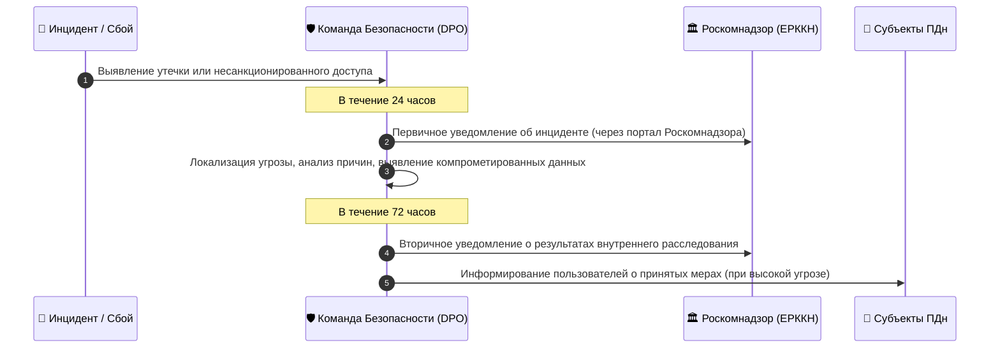

# Регламент обработки и локализации персональных данных (152-ФЗ)
**Проект:** AI Adaptive Coach v7.0  
**Версия документа:** 1.0  
**Дата вступления в силу:** 01 августа 2026 г.  
**Ответственное лицо (DPO / Оператор):** ООО «АИ СПОРТ» (или ИП Оператор)

---

## 1. Введение и нормативно-правовая база

Настоящий Регламент разработан в соответствии с Федеральным законом от 27.07.2006 № 152-ФЗ «О персональных данных» (далее — **152-ФЗ**), Федеральным законом от 27.07.2006 № 149-ФЗ «Об информации, информационных технологиях и о защите информации», Постановлением Правительства РФ от 01.11.2012 № 1119 «Об утверждении требований к защите персональных данных при их обработке в информационных системах персональных данных», а также приказами ФСТЭК России № 21 и ФСБ России № 378.

Регламент определяет порядок обработки, хранение, локализацию, защиту и удаление персональных данных (ПДн) пользователей платформы **AI Adaptive Coach v7.0** (веб-приложение, PWA, Telegram-бот и B2B-кабинет тренера).

---

## 2. Категоризация и классификация персональных данных в AI Adaptive Coach v7.0

В системе **AI Adaptive Coach v7.0** обрабатываются следующие категории персональных данных:

| Категория ПДн | Состав данных | Цель обработки | Правовое основание | Уровень защищенности (УЗ) |
| :--- | :--- | :--- | :--- | :--- |
| **1. Общие ПДн** | ФИО, e-mail, номер телефона, Telegram ID, дата рождения, пол, часовой пояс, фото профиля | Регистрация, аутентификация, финансовые расчеты, поддержка | Согласие на обработку ПДн, Исполнение публичной оферты (ст. 6 152-ФЗ) | **УЗ-3** |
| **2. Данные о физическом состоянии и фитнес-телеметрии** *(НЕ являются медицинскими ПДн согласно 323-ФЗ, но требуют повышенной защиты)* | Рост, вес, пульсовые зоны, вариабельность сердечного ритма (HRV), показатель $VO_2max$, данные .FIT/.TCX файлов, каденс, мощность, динамика нагрузок, жалоба на усталость | Генерация адаптивных спортивных планов ИИ-движком, расчет индексов восстановления | Явное согласие пользователя | **УЗ-2** |
| **3. Данные о здоровье (Специальные категории)** *(Обрабатываются ИСКЛЮЧИТЕЛЬНО при явном согласии и в обезличенном виде)* | Отметки о травмах, хронических заболеваниях, медицинских противопоказаниях к фитнесу (заполняются пользователем добровольно) | Корректировка ИИ-тренировок с целью исключения травмоопасных упражнений | Ст. 10 152-ФЗ (Письменное / электронное явное согласие) | **УЗ-1 / УЗ-2** |
| **4. Биометрические ПДн** | **НЕ СОБИРАЮТСЯ И НЕ ОБРАБАТЫВАЮТСЯ**. Фотографии профиля не используются для идентификации личности на основе физиологических и биологических особенностей (ст. 11 152-ФЗ). | N/A | N/A | N/A |

---

## 3. Локализация персональных данных в РФ (Ч. 5 ст. 18 152-ФЗ)

1. **Первичный сбор и запись**: Запись, систематизация, накопление, хранение, уточнение (обновление, изменение), извлечение персональных данных граждан Российской Федерации при сборе осуществляются **строго с использованием баз данных, находящихся на территории РФ**.
2. **Инфраструктура**:
   - Первичная БД (PostgreSQL): Размещена в ЦОД на территории РФ (Yandex Cloud / Selectel, сертификат ФСТЭК по УЗ-1 / УЗ-2).
   - Кэш и сессии (Redis): Размещены в ЦОД на территории РФ.
   - S3-совместимое хранилище треков (.FIT/TCX): Хранится в российском облачном хранилище в зашифрованном виде.
3. **Трансграничная передача**: Трансграничная передача ПДн граждан РФ в сторонние сервисы (например, сторонние ИИ-провайдеры خارج территории РФ без обезличивания) **КАТЕГОРИЧЕСКИ ЗАПРЕЩЕНА**.
4. **Обезличивание перед обработкой ИИ**: В случае использования внешних ИИ-моделей (например, LLM), в промпты передаются **исключительно обезличенные идентификаторы (UUID)** и числовые метрики без ФИО, e-mail, телефона и иных прямых идентификаторов.

---

## 4. Технические стандарты защиты и шифрование (AES-256)

Для обеспечения безопасности ПДн в соответствии с УЗ-2 применяются следующие технические и организационные меры:

### 4.1. Шифрование при хранении (Data at Rest)
- **Алгоритм шифрования**: **AES-256-GCM** (Advanced Encryption Standard с режимом Galois/Counter Mode).
- **Область шифрования**:
  - Таблицы БД, содержащие чувствительные фитнес-метрики и отметки о здоровье.
  - Поля с ФИО, e-mail, Telegram ID шифруются на уровне приложения перед записью в PostgreSQL с использованием уникальных ключей шифрования колонок (Column-Level Encryption).
- **Управление ключами (KMS)**:
  - Использование специализированного сервиса управления ключами (Key Management Service) с ротацией ключей каждые 90 дней.
  - Мастер-ключ хранится в аппаратном/защищенном модуле (HSM/KMS в закрытом контуре РФ).

### 4.2. Шифрование при передаче (Data in Transit)
- **Протоколы**: **TLS 1.3** (с фолбэком на TLS 1.2 с безопасными шифронаборами ECDHE-RSA-AES256-GCM-SHA384).
- **Защита веб-трафика и API**: Сертификаты выданные аккредитованными УЦ в РФ / Let's Encrypt, обязательный HTTP Strict Transport Security (HSTS).

### 4.3. Обезличивание и псевдонимизация
- Каждому пользователю присваивается случайный `UUIDv4`.
- Связка `UUIDv4 <-> Реальные ПДн` хранится в изолированной БД с повышенным контролем доступа.

---

## 5. Форма Согласия на обработку персональных данных (Шаблон)

```markdown
СОГЛАСИЕ НА ОБРАБОТКУ ПЕРСОНАЛЬНЫХ ДАННЫХ
(в соответствии со ст. 9 Федерального закона от 27.07.2006 № 152-ФЗ)

Нажимая кнопку «Зарегистрироваться» / «Согласен» или отправляя команду /start в Telegram-боте AI Adaptive Coach v7.0, я (далее — «Пользователь»), действуя своей волей и в своем интересе, даю свое согласие Оператору персональных данных — ООО «АИ СПОРТ» (ОГРН: XXXXXXXXXXXXX, ИНН: XXXXXXXXXX, адрес: 101000, г. Москва, ул. Спортивная, д. 1) на обработку моих персональных данных на следующих условиях:

1. Перечень персональных данных, на обработку которых дается согласие:
   - Общие ПДн: ФИО, адрес электронной почты, номер телефона, аккаунт Telegram (Telegram ID, имя пользователя), дата рождения, пол.
   - Спортивные и физиологические данные: вес, рост, пульсовые зоны, вариабельность сердечного ритма (HRV), показатель VO2max, спортивный стаж, данные файлов тренировочной телеметрии (.FIT, .TCX), уровень усталости, отметки о субъективном самочувствии.
   - Сведения о физических ограничениях и противопоказаниях: добровольно указываемые сведения о перенесенных спортивных травмах и ограничениях по физической нагрузке.

2. Цели обработки персональных данных:
   - Предоставление доступа к функционалу сервиса AI Adaptive Coach v7.0.
   - Автоматизированное построение и адаптация персонализированных планов физических тренировок с использованием алгоритмов искусственного интеллекта.
   - Расчет показателей восстановления, нагрузочных индексов и риск-профиля перетренированности.
   - Осуществление обратной связи, отправка уведомлений о тренировках и финансовых чеков (по 54-ФЗ).

3. Перечень действий с персональными данными:
   Сбор, запись, систематизация, накопление, хранение, уточнение (обновление, изменение), извлечение, использование, обезличивание, блокирование, удаление, уничтожение персональных данных с использованием средств автоматизации на серверах, расположенных на территории Российской Федерации.

4. Срок действия согласия и порядок его отзыва:
   Согласие действует с момента его акцепта до достижения целей обработки или до момента отзыва.
   Согласие может быть отозвано Пользователем в любой момент путем направления письменного заявления на электронную почту dpo@aicoach.ru или отправки команды /delete_account в Telegram-боте.
   Оператор обязуется прекратить обработку и уничтожить ПДн в срок, не превышающий 30 (тридцати) дней с даты получения отзыва.
```

---

## 6. Порядок реализации прав субъектов персональных данных

1. **Право на доступ и получение сведений**: Пользователь имеет право запросить информацию о факте, целях, способах обработки и категориях обрабатываемых ПДн через запрос на `dpo@aicoach.ru`.
2. **Право на уточнение и удаление («Право на забвение»)**:
   - Автоматическая выгрузка данных (Data Export): В личном кабинете доступна функция скачивания всех данных в формате `.JSON`.
   - Полное удаление аккаунта: Функция «Удалить аккаунт» каскадно каскадно стирает все ПДн пользователя из активных БД в течение 48 часов, и из резервных копий — в течение 30 дней.
3. **Право на отзыв согласия**: В любой момент без объяснения причин.

---

## 7. Регламент реагирования на инциденты утечки ПДн (Data Breach Incident Protocol)

В соответствии с требованиями ч. 3.1 ст. 21 152-ФЗ при обнаружении факта неправомерной или случайной передачи (предоставления, распространения, доступа) персональных данных Оператор обязан:



1. **В течение 24 часов**: Уведомлить Роскомнадзор о произошедшем инциденте, о предполагаемых причинах, повлекших нарушение прав субъектов ПДн, и о принятых мерах по устранению последствий.
2. **В течение 72 часов**: Уведомлить Роскомнадзор о результатах внутреннего расследования инцидента, а также предоставить сведения о лицах, причастных к его совершению (при наличии).
3. **Регистр инцидентов**: Все инциденты подлежат обязательной фиксации в Внутреннем журнале учета инцидентов информационной безопасности.

---

## 8. Ответственность и контроль compliance

1. Назначен Ответственный за организацию обработки персональных данных (Data Protection Officer / DPO). E-mail: `dpo@aicoach.ru`.
2. Проводятся ежегодные внутренние аудиты соответствия 152-ФЗ, Приказу ФСТЭК № 21 и регулярное пентестирование сервиса.
3. Все сотрудники Оператора, имеющие доступ к ПДн, подписывают Соглашение о неразглашении конфиденциальной информации (NDA) и проходят инструктаж по информационной безопасности.
