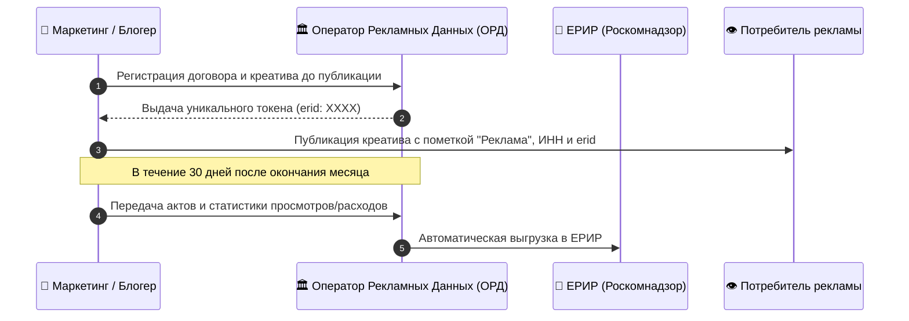
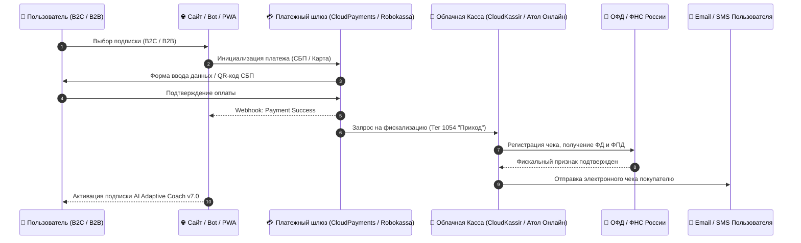

# Правовой регламент по 38-ФЗ (Реклама) и 54-ФЗ (Онлайн-кассы и фискализация)
**Проект:** AI Adaptive Coach v7.0  
**Версия документа:** 1.0  
**Дата вступления в силу:** 01 августа 2026 г.  
**Сфера применения:** Маркетинг, платежные интеграции, эквайринг, биллинг B2C/B2B

---

## ЧАСТЬ I. Соблюдение 38-ФЗ «О рекламе» (Маркировка, ОРД, БАДы и гарантии результатов)

### 1. Маркировка интернет-рекламы в РФ (Ст. 18.1 Федерального закона от 13.03.2006 № 38-ФЗ)

Все рекламные материалы платформы **AI Adaptive Coach v7.0** (таргетированная реклама, посты в Telegram-каналах, интеграции у блогеров, контекстная реклама), распространяемые на территории Российской Федерации, подлежат обязательной маркировке и передаче в **Единый реестр интернет-рекламы (ЕРИР)** через аккредитованного **Оператора рекламных данных (ОРД)** (например, ОРД Яндекс, ОРД VK, ОРД-Алекс).

#### 1.1. Обязательные реквизиты каждого рекламного материала:
1. Пометка **«Реклама»**.
2. Указание на рекламодателя и (или) сайт рекламодателя: **«Рекламодатель ООО "АИ СПОРТ", ИНН XXXXXXXXXX»** или **«Рекламодатель ИП Иванов И.И., ОГРНИП XXXXXXXXXXXXXXX»**.
3. Уникальный идентификатор рекламы (**тот же erid token**), присвоенный ОРД: формат `erid: XXXXxxxxXXXX`.

#### 1.2. Схема подачи сведений в ОРД:

---

### 2. Запрет гарантий спортивных и оздоровительных результатов

В силу требований 38-ФЗ и законодательства о защите прав потребителей при рекламе фитнес-сервиса **AI Adaptive Coach v7.0** запрещается:

1. **Гарантировать 100% результат**: Запрещены формулировки вроде *«Гарантируем прибавку 20 Вт к FTP за 2 недели», «Гарантированное похудение на 10 кг», «100% марафон без травм»*.
2. **Использовать недостоверные сравнения**: Запрещено утверждение *«Лучший ИИ-тренер в России»* без указания конкретного объективного критерия сравнения и ссылки на независимое исследование.
3. **Разрешенные формулировки**: *«Адаптивные алгоритмы помогают оптимизировать нагрузки на основе вашей телеметрии», «Персональный подбор пульсовых зон согласно научно обоснованным методикам»*.

---

### 3. Правила рекламы БАД и спортивного питания (при наличии интеграций)

Если платформа AI Adaptive Coach v7.0 содержит рекомендации или рекламные интеграции спортивного питания/БАДов:

1. **Обязательное предупреждение (ч. 1.1 ст. 25 38-ФЗ)**: Каждый рекламный материал БАД должен сопровождаться предупреждением:  
   > **«БАД. НЕ ЯВЛЯЕТСЯ ЛЕКАРСТВЕННЫМ СРЕДСТВОМ»**  
   *(В радиорекламе — не менее 3 сек, в ТВ/видео — не менее 5 сек и 7% площади кадра, в интернете — не менее 10% площади рекламного баннера)*.
2. **Запрет создания впечатления о терапевтическом эффекте**: Реклама БАД не должна производить впечатление, что они являются лекарственными средствами или обладают лечебными свойствами.
3. **Проверка государственной регистрации**: Допускается реклама только тех БАД и специализированного спортивного питания, которые имеют действующее Свидетельство о государственной регистрации (СГР) ЕАЭС.

---

## ЧАСТЬ II. Соблюдение 54-ФЗ (Онлайн-кассы, Эквайринг и Фискализация)

### 4. Нормативно-правовая база и архитектура 54-ФЗ

В соответствии с Федеральным законом от 22.05.2003 № 54-ФЗ «О применении контрольно-кассовой техники при осуществлении расчетов в Российской Федерации», все расчеты за подписки B2C и B2B-лицензии на территории РФ должны осуществляться с применением контрольно-кассовой техники (ККТ / Облачная онлайн-касса), внесенной в реестр ФНС, с немедленной генерацией фискального чека и передачей его в **Оператор фискальных данных (ОФД)** и покупателю на e-mail / SMS.

---

### 5. Интеграционная схема эквайринга и фискализации

---

### 6. Обязательные теги фискального чека (ФФД 1.2)

При формировании чека облачной кассой передаются следующие фискальные теги:

| Тег ФФД | Наименование реквизита | Значение для AI Adaptive Coach v7.0 |
| :--- | :--- | :--- |
| **1054** | Признак расчета | `1` (Приход) / `2` (Возврат прихода) |
| **1214** | Признак предмета расчета | `4` (Услуга) или `10` (Платеж / Предоплата) |
| **1212** | Признак способа расчета | `4` (Полная оплата / Рекуррентное списание) |
| **1030** | Наименование предмета расчета | *«Доступ к сервису AI Adaptive Coach v7.0 (Тариф Премиум 1 месяц)»* |
| **1108** | Сумма НДС | Без НДС (при применении УСН) или НДС 20% |
| **1008** | Адрес покупателя | e-mail или номер телефона Пользователя |

---

## 7. Регламент обработок рекуррентных платежей (Подписки B2C/B2B) и Возвратов

### 7.1. Рекуррентное безакцептное списание (Recurrent Subscriptions)
1. **Безакцептное списание**: При оформлении подписки Пользователь дает явное согласие на привязку банковской карты и регулярные списания (1 раз в месяц / 1 раз в год).
2. **Уведомление о списании**: Сервис направляет push-уведомление или e-mail за 3 дня до очередного рекуррентного списания.
3. **Фискализация рекуррента**: Каждое автоматическое списание сопровождается моментальной генерацией чека по 54-ФЗ с отправкой чека на e-mail.
4. **Легкая отмена**: Кнопка «Отменить подписку» должна быть доступна в личном кабинете в 1 клик без обращения в техподдержку.

### 7.2. Возвраты денежных средств (Refund Protocol)
1. При удовлетворении заявления на возврат средства возвращаются строго на ту же банковскую карту / счет СБП, с которой производилась оплата.
2. Облачная касса генерирует фискальный чек с признаком расчета **«Возврат прихода» (Тег 1054 = 2)** и направляет его в ОФД и Пользователю.
