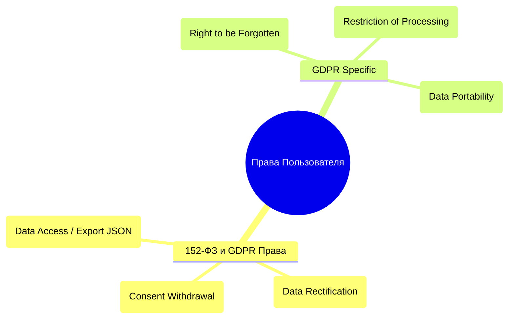

# Документы обслуживания и конфиденциальности AI Adaptive Coach v7.0

Данный документ содержит **Часть I: Публичная оферта и Пользовательское соглашение (Terms of Service)** и **Часть II: Политика конфиденциальности (Privacy Policy - 152-ФЗ + GDPR Compliance)**.

---

# ЧАСТЬ I. ПУБЛИЧНАЯ ОФЕРТА И ПОЛЬЗОВАТЕЛЬСКОЕ СОГЛАШЕНИЕ (TERMS OF SERVICE)

**Дата публикации:** 01 августа 2026 г.  
**Редакция:** 7.0  
**Оператор:** ООО «АИ СПОРТ» (ОГРН XXXXXXXXXXXXX, ИНН XXXXXXXXXX)

Настоящий документ является официальным публичным предложением (Публичной офертой в соответствии со ст. 437 Гражданского кодекса Российской Федерации) ООО «АИ СПОРТ» (далее — **«Оператор»**) заключить Пользовательское соглашение об использовании платформы **AI Adaptive Coach v7.0** на нижеуказанных условиях.

---

## 1. Термины и определения
1.1. **Платформа / Сервис** — программный комплекс «AI Adaptive Coach v7.0», включающий веб-сайт, PWA-приложение, Telegram-бот, алгоритмы ИИ-анализа телеметрии и B2B-кабинет тренера.  
1.2. **Пользователь** — физическое или юридическое лицо, осуществившее акцепт оферты.  
1.3. **Акцепт оферты** — полное и безоговорочное принятие условий Соглашения путем регистрации в Сервисе, нажатия кнопки «Зарегистрироваться», отправки команды `/start` в Telegram-боте или оплаты Тарифа.  
1.4. **ИИ-Контент / Тренировочный план** — автоматизированно сгенерированные алгоритмами сервиса графики, рекомендации по пульсу, темпу и физическим упражнениям.

---

## 2. Предмет соглашения
2.1. Оператор предоставляет Пользователю неисключительное право использования Платформы (простую неисключительную лицензию) по функциональному назначению для самостоятельных спортивных тренировок (B2C) или ведения подопечных атлетов (B2B).  
2.2. Сервис носит **информационно-аналитический спортивный характер** и не оказывает медицинских услуг (в соответствии с 323-ФЗ).

---

## 3. Тарифы, порядок расчетов и подписки (B2C и B2B)
3.1. Доступ к расширенному функционалу Платформы предоставляется на условиях платной подписки (Тарифы B2C и B2B Кабинет Тренера).  
3.2. Оплата производится через интегрированные платежные шлюзы с моментальной выдачей кассового чека по 54-ФЗ.  
3.3. **Рекуррентные платежи**: При оформлении подписки Пользователь соглашается на автоматическое ежемесячное/ежегодное безакцептное списание средств. Пользователь вправе отключить рекуррентные списания в любое время в Личном кабинете.  
3.4. **Порядок возвратов**: Возврат денежных средств за неиспользованный период подписки осуществляется по письменному заявлению Пользователя на `support@aicoach.ru` в течение 10 рабочих дней с момента получения заявления.

---

## 4. Интеллектуальная собственность (ИС)
4.1. Все исключительные права на Платформу, включая ИИ-модели, исходный код, графические интерфейсы, товарные знаки и алгоритмы, принадлежат Оператору.  
4.2. Пользователю предоставляется право использовать сгенерированные Тренировочные планы исключительно в личных некоммерческих целях (для B2C) или в рамках профессиональной тренерской деятельности (для B2B).

---

## 5. Ограничение ответственности и гарантии
5.1. Платформа предоставляется на условиях **«КАК ЕСТЬ» («AS IS»)**. Оператор не гарантирует, что Сервис будет функционировать бесперебойно и без ошибок.  
5.2. **Отказ от медицинских гарантий**: Пользователь признает, что ИИ-рекомендации не являются медицинскими диагнозами. Оператор не несет ответственности за любой ущерб здоровью, полученный в результате выполнения упражнений.  
5.3. Предельный размер ответственности Оператора по любым искам ограничен суммой, фактически уплаченной Пользователем за подписку за последний 1 календарный месяц.

---

## 6. Разрешение споров и подсудность
6.1. Досудебный претензионный порядок обязателен. Срок ответа на претензию — 30 (тридцать) календарных дней.  
6.2. При невозможности достижения согласия все споры подлежат рассмотрению в суде по месту нахождения Оператора (г. Москва, РФ) в соответствии с законодательством Российской Федерации.

---

# ЧАСТЬ II. ПОЛИТИКА КОНФИДЕНЦИАЛЬНОСТИ (PRIVACY POLICY - 152-ФЗ & GDPR COMPLIANCE)

**Дата публикации:** 01 августа 2026 г.

Настоящая Политика конфиденциальности определяет порядок обработки и защиты персональных данных Пользователей платформы **AI Adaptive Coach v7.0** со стороны Оператора ООО «АИ СПОРТ» в соответствии с 152-ФЗ (РФ) и General Data Protection Regulation (GDPR - EU 2016/679).

---

## 1. Категории собираемых данных
1.1. **Идентификационные данные**: Имя, e-mail, номер телефона, Telegram ID, дата рождения, пол.  
1.2. **Спортивно-телеметрические данные**: Масса тела, рост, показатели ЧСС, $VO_2max$, HRV, файлы спортивных треков (.FIT, .TCX), уровень утомляемости.  
1.3. **Технические данные**: IP-адрес, тип устройства, куки (Cookies), логи доступа.

---

## 2. Цели и правовые основания обработки

| Цель | Категории данных | Правовое основание (152-ФЗ / GDPR) |
| :--- | :--- | :--- |
| Регистрация и идентификация | Имя, e-mail, Phone, Telegram ID | Исполнение договора (ст. 6 152-ФЗ / Art. 6(1)(b) GDPR) |
| Построение ИИ-тренировочных планов | Телеметрия, ЧСС, HRV, спортивный стаж | Согласие пользователя (ст. 9 152-ФЗ / Art. 6(1)(a), Art. 9 GDPR) |
| Выписка кассовых чеков (54-ФЗ) | e-mail, Телефон, Сумма платежа | Выполнение установленной законом обязанности (Art. 6(1)(c) GDPR) |

---

## 3. Локализация и Безопасность (152-ФЗ & GDPR)
3.1. **Локализация в РФ**: Персональные данные граждан РФ хранятся в защищенных дата-центрах на территории Российской Федерации (Yandex Cloud / Selectel).  
3.2. **Шифрование**: Все чувствительные данные зашифрованы с использованием алгоритма **AES-256** в покое и **TLS 1.3** при передаче.  
3.3. **Обезличивание**: Передача данных в ИИ-алгоритмы осуществляется исключительно в обезличенном виде (без прямых PII-идентификаторов).

---

## 4. Права субъектов данных (152-ФЗ и GDPR)

Пользователи обладают следующими правами:

- **Право на выгрузку (Data Portability)**: Экспорт всех фитнес-данных и профиля в машиночитаемом формате `.JSON` через Личный кабинет.
- **Право на удаление («Право на забвение»)**: Каскадное удаление аккаунта и всех связанных ПДн при нажатии кнопки «Удалить аккаунт» или по запросу на `dpo@aicoach.ru`.

---

## 5. Использование файлов Cookie и аналитика
5.1. Сервис использует технические куки для сохранения сессии и аутентификации.  
5.2. Аналитические куки собираются только с предварительного согласия Пользователя через Баннер Cookie (Cookie Banner).

---

## 6. Контакты Оператора и DPO

- **Оператор ПДн**: ООО «АИ СПОРТ»  
- **Адрес**: 101000, г. Москва, ул. Спортивная, д. 1  
- **Ответственный за защиту данных (DPO)**: `dpo@aicoach.ru`  
- **Служба поддержки**: `support@aicoach.ru`
