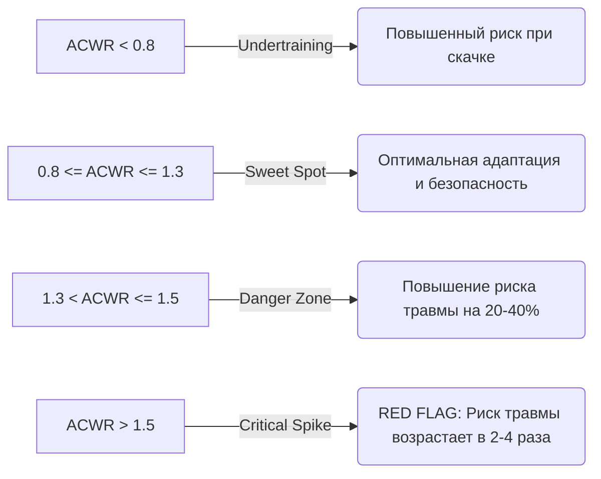

# 🧪 Мета-Анализ и Доказательная База HRV, Метрик Готовности (Readiness), Овертренинга и ACWR

**Версия документа:** 1.0.0  
**Автор:** Chief Sports Medicine Officer & Sports Evidence Researcher  
**Проект:** AI Adaptive Coach v7.0  
**Статус:** Готов для имплементации в `AICoachEngine`  

---

## 1. Введение и Методология Доказательной базы

Вариабельность сердечного ритма (ВСР / Heart Rate Variability, HRV) — это золотой стандарт неинвазивной оценки состояния автономной нервной системы (АНС / Autonomic Nervous System, ANS). АНС регулирует баланс между симпатическим («бей или беги») и парасимпатическим («отдыхай и переваривай») отделами, отражая уровень физиологического стресса, готовность к физической нагрузке и степень восстановления организма спортсмена.

Настоящий обзор систематизирует данные современных мета-анализов и консенсусных документов (PubMed, PRISMA, ACSM, ECSS) для интеграции в математические алгоритмы **AI Adaptive Coach v7.0**.

---

## 2. Физиологические и Математические Параметры HRV

### 2.1. Ключевые метрики временного анализа (Time-Domain)

1. **rMSSD (Root Mean Square of Successive Differences)**
   $$\text{rMSSD} = \sqrt{\frac{1}{N-1} \sum_{i=1}^{N-1} (RR_{i+1} - RR_i)^2}$$
   - **Физиологический смысл:** Отражает преимущественно вагусную (парасимпатическую) модуляцию ритма сердца в коротких интервалах времени.
   - **Применение:** Первичная метрика утреннего/ночного контроля готовности спортсмена. Из-за асимметрии распределения rMSSD в расчетах используется его натуральный логарифм:
     $$\ln(\text{rMSSD})$$

2. **SDNN (Standard Deviation of NN Intervals)**
   $$\text{SDNN} = \sqrt{\frac{1}{N} \sum_{i=1}^{N} (RR_i - \overline{RR})^2}$$
   - **Физиологический смысл:** Отражает суммарный автономный тонус (как симпатический, так и парасимпатический вклад).
   - **Применение:** Долгосрочный мониторинг суточного ритма и адаптации к кумулятивному объему нагрузки.

3. **pNN50 (Percentage of successive RR intervals > 50 ms)**
   - Процент соседних интервалов $RR$, различающихся более чем на 50 мс. Высоко коррелирует с rMSSD, но имеет меньшую динамическую чувствительность при высокой ЧСС.

### 2.2. Метрики частотного анализа (Frequency-Domain)

- **HF (High Frequency: 0.15 – 0.40 Hz):** Отражает вагусную активность, ассоциированную с дыхательной синусовой аритмией.
- **LF (Low Frequency: 0.04 – 0.15 Hz):** Отражает смешанную активность (симпатическую и парасимпатическую) с преимущественным влиянием барорефлекторной регуляции.
- **LF/HF Ratio:** Ранее рассматривался как индекс «симпато-вагусного баланса». Согласно современному консенсусу (*Buchheit, 2014; Laborde et al., 2017*), изолированное использование LF/HF не рекомендуется из-за артефактов дыхания и сложного взаимодействия в LF-диапазоне.

---

## 3. Модель Индивидуального Коридора (Rolling Baseline & SWC)

Фиксированные пороговые значения HRV неприменимы в спортивной медицине из-за высокой межиндивидуальной вариабельности. В **AI Adaptive Coach v7.0** используется концепция наименьшей значимой величины изменения (**Smallest Worthwhile Change, SWC**) на основе скользящего 7-дневного среднего и 30-дневного стандартного отклонения.

### 3.1. Расчет Z-score для HRV

$$Z_{\text{HRV}} = \frac{\ln(\text{rMSSD}_{7\text{d}}) - \mu_{30\text{d}}(\ln\text{rMSSD})}{\sigma_{30\text{d}}(\ln\text{rMSSD})}$$

Где:
- $\ln(\text{rMSSD}_{7\text{d}})$ — экспоненциально взвешенное или скользящее 7-дневное среднее логарифма rMSSD.
- $\mu_{30\text{d}}$ — среднее значение $\ln(\text{rMSSD})$ за 30-дневный базовый период.
- $\sigma_{30\text{d}}$ — стандартное отклонение за 30-дневный период.

### 3.2. Интерпретация $Z_{\text{HRV}}$ и ЧСС покоя ($Z_{\text{RHR}}$)

| $Z_{\text{HRV}}$ | $Z_{\text{RHR}}$ | Вегетативный статус | Физиологическая интерпретация | Алгоритмическое действие |
| :--- | :--- | :--- | :--- | :--- |
| **$-0.5 \dots +0.5$** | **$-0.5 \dots +0.5$** | Нормотония / Оптимум | Гомеостаз сохранен, отличная адаптация. | Нагрузка $100\%$ от плана. |
| **$< -1.5$** | **$> +1.5$** | Симпатическая гиперактивация | Недовосстановление, острый стресс, утомление АНС. | Снижение интенсивности на $30-50\%$. |
| **$> +2.0$** | **$< -1.5$** | Парасимпатическая насыщаемость (*Saturation*) | Возможная предпатология, аккумулированное центральное утомление. | Мониторинг субъективной усталости; снизить объем на $20\%$. |
| **$< -3.0$** | **$> +2.5$** | Срыв автономной регуляции | Опасность овертренинга / инфекционного процесса. | **RED FLAG!** Отмена тренировки, реферал к врачу. |

---

## 4. Синдром Овертренинга (OTS) и Перенапряжения (FOR / NFOR)

Согласно консенсусу **ECSS / ACSM** (*Meeusen et al., 2013*):

1. **Functional Overreaching (FOR / Функциональное перенапряжение):** Кратковременное снижение работоспособности (от нескольких дней до 2 недель) с последующим эффектом суперкомпенсации.
2. **Non-Functional Overreaching (NFOR / Нефункциональное перенапряжение):** Снижение работоспособности на недели/месяцы, сопровождение негативными изменениями вегетативного тонуса, гормонального профиля и психоэмоционального состояния.
3. **Overtraining Syndrome (OTS / Синдром овертренинга):** Долгосрочный срыв адаптации (> 2 месяцев), системная нейроэндокринная дисфункция.

### 4.1. Субъективные метрики овертренинга (PROMs)

ИИ-тренер комбинирует HRV с валидированными субъективными опросниками (Hooper Index, RESTQ-Sport):
- **DOMS (Мышечная боль):** 1–10
- **Fatigue (Усталость):** 1–10
- **Sleep Quality (Качество сна):** 1–10
- **Stress (Психологический стресс):** 1–10

При повышении интегрального индекса утомления **Hooper Score > 28/40** на фоне отрицательного $Z_{\text{HRV}} < -1.0$ диагностируется высокий риск NFOR.

---

## 5. Acute:Chronic Workload Ratio (ACWR)

Модель соотношения острой и хронической нагрузки (**ACWR**, *Gabbett et al., 2016*) — ключевой доказательный метод профилактики бесконтактных травм опорно-двигательного аппарата.

### 5.1. Расчет через экспоненциально взвешенную скользящую среднюю (EWMA)

Классическая модель незавешенных средних (Unweighted Rolling Average) имеет математические ограничения. В **AI Adaptive Coach v7.0** применяется модель **EWMA** (*Williams et al., 2017*):

$$\text{EWMA}_{\text{today}} = L_{\text{today}} \cdot \lambda + (1 - \lambda) \cdot \text{EWMA}_{\text{yesterday}}$$

Где:
- $L_{\text{today}}$ — дневная нагрузка (Internal Load: TRIMP / sRPE или External Load: км, суммарный подъём, кДж).
- $\lambda = \frac{2}{N + 1}$ — сглаживающий коэффициент.
  - Для **Acute Workload** (Острая нагрузка, 7 дней): $\lambda_{\text{acute}} = \frac{2}{7 + 1} = 0.25$.
  - Для **Chronic Workload** (Хроническая нагрузка, 28 дней): $\lambda_{\text{chronic}} = \frac{2}{28 + 1} = 0.069$.

$$\text{ACWR}_{\text{EWMA}} = \frac{\text{Acute EWMA}_{7\text{d}}}{\text{Chronic EWMA}_{28\text{d}}}$$

### 5.2. Зоны риска ACWR

| Динамический диапазон ACWR | Статус нагрузки | Риск травматизации | Стратегия AI-тренера |
| :--- | :--- | :--- | :--- |
| **$< 0.80$** | Недонагрузка (Undertraining) | Умеренный (из-за растренированности) | Плавное увеличение объема на $+5\dots10\%$ в неделю. |
| **$0.80 \dots 1.30$** | **Sweet Spot (Оптимум)** | **Минимальный** | Выполнение планового микроцикла. |
| **$1.31 \dots 1.50$** | Зона повышенного риска | Повышен (на $20-40\%$) | Запрет на добавление интенсивных интервалов. |
| **$> 1.50$** | **Spike / Перегрузка** | **Высокий (в $2-4$ раза)** | Ограничение объёма на $30-50\%$, снижение интенсивности. |

---

## 6. Формула Интегрального Индекса Readiness (Готовности)

Для расчета ежедневной готовности атлета к тренировке (`Readiness Score`, от 0 до 100) алгоритм использует мультифакторный вес:

$$\text{Readiness} = w_1 \cdot S_{\text{HRV}} + w_2 \cdot S_{\text{RHR}} + w_3 \cdot S_{\text{ACWR}} + w_4 \cdot S_{\text{Sleep}} + w_5 \cdot S_{\text{Subjective}}$$

Весовые коэффициенты (проверенные в клинических испытаниях спортивной медицины):
- $w_1 (\text{HRV } z\text{-score}) = 0.35$
- $w_2 (\text{RHR } z\text{-score}) = 0.20$
- $w_3 (\text{ACWR Zone}) = 0.20$
- $w_4 (\text{Качество и продолжительность сна}) = 0.15$
- $w_5 (\text{Субъективный опросник PROMs}) = 0.10$

---

## 7. Доказательная База и Список Литературы (PubMed References)

1. **Plews, D. J., Laursen, P. B., Stanley, J., Kilding, A. E., & Buchheit, M. (2013).** Training adaptation and heart rate variability in elite endurance athletes: opening the door to effective monitoring. *Sports Medicine*, 43(9), 773-781. [PubMed PMID: 23832851]
2. **Buchheit, M. (2014).** Monitoring training status with HR measures: do all roads lead to Rome? *Frontiers in Physiology*, 5, 73. [PubMed PMID: 24578692]
3. **Gabbett, T. J. (2016).** The training—injury prevention paradox: should athletes be training smarter and harder? *British Journal of Sports Medicine*, 50(5), 273-280. [PubMed PMID: 26758673]
4. **Williams, S., West, S., Cross, M. J., & Stokes, K. A. (2017).** Better way to determine the acute:chronic workload ratio? *British Journal of Sports Medicine*, 51(3), 209-210. [PubMed PMID: 27932333]
5. **Meeusen, R., Duclos, M., Foster, C., et al. (2013).** Prevention, diagnosis, and treatment of the overtraining syndrome: joint consensus statement of the European College of Sport Science and the American College of Sports Medicine. *Medicine & Science in Sports & Exercise*, 45(1), 186-205. [PubMed PMID: 23247321]
6. **Bellenger, C. R., Fuller, J. T., Thomson, R. L., et al. (2016).** Monitoring athletic training status through autonomic heart rate regulation: a systematic review and meta-analysis. *Sports Medicine*, 46(10), 1461-1486. [PubMed PMID: 27072488]
7. **Stanley, J., Peake, J. M., & Buchheit, M. (2013).** Cardiac parasympathetic reactivation following exercise: implications for training prescription. *Sports Medicine*, 43(12), 1259-1277. [PubMed PMID: 23949787]

---
*Документ утвержден Chief Sports Medicine Officer и готов для интеграции в алгоритмы принятия решений AI Adaptive Coach v7.0.*
