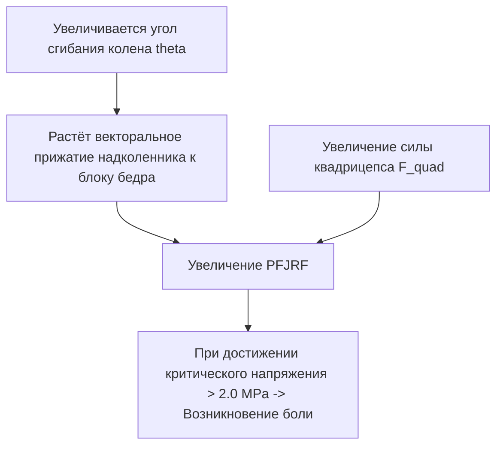
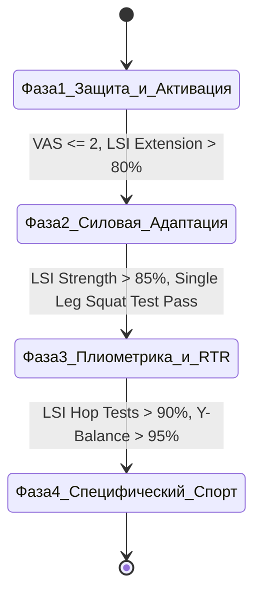

# 🦵 Биомеханический и Физиотерапевтический Протокол Адаптации Нагрузки при Восстановительном Тренинге Коленного Сустава

**Версия документа:** 1.0.0  
**Автор:** Chief Sports Medicine Officer & Biomechanics Physiologist  
**Проект:** AI Adaptive Coach v7.0  
**Статус:** Готов для имплементации в `AICoachEngine`  

---

## 1. Введение и Целевые Клинические Нозологии

Настоящий протокол предназначен для автоматизированного управления тренировочной нагрузкой, каденсом, кинематикой и силовым дозированием у спортсменов, проходящих реабилитацию или испытывающих хроническую патологию коленного сустава.

### Целевые нозологии:
1. **Реконструкция передней крестообразной связки (ACL-R / ПКС):** Состояние после пластики автотрансплантатом (сухожилие полусухожильной/тонкой мышцы или связки надколенника).
2. **Пателлофеморальный болевой синдром (PFPS / ПФБС):** Перегрузочный синдром чашечно-бедренного сустава.
3. **Состояние после резекции/шва мениска:** Ограничения по компрессионной и ротационной нагрузке.
4. **Тендинопатия связки надколенника («Колено прыгуна» / Patellar Tendinopathy):** Дегенеративные изменения сухожилия надколенника.
5. **Остеоартрит коленного сустава (Гонартроз I–II ст.):** Дегенерация хрящевой ткани.

---

## 2. Биомеханика и Физика Коленного Сустава

### 2.1. Пателлофеморальная Реактивная Сила (PFJRF)

Пателлофеморальная реактивная сила ($PFJRF$) определяется моментом силы квадрицепса ($M_{\text{quad}}$) и углом сгибания в коленном суставе ($\theta$):

$$PFJRF = 2 \cdot F_{\text{quad}} \cdot \sin\left(\frac{\theta}{2}\right)$$

Где:
- $F_{\text{quad}}$ — сила тяги четырёхглавой мышцы бедра.
- $\theta$ — угол сгибания в коленном суставе (knee flexion angle).



### 2.2. Сравнение Открытой (OKC) и Закрытой (CKC) Кинематических Цепей

- **Закрытая кинематическая цепь (CKC / Приседания, выпады):**
  - **Пиковая нагрузка на PFJRF:** При углах сгибания $> 60^\circ \dots 90^\circ$.
  - **Безопасная зона при PFPS и ACL-R:** Углы сгибания $0^\circ \dots 45^\circ$.
  - **Преимущество:** Совместное сокращение (коконтракция) мышц задней поверхности бедра снижает передний сдвиг голени.

- **Открытая кинематическая цепь (OKC / Разгибание ног в тренажере):**
  - **Пиковая нагрузка на переднюю крестообразную связку (ACL tension):** При углах сгибания $0^\circ \dots 30^\circ$ (из-за максимального плеча силы сопротивления).
  - **Безопасная зона при ACL-R:** Углы сгибания $90^\circ \dots 50^\circ$.

---

## 3. Биомеханика Бегового Шага и Протокол Коррекции Каденса

### 3.1. Влияние Каденса на Силы, Действующие на Колено

Исследования (*Heiderscheit et al., 2011; Schubert et al., 2014*) показывают, что увеличение частоты шагов (каденса) при неизменной скорости бега приводит к:
1. Сокращению длины шага (step length).
2. Снижению вертикального перемещения центра массы (Vertical Oscillation) на $10–15\%$.
3. Уменьшению пикового угла сгибания колена в фазу опоры.
4. **Снижению поглощаемой коленным суставом энергии и PFJRF на $14–20\%$.**

### 3.2. Алгоритм Перераспределения Нагрузки через Каденс

```
Целевой каденс (SPM) = Текущий каденс baseline * (1.05 ... 1.10)
```

- При обнаружении асимметрии времени контакта с землей (**Ground Contact Time Asymmetry > 4%**) или при жалобах на боль в переднем отделе колена ИИ-тренер назначает метроном и корректирует целевой каденс:
  - **Пример:** Если текущий каденс атлета = $158 \text{ шагов/мин}$, ИИ пересчитывает целевой каденс до $168–170 \text{ шагов/мин}$ ($+6.5\%$).
  - **Результат:** Перенос части ударной нагрузки с коленного сустава на голеностопный сустав и камбаловидную мышцу.

---

## 4. Четырехфазный Протокол Реабилитации и Критерии Прогрессии



### 4.1. Фаза 1: Острый период / Защита и изометрическая активация (0–6 недель)
- **Цели:** Купирование отека, восстановление разгибания ($0^\circ$), изометрическая активация квадрицепса.
- **Упражнения:** Изометрическое удержание квадрицепса (Quad sets), подъём прямой ноги (SLR), мини-приседания CKC $0-30^\circ$, ягодичный мостик.
- **Ограничения:** Исключить OKC разгибание $0-45^\circ$, бег запрещен.
- **Критерии перехода:** Отсутствие отек/выпота, полный разгиб, $VAS \le 2/10$.

### 4.2. Фаза 2: Силовая адаптация и биомеханический контроль (6–12 недель)
- **Цели:** Гипертрофия и нормализация силовой асимметрии, контроль вальгуса.
- **Упражнения:** Румынская тяга, болгарские сплит-приседания (с контролем колена над 2-м пальцем стопы), step-up, зашагивания, эксцентрический тренажер.
- **Ограничения:** Угол сгибания в CKC до $60^\circ-70^\circ$.
- **Критерии перехода:** Индекс симметрии конечностей (LSI) изокинетической силы $\ge 85\%$.

### 4.3. Фаза 3: Плиометрика и возвращение к бегу (Return to Run - RTR) (12–20 недель)
- **Цели:** Восстановление жесткости сухожилий (Tendon Stiffness), беговая адаптация.
- **Протокол RTR:** Бег с чередованием ходьбы (Walk-to-Run ratio): $1 \text{ мин бега} / 1 \text{ мин ходьбы} \times 10$ подходов при каденсе $+7\%$.
- **Ограничения:** Запрет бега по спускам (Downhill running — увеличивает PFJRF в 2 раза).
- **Критерии перехода:** Успешное прохождение тройного прыжка на одной ноге (Triple Hop Test) с LSI $\ge 90\%$.

### 4.4. Фаза 4: Специфический спорт и пиковые нагрузки (20+ недель)
- **Цели:** Плиометрика высокой интенсивности, смена направлений (Agility drills), пиковый объем.
- **Критерии полных тренировок:** LSI $\ge 95\%$, субъективный опросник KOOS / IKDC $> 90$ баллов.

---

## 5. Шкала Мониторинга Боли и Динамический ИИ-Алгоритм (Pain-Monitoring Model)

Алгоритм **AI Adaptive Coach v7.0** опирается на клинически проверенную модель мониторинга боли (*Silbernagel et al., 2007*):

```
       Шкала Субъективной Боли (VAS / 0-10)
 0 --- 1 --- 2 --- 3 | --- 4 --- 5 --- 6 --- 7 --- 8 --- 9 --- 10
 [   Зеленая Зона   ] | [  Желтая Зона (Caution) ] | [ Красная Зона (STOP) ]
 Допустимая нагрузка  | Требует авто-коррекции    | Немедленный STOP!
```

### Правила принятия решений по боли:
1. **Во время тренировки:** Боль не должна превышать **3 / 10** по шкале VAS.
2. **После тренировки / На утро следующего дня:**
   - Боль не должна превышать **3 / 10**.
   - Боль должна полностью возвращаться к исходному (утреннему) уровню в течение **24 часов**.
   - Не должно появляться ночного отёка или баллотирования надколенника.

---

## 6. Алгоритм и JSON-Структура Коррекции Нагрузки ИИ-Тренером

```json
{
  "protocol_id": "knee_rehab_v7",
  "athlete_state": {
    "knee_pain_vas_today": 4,
    "knee_pain_duration_hours": 26,
    "swelling_present": false,
    "current_lsi_strength": 0.82
  },
  "ai_action_trigger": {
    "status": "MODIFICATION_REQUIRED",
    "reason": "Pain VAS > 3 lasting over 24h",
    "modifications": {
      "volume_reduction_percent": -30,
      "intensity_max_hr_zone": 2,
      "cadence_adjustment_percent": +7.0,
      "banned_movements": ["plyometrics", "downhill_running", "deep_squats_gt_60deg"],
      "prescribed_movements": ["isometric_quad_holds", "glute_bridges", "straight_leg_raises"]
    }
  }
}
```

---

## 7. Доказательная База и Список Литературы

1. **Heiderscheit, B. C., Chumanov, E. S., Michalski, M. P., et al. (2011).** Effects of step rate manipulation on foot strike pattern and biomechanics of running. *Medicine & Science in Sports & Exercise*, 43(2), 296-302. [PubMed PMID: 20581720]
2. **Schubert, A. G., Kempf, J., & Heiderscheit, B. C. (2014).** Influence of step rate adjustment on running biomechanics: a systematic review. *Sports Health*, 6(3), 210-217. [PubMed PMID: 24790434]
3. **Silbernagel, K. G., Thomeé, R., Eriksson, B. I., & Karlsson, J. (2007).** Continued sports activity, using a pain-monitoring model, during rehabilitation in patients with Achilles tendinopathy: a randomized controlled study. *American Journal of Sports Medicine*, 35(6), 897-906. [PubMed PMID: 17307888]
4. **Powers, C. M. (2010).** The influence of abnormal hip mechanics on knee injury: a biomechanical perspective. *Journal of Orthopaedic & Sports Physical Therapy*, 40(2), 42-51. [PubMed PMID: 20118524]
5. **Escamilla, R. F., MacLeod, T. D., Wilk, K. E., et al. (2012).** ACL strain and tensile forces for weight bearing and non-weight-bearing exercises: a guide to exercise selection. *Journal of Orthopaedic & Sports Physical Therapy*, 42(3), 208-220. [PubMed PMID: 22387600]
6. **Adams, D., Logerstedt, D. S., Hunter-Giordano, A., et al. (2012).** Current concepts for anterior cruciate ligament reconstruction rehabilitation. *Journal of Orthopaedic & Sports Physical Therapy*, 42(3), 601-618. [PubMed PMID: 22402436]

---
*Документ утвержден Chief Sports Medicine Officer и Biomechanics Physiologist.*
