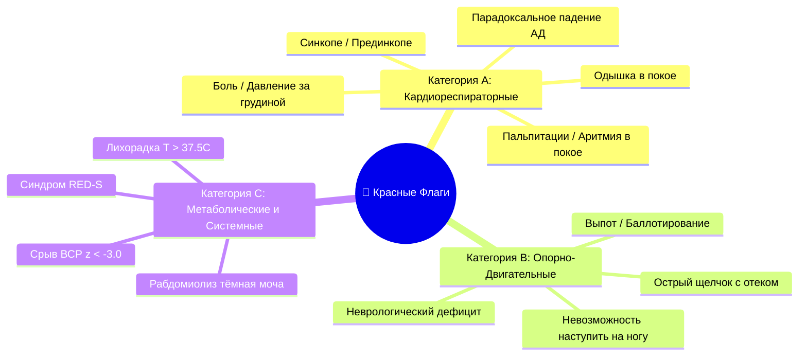
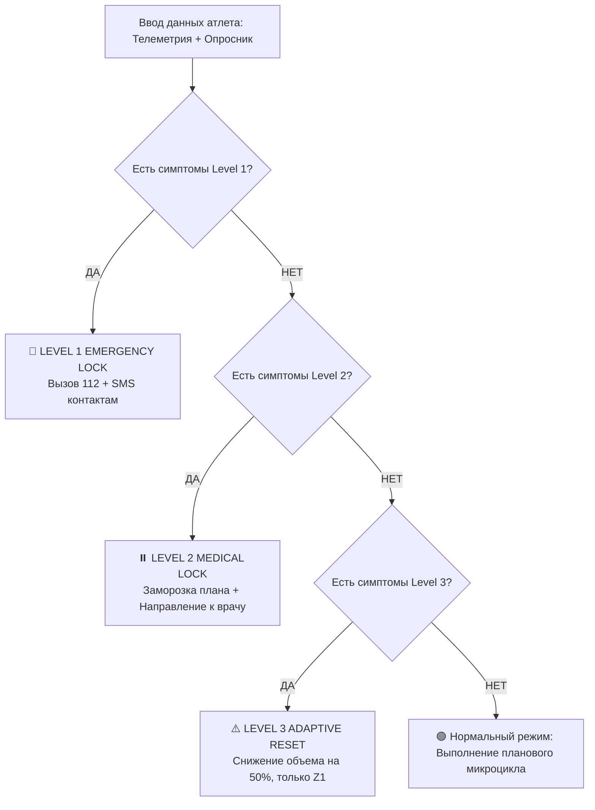

# 🚨 Врачебный Регламент «Красных Флагов», Алгоритм Триажа и Протокол Реферации к Врачу

**Версия документа:** 1.0.0  
**Автор:** Chief Sports Medicine Officer & Medical Advisory Board  
**Проект:** AI Adaptive Coach v7.0  
**Статус:** Обязательный регламент безопасности для `AICoachEngine`  

---

## 1. Введение и Медико-Правовые Принципы Безопасности

Автоматизированная система **AI Adaptive Coach v7.0** не является заменяющим врачебным органом, однако несет прямую ответственность за предотвращение жизнеугрожающих состояний, внезапной сердечной смерти (ВСС / Sudden Cardiac Death) и тяжелых травм.

Настоящий документ устанавливает строгий алгоритм скрининга и немедленной блокировки тренировочного процесса при выявлении клиника-физиологических симптомов высокого риска (**Красных Флагов / Red Flags**).

---

## 2. Полная Систематизация «Красных Флагов» (Red Flags Taxonomy)



### 2.1. Категория A: Кардиоваскулярные и Кардиореспираторные Флаги (CR-RF)

При появлении хотя бы одного из следующих симптомов тренировочный процесс останавливается **немедленно**:

1. **Ангинозный синдром:** Острая, давящая, сжимающая боль или чувство тяжести за грудиной, с иррадиацией в левую руку, плечо, шею или нижнюю челюсть.
2. **Аритмия / Пальпитации:** Ощущение «перебоев» в работе сердца, хаотического или часоподобного учащенного сердцебиения в покое ($HR > 100 \text{ уд/мин}$) или при незначительной нагрузке.
3. **Синкопе / Прединкопе:** Обморок, эпизоды выраженного головокружения, «потемнения в глазах» или потери равновесия во время или сразу после физической нагрузки.
4. **Неадекватная одышка:** Тяжелая одышка, не соответствующая выполняемой нагрузке, или одышка в состоянии покоя (ДН 1-3 ст.).
5. **Парадоксальный гемодинамический ответ:** Падение систолического артериального давления ниже базового уровня при возрастании нагрузки, или неадекватная тахикардия ($HR > HR_{\text{max predicted}} = 220 - \text{возраст}$).

### 2.2. Категория B: Острые Опорно-Двигательные и Неврологические Флаги (MSK-RF)

1. **Невозможность осевой нагрузки (Ottawa Rules):** Неспособность атлета сделать 4 шага на травмированной конечности сразу после повреждения.
2. **Выраженный суставной выпот:** Симптом баллотирования надколенника, быстрый отек сустава (в течение 1–2 часов после травмы — гемартроз).
3. **Острый неврологический дефицит:** Онемение, парестезии, слабость группы мышц (парез foot-drop), острая корешковая боль с иррадиацией по ходу седалищного/бедерного нерва.
4. **Видимая деформация / Патологическая подвижность:** Подозрение на перелом или полный разрыв связок.

### 2.3. Категория C: Метаболические, Системные и Овертренинговые Флаги (MET-RF)

1. **Подозрение на Рабдомиолиз:** Выраженная спонтанная миалгия + моча цвета «колы» / чая (миоглобинурия) после экстремальной нагрузки (CrossFit, ультрамарафон).
2. **Острая инфекция / Лихорадка ($T > 37.5^\circ\text{C}$):** Физическая нагрузка при вирусных инфекциях категорически запрещена из-за высокого риска развития **вирусного миокардита**.
3. **Критический автономный срыв:** $Z_{\text{HRV}} < -3.0$ в сочетании с приростом ЧСС покоя $RHR > +15 \text{ уд/мин}$ от 30-дневного базиса.
4. **Синдром RED-S (Relative Energy Deficiency in Sport):** ИМТ $< 17.5 \text{ кг/м}^2$, вторичная аменорея у женщин $> 3$ месяцев, рецидивирующие стресс-переломы.

---

## 3. Трехуровневая Алгоритмическая Матрица Триажа (3-Tier Triage Architecture)

| Уровень Триажа | Триггер | Системный Статус ИИ | Физическое Действие | Условия Разблокировки |
| :--- | :--- | :--- | :--- | :--- |
| **LEVEL 1: EMERGENCY** | Симптомы Категории A (Ангина, Синкопе) или Рабдомиолиз. | **CRITICAL HARD LOCK** | Немедленный STOP. Экран вызова 112 / 911. SMS близким. | Разблокировка **только** администратором после предоставления заключения ВК / кардиолога. |
| **LEVEL 2: MEDICAL REFERRAL** | Симптомы Категории B (Травмы, отек) или лихорадка $T > 37.5^\circ\text{C}$. | **PLAN FROZEN** | Заморозка спортивного плана. Направление к профильному врачу. | Загрузка медицинского заключения/справки в приложение с валидацией OCR/врачом. |
| **LEVEL 3: CAUTION ADJUST** | $Z_{\text{HRV}} < -2.0$ или боль в колене VAS 4-5/10. | **ADAPTIVE RESTRICTION** | Авто-сброс объема на $50\%$, отмена интервалов, только Z1. | Нормализация $Z_{\text{HRV}} > -1.0$ и $VAS \le 2/10$ в течение 48 часов. |



---

## 4. Программируемый Движок Проверок (Python Pseudocode Engine)

```python
from dataclasses import dataclass
from typing import List, Optional

@dataclass
class TriageAssessmentInput:
    chest_pain_or_pressure: bool
    syncope_or_dizziness: bool
    palpitations_at_rest: bool
    fever_celsius: float
    dark_urine_rhabdo_suspect: bool
    inability_to_bear_weight: bool
    knee_pain_vas: int
    hrv_z_score: float
    rhr_elevation_bpm: int

class RedFlagsTriageEngine:
    def evaluate(self, data: TriageAssessmentInput) -> dict:
        # Level 1: Emergency Hard Lock
        if (data.chest_pain_or_pressure or 
            data.syncope_or_dizziness or 
            data.palpitations_at_rest or 
            data.dark_urine_rhabdo_suspect):
            return {
                "triage_level": "LEVEL_1_EMERGENCY",
                "action": "HARD_LOCK",
                "message": "Опасность для жизни! Немедленно прекратите тренировку и вызовите скорую помощь (112).",
                "call_emergency": True
            }
        
        # Level 2: Medical Referral
        if (data.fever_celsius >= 37.5 or 
            data.inability_to_bear_weight or 
            data.knee_pain_vas >= 6 or 
            data.hrv_z_score < -3.0):
            return {
                "triage_level": "LEVEL_2_MEDICAL_REFERRAL",
                "action": "FREEZE_PLAN",
                "message": "Обнаружены клинические красные флаги. Тренировочный план приостановлен. Требуется консультация врача.",
                "referral_specialist": "Кардиолог / Спортивный врач / Травматолог"
            }
        
        # Level 3: Caution Adaptive Reduction
        if (data.hrv_z_score < -1.5 or 
            data.rhr_elevation_bpm >= 10 or 
            data.knee_pain_vas >= 3):
            return {
                "triage_level": "LEVEL_3_CAUTION",
                "action": "REDUCE_LOAD",
                "message": "Внимание: организм переутомлен. Нагрузка снижена на 50%, интенсивные интервалы отменены.",
                "volume_reduction": 0.50
            }
            
        return {
            "triage_level": "LEVEL_0_CLEAR",
            "action": "PROCEED",
            "message": "Все показатели в норме. Готовность к тренировке высокая."
        }
```

---

## 5. Протокол Возобновления Тренировок (Return to Play Protocol - RTP)

После снятия медицинского блокирования Level 1 или Level 2 возобновление тренировок проводится по **6-ступенчатой системе GRTP (Graduated Return to Play)**:

1. **Ступень 1 (Symptom-Free Rest):** Полный покой до полного исчезновения симптомов (минимум 24-48 ч).
2. **Ступень 2 (Light Aerobic Exercise):** Ходьба, велоэргометр (ЧСС $< 60\% \text{ HR}_{\text{max}}$, до 20 минут).
3. **Ступень 3 (Sport-Specific Exercise):** Беговые упражнения без контакта и бега по спускам ($< 70\% \text{ HR}_{\text{max}}$).
4. **Ступень 4 (Non-Contact Training Drills):** Усложненные координационные упражнения, силовая тренировка с легким весом.
5. **Ступень 5 (Full Contact / High Intensity Practice):** Допуск к полноценным тренировкам после повторного медицинского осмотра.
6. **Ступень 6 (Return to Competition):** Полное восстановление соревновательной активности.

Переход между ступенями осуществляется только при **полном отсутствии симптомов в течение 24 часов** на текущей ступени.

---

## 6. Доказательная База и Список Литературы

1. **Mountjoy, M., Sundgot-Borgen, J., Badminton, L., et al. (2018).** IOC consensus statement on relative energy deficiency in sport (RED-S): 2018 update. *British Journal of Sports Medicine*, 52(11), 687-697. [PubMed PMID: 29773536]
2. **Harmon, K. G., Asif, I. M., Maleszewski, J. J., et al. (2015).** Incidence, etiology, and prevention of sudden cardiac death in adolescent athletes: a systematic review. *British Journal of Sports Medicine*, 49(18), 1172-1185. [PubMed PMID: 26038317]
3. **American College of Sports Medicine (ACSM). (2021).** *ACSM's Guidelines for Exercise Testing and Prescription* (11th ed.). Lippincott Williams & Wilkins.
4. **Corrado, D., Basso, C., Schiavon, M., & Thiene, G. (2008).** Pre-participation screening of young competitive athletes for prevention of sudden cardiac death. *Journal of the American College of Cardiology*, 52(24), 1981-1989. [PubMed PMID: 19064124]
5. **Stults-Kolehmainen, M. A., & Sinha, R. (2014).** The effects of stress on physical activity and exercise. *Sports Medicine*, 44(1), 81-121. [PubMed PMID: 24030837]

---
*Документ утвержден Chief Sports Medicine Officer и является законодательным регламентом для AI Adaptive Coach v7.0.*
