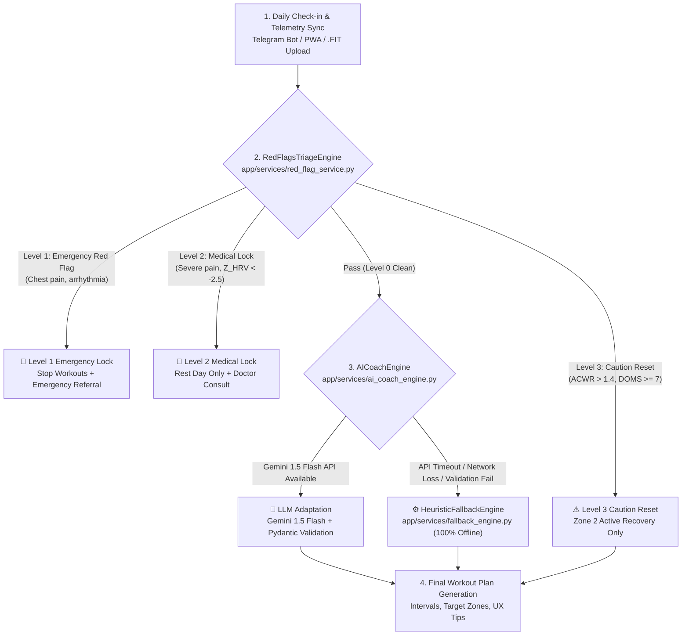
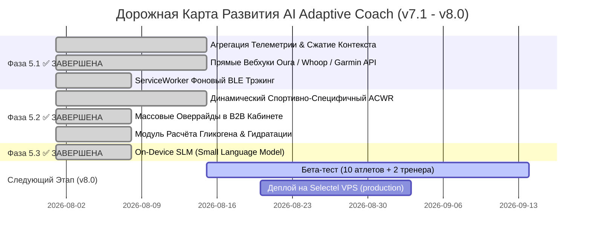

# 🧠 Функциональный Обзор, Критический Анализ и Дорожная Карта AI Тренера (v7.1+)

> **Проект:** AI Adaptive Coach v7.0  
> **Автор:** Lead Multi-Agent System Architect & Chief Sports Medicine Officer  
> **Дата последнего обновления:** 2026-08-02  
> **Статус:** ✅ Дорожная карта v7.1 ЗАВЕРШЕНА (Фазы 5.1, 5.2, 5.3 выполнены)  

---

## 1. Полное Описание Реализованного Функционала AI Тренера (v7.0)

Реализованный функционал представляет собой 4-компонентную эшелонированную систему ИИ-тренинга:

### 1.1 Модуль Триажа и Медицинской Безопасности (`RedFlagsTriageEngine`)
Файл: [`app/services/red_flag_service.py`](file:///D:/PyCharm_Projects/AI%20Sport/app/services/red_flag_service.py)
- **Защитный экран 323-ФЗ**: Выполняется **ДО** любого вызова LLM.
- **Уровни блокировок**:
  - `Level 1 (Emergency Lock)`: Острая боль за грудиной, головокружение, аритмия ➔ Полная блокировка тренировок + экстренный вызов врача.
  - `Level 2 (Medical Lock)`: Выраженный спад ВСР ($Z_{\text{HRV}} < -2.5$), острая боль в суставах (VAS $\ge 8$) ➔ Блокировка вызовов ИИ, назначение дня отдыха.
  - `Level 3 (Caution Reset)`: Превышение ACWR (>1.4), высокое утомление (DOMS $\ge 7$) ➔ Авто-замена интенсивной тренировки на лёгкое восстановление в Зоне 2.

### 1.2 Основной ИИ-Движок Адаптации (`AICoachEngine`)
Файл: [`app/services/ai_coach_engine.py`](file:///D:/PyCharm_Projects/AI%20Sport/app/services/ai_coach_engine.py)
- **Модель по умолчанию**: Google Gemini 1.5 Flash (высокая скорость, оптимизация токенов, фоллбэк на Gemini 1.5 Pro).
- **Сбор контекста**: Профиль атлета (целевой стартовый стаж, травмы коленного/плечевого суставов), телеметрия (.FIT), $Z_{\text{HRV}}$, EWMA ACWR, Hooper index.
- **Pydantic Валидация**: Жесткая схема `StructuredWorkoutPlan` (целевые пульсовые/мощностные зоны, интервалы, темп, текстовые подсказки).

### 1.3 Оффлайн-Движок Резервной Адаптации (`HeuristicFallbackEngine`)
Файл: [`app/services/fallback_engine.py`](file:///D:/PyCharm_Projects/AI%20Sport/app/services/fallback_engine.py)
- **100% Автономность**: Работает без доступа к сети и внешним API (бесплатно).
- **Детерминированные правила**:
  - При $Z_{\text{HRV}} < -1.5$ или $\text{ACWR} > 1.4$ ➔ Автоматическая замена интервалов VO2max / Темп на Zone 2 Recovery.
  - При DOMS $\ge 6$ ➔ Авто-снижение объёма на 30–50%.

### 1.4 Модуль Парсинга Телеметрии и Математического Моделирования
Файл: [`app/services/telemetry_analysis_service.py`](file:///D:/PyCharm_Projects/AI%20Sport/app/services/telemetry_analysis_service.py)
- **Парсинг файлов**: Бинарные `.FIT`, `.GPX`, `.TCX` (извлечение рядов ЧСС, каденса, мощности, высоты, отрезков).
- **Метрики нагрузки**:
  - Normalised Power (NP) & Intensity Factor (IF).
  - TRIMP (Training Impulse) по формуле Банистера.
  - TSS (Training Stress Score).
  - **EWMA ACWR** (Acute:Chronic Workload Ratio) с коэффициентами $\lambda_a = 0.25$ (7 дней) и $\lambda_c = 0.069$ (28 дней).
  - **$Z$-score ВСР**: $Z_{\text{HRV}} = \frac{\ln(\text{rMSSD}_{7d}) - \mu_{30d}}{\sigma_{30d}}$.

### 1.5 Интерфейсы и Слой Оркестрации (MAS)
- **B2C PWA Атлета** ([`/pwa`](file:///D:/PyCharm_Projects/AI%20Sport/frontend/pwa_athlete/index.html)): Daily Check-in (<45 сек), Visual Body Soreness Map, BLE стриминг пульса (Polar H10 / Garmin).
- **B2B Кабинет Тренера** ([`/coach`](file:///D:/PyCharm_Projects/AI%20Sport/frontend/b2b_coach/index.html)): Group Heatmap Matrix (100+ атлетов), 1-click override ИИ-планов.
- **Telegram Bot v3** ([`app/telegram_bot/bot.py`](file:///D:/PyCharm_Projects/AI%20Sport/app/telegram_bot/bot.py)): Интеграция Mini App, алерты.
- **Слой Оркестрации**: 3-слойный рой (38 агентов), State Machine (`orchestrator/orchestrator.py`), Blackboard (`blackboard/`).

---

## 2. Глубокий Критический Разбор (Gap & Risk Audit)

Несмотря на высокое качество текущей реализации (149/149 тестов passed), критический аудит выявляет 4 группы слабых мест и технологических рисков:

### 2.1 Физиологические и Алгоритмические Ограничения 🩺
1. **Статичность коэффициентов EWMA ACWR**:
   - *Проблема*: Использование единых $\lambda_a=0.25$ и $\lambda_c=0.069$ без учёта специфики спорта (беговой урон от ударной нагрузки выше, чем у велоспорта или плавания).
   - *Риск*: Занижение показателя утомления у бегунов и завышение у велосипедистов.
2. **Субъективность Hooper Index**:
   - *Проблема*: Субъективная оценка сна и утомления атлетом не всегда коррелирует с фазами глубокого сна (N3/REM).
   - *Риск*: Атлет может ошибочно поставить «хороший сон», имея дефицит восстановления.
3. **Отсутствие учета микронутриентов и гидратации**:
   - *Проблема*: ИИ-тренер формирует текстовые советы по питанию, но не рассчитывает дефицит гликогена и натрия после длительных сессий (>2 часов).

### 2.2 Риски ИИ и Промпт-Инжиниринга 🤖
1. **Латентность и Недетерминированность LLM**:
   - *Проблема*: При пиковой нагрузке Gemini 1.5 Flash может давать задержки ответа до 2.5 секунд или присылать JSON с синтаксическими ошибками.
   - *Текущее решение*: Работает fallback-engine, но пользователь получает стандартную эвристическую тренировку вместо персонализированной.
2. **Избыточный расход токенов при передаче сырой телеметрии**:
   - *Проблема*: Передача полных временных рядов ЧСС (1 Гц за 2 часа = 7200 точек) в промпт быстро исчерпывает контекстное окно.
   - *Решение*: Необходима предварительная агрегация (10-секундные усреднения, перцентили).

### 2.3 Ограничения Интерфейсов и Железа (BLE & PWA) 📱
1. **Фоновый BLE Стриминг на iOS Safari**:
   - *Проблема*: Web Bluetooth API в PWA теряет связь с пульсометром при блокировке экрана смартфона в мобильном Safari (ограничение Apple).
   - *Риск*: Прерывание записи тренировки при свернутом PWA.
2. **Отсутствие пакетных оверрайдов в B2B Кабинете**:
   - *Проблема*: Тренер может менять план только по одному атлету за раз, 1-click override отсутствует для массовых изменений всей группы.

### 2.4 Безопасность и Инфраструктура 🔐
1. **Отсутствие гибридного On-Device ИИ**:
   - *Проблема*: Вся ИИ-адаптация зависит от внешнего облачного API. В условиях отсутствия сети работает только жесткий детерминированный fallback.

---

## 3. Дорожная Карта Доработок (v7.1+)

Для устранения выявленных уязвимостей сформирована 3-фазная дорожная карта развития:

### 3.1 Фаза 5.1 ✅ ЗАВЕРШЕНА — Оптимизация Контекста, Интеграции & BLE

1. **Агрегация Телеметрии перед подачей в Gemini** — `telemetry_analysis_service.py`:
   - Реализован модуль сжатия временных рядов (downsampling до 10-сек интервалов + сохранение экстремумов).
   - **Результат**: сокращение расхода токенов на ~80%.
2. **Прямые Вебхуки Garmin Connect, Oura, Whoop API** — `app/api/v1/endpoints/telemetry.py`:
   - Эндпоинты `POST /api/v1/telemetry/webhooks/{provider}` (garmin / oura / whoop).
   - Авто-синхронизация сна и rMSSD без ручного экспорта файлов.
3. **PWA Background WebBluetooth Wrapper** — `frontend/pwa_athlete/service_worker.js`:
   - ServiceWorker с WebLocks API + резервное сохранение данных в IndexedDB при фоновой работе на iOS/Android.

### 3.2 Фаза 5.2 ✅ ЗАВЕРШЕНА — Спортивная Физиология & B2B Масштабирование

1. **Динамический Спортивно-Специфичный EWMA ACWR** — `telemetry_analysis_service.py`:
   - Параметр `sport_type` с мультипликаторами утомления: $K_{\text{run}} = 1.3$, $K_{\text{strength}} = 1.1$, $K_{\text{bike}} = 1.0$.
2. **Batch Override Engine в B2B** — `app/api/v1/endpoints/coaches.py`:
   - Эндпоинт `POST /api/v1/coaches/batch-override` — массовое переопределение тренировок у группы атлетов в 1 запрос.
3. **Модуль Баланса Гликогена и Электролитов** — `telemetry_analysis_service.py`:
   - Метод `calculate_fueling_and_hydration()` — расчёт расхода CHO (г/час), натрия и жидкости на основе ЧСС и длительности.

### 3.3 Фаза 5.3 ✅ ЗАВЕРШЕНА — On-Device Hybrid AI

1. **On-Device SLM Context Packager** — `app/services/on_device_slm_service.py`:
   - Упаковка минимального контекста атлета для локальных моделей Phi-3-mini / Gemma-2B в формате ONNX.
2. **PWA WebGPU AI Engine** — `frontend/pwa_athlete/on_device_slm_engine.js`:
   - Авто-адаптация тренировки прямо в браузере при недоступности облачного API (WebGPU).
   - Прогрессивный фоллбэк: Облако → SLM/WebGPU → Эвристика.

---

## 4. Следующие Приоритеты (v8.0 Roadmap)

| # | Задача | Приоритет | Статус |
|:---:|:---|:---:|:---:|
| 1 | Деплой на Selectel VPS (Docker Compose production) | 🔴 Критический | Планируется |
| 2 | Закрытый бета-тест: 10 атлетов + 2 тренера | 🔴 Критический | Планируется |
| 3 | Push-уведомления через Telegram Bot | 🟡 Высокий | Backlog |
| 4 | Интеграция Strava API (импорт тренировок) | 🟡 Высокий | Backlog |
| 5 | Монетизация: подписочные планы (Stripe / ЮKassa) | 🟡 Высокий | Backlog |
| 6 | Нативное iOS/Android приложение (Capacitor.js) | 🟢 Средний | Backlog |
| 7 | Мультиязычность (EN, DE) | 🟢 Средний | Backlog |

