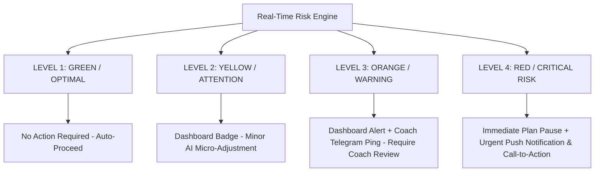
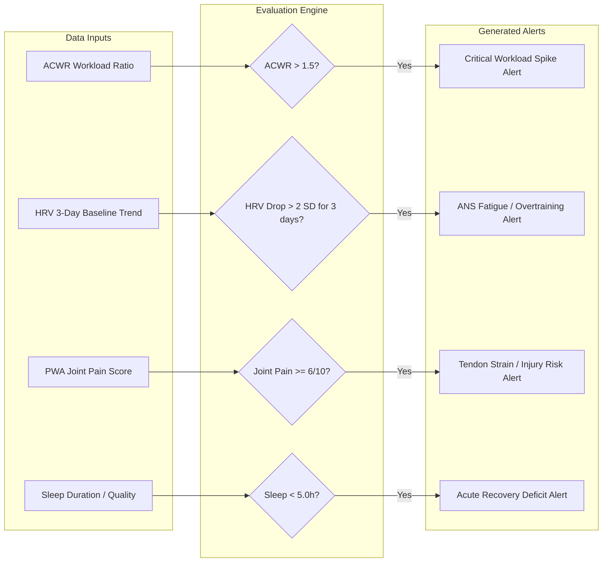
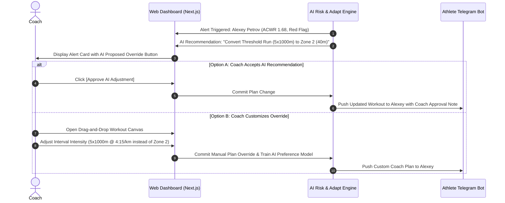
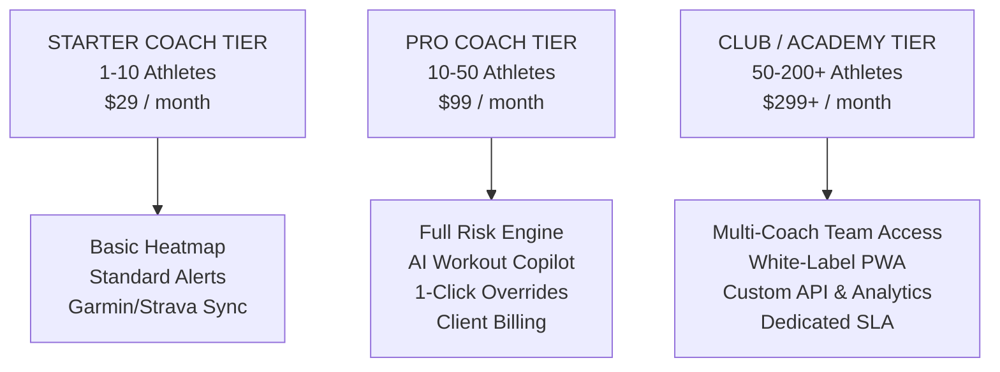

# 💻 B2B Coach Dashboard Specification (Web Cabinet)
**AI Adaptive Coach v7.0 — Product Specification & Technical Architecture**
**Document Version:** 1.0.0  
**Target Audience:** Engineering, Frontend (Next.js/React), Backend (FastAPI), Product Managers & AI Engineers

---

## 1. Executive Vision & Architecture

The **B2B Coach Dashboard** (Web Cabinet) is a high-performance web platform designed for professional sports coaches, athletic directors, and endurance/strength clubs. It acts as an **AI-augmented copilot**, allowing a single coach to scale their active roster from **15–20 athletes up to 100+ athletes** without sacrificing personalization or safety monitoring.

### 1.1 Core Value Proposition
1. **Automated Risk Triaging:** AI continuously monitors 24/7 telemetry and daily check-ins, highlighting only the athletes who need immediate human attention (e.g., elevated ACWR, HRV drops, localized tendon pain).
2. **Human-in-the-Loop Control:** Coach maintains full authority over micro-periodization and workout overrides with 1-click AI suggestions.
3. **Monetization & Scalability:** Integrated billing, client management, and white-label PWA capabilities for coaching businesses.

---

## 2. Group Monitoring Matrix (Heatmap Grid UI Component)

### 2.1 Heatmap Grid UI Layout & Structure

The Group Monitoring Matrix is the central workspace of the Coach Dashboard. It presents a real-time, color-coded heat grid of all managed athletes, updated via WebSockets.

```
+-------------------------------------------------------------------------------------------------------------------------+
| 🏋️ SQUAD MONITORING MATRIX  [ All Squads v ]  [ Sort by: Risk Level v ]  [ Filter: 🔴 High Risk (4) ]  [ 🔍 Search... ] |
+-------------------------------------------------------------------------------------------------------------------------+
| ATHLETE           | SPORT/SQUAD  | READINESS (Ri) | ACWR LOAD | TSB (CTL/ATL) | COMPLIANCE | ACTIVE RISK ALERT  | ACTIONS    |
+-------------------+--------------+----------------+-----------+---------------+------------+--------------------+------------+
| 🔴 Alexey Petrov  | Marathon Pro | 38 / 100 🔻     | 1.68 ⚠️   | -38 (62/100)  | 94%        | ACWR Spike + Knee  | [Review] ⚡ |
| 🟠 Elena Sidorova | Hyrox Squad  | 54 / 100 🔻     | 1.35      | -24 (45/69)   | 88%        | HRV Drop 3d (-2.1SD)| [Review] ⚡ |
| 🟡 Dmitry Volkov  | Cycling Tri  | 68 / 100 ➖     | 1.10      | -12 (80/92)   | 100%       | Mild Sleep Depriv  | [Details]   |
| 🟢 Igor Smirnov   | Marathon Pro | 92 / 100 🟢     | 0.98      | +4 (75/71)    | 96%        | None (Optimal)     | [Details]   |
| 🟢 Maria Ivanova  | Powerlifting | 89 / 100 🟢     | 1.05      | -8 (55/63)    | 92%        | None (Optimal)     | [Details]   |
+-------------------------------------------------------------------------------------------------------------------------+
```

---

### 2.2 Data Fields & Metric Specification

| Field Name | Type | Source | Visualization / Calculation |
| :--- | :--- | :--- | :--- |
| **Athlete Name & Avatar** | Component | User Profile | Direct link to individual 360-degree athlete file. |
| **Sport & Squad** | Tag / String | System Metadata | Filters grid by sport modality (e.g. Marathon, Powerlifting, Hyrox). |
| **Readiness Score (\(R_i\))** | Numeric (0-100) | Morning Check-in + Telemetry | Color code: Green ($\ge 85$), Yellow ($60-84$), Red ($< 60$). Shows trend arrow. |
| **ACWR (Acute:Chronic)** | Numeric Ratio | Telemetry (.FIT/Garmin) | $ACWR = \frac{\text{ATL (7-day)}}{\text{CTL (42-day)}}$. Highlights $> 1.5$ (Danger) or $< 0.8$ (Under-training). |
| **TSB (Stress Balance)** | Numeric ($CTL - ATL$) | Telemetry | Shows current Training Stress Balance and raw CTL/ATL values. |
| **Weekly Compliance (%)** | Percentage | Session Logging | Completed vs. Planned sessions for current microcycle. |
| **Active Risk Alert** | Tag / Badge | Risk Rules Engine | Primary warning badge (e.g. `ACWR Spike`, `HRV Depression`, `Knee Soreness`). |
| **Quick Action Button** | Interactive UI | System Action | Opens 1-click **AI Workout Override Modal** or Direct Telegram Chat. |

---

## 3. Injury & Overtraining Risk Alert System

### 3.1 Alert Classification & Taxonomy



#### Detailed Rule Taxonomy Matrix



---

### 3.2 Quantitative Alert Threshold Rules

1. **ACWR Injury Risk Rule ($A_{ACWR}$):**
   $$\text{If } ACWR = \frac{\text{ATL}_{7d}}{\text{CTL}_{42d}} > 1.50 \implies \mathbf{CRITICAL\ ALERT\ (Red)}$$
   * *Biomechanical Rationale:* Workload increased over 50% above 6-week chronic adaptation baseline, increasing acute soft-tissue injury risk by 3.2x.

2. **Autonomic Nervous System (ANS) Suppression Rule ($A_{HRV}$):**
   $$\text{If } HRV_{rMSSD\_3d\_avg} < \mu_{HRV\_42d} - 2.0 \times \sigma_{HRV\_42d} \implies \mathbf{WARNING\ ALERT\ (Orange)}$$
   * *Physiological Rationale:* Persistent parasympathetic suppression indicating systemic overtraining or early illness onset.

3. **Localized Joint / Tendon Strain Rule ($A_{Pain}$):**
   $$\text{If } Soreness_{Joint} \ge 6/10 \quad \text{AND} \quad PainType = \text{"Sharp / Tendon"} \implies \mathbf{CRITICAL\ ALERT\ (Red)}$$
   * *Clinical Rationale:* High probability of acute tendinopathy or structural irritation. Immediate deload or exercise substitution required.

4. **Monotony & Strain Index Rule ($A_{Strain}$):**
   $$\text{Monotony} = \frac{\text{Mean Daily Load}}{\text{Standard Deviation of Load}}, \quad \text{Strain} = \text{Total Weekly Load} \times \text{Monotony}$$
   $$\text{If } Strain > 4000 \implies \mathbf{WARNING\ ALERT\ (Yellow)}$$

---

## 4. Manual Plan Overrides & AI Collaboration Workflow

### 4.1 "Coach-in-the-Loop" Interactive Flow

The system operates on an **AI-Proposal / Coach-Approval** paradigm. The AI generates adaptive recommendations, but the coach can accept, modify, or reject them with a single click.



---

### 4.2 Drag-and-Drop Workout Builder UI Component Structure

The dashboard includes a full-featured micro-periodization editor:

```
+----------------------------------------------------------------------------------------------------+
| 🛠️ WORKOUT OVERRIDE EDITOR: Alexey Petrov — Today's Session                                       |
+----------------------------------------------------------------------------------------------------+
| Original Plan: 5 x 1000m @ 3:45/km (Interval Tempo)                                                |
| AI Suggested Adjustment: 45 min Zone 2 Easy Run @ 5:15/km [Reason: ACWR 1.68 + Knee Sensitivity]  |
+----------------------------------------------------------------------------------------------------+
| WORKOUT BLOCKS CANVAS (Drag to re-order or adjust):                                                |
|                                                                                                    |
| [ Block 1: Warm-up ]-----------------------------------------------------------------------------+ |
| | 15 min Easy Zone 1 Jog + Dynamic Mobility (Knee focus)                                         | |
| +------------------------------------------------------------------------------------------------+ |
|                                                                                                    |
| [ Block 2: Main Set (Modified by Coach) ]--------------------------------------------------------+ |
| | Type: Running Intervals  | Sets: [ 3 v ] | Dist: [ 800m v ] | Target Pace: [ 4:00/km v ]     | |
| | Rest between sets: [ 3 min Walk v ]                                                            | |
| +------------------------------------------------------------------------------------------------+ |
|                                                                                                    |
| [ Block 3: Cool-down ]----------------------------------------------------------------------------+ |
| | 10 min Easy Walk + Foam Rolling (Quads/ITB)                                                    | |
| +------------------------------------------------------------------------------------------------+ |
+----------------------------------------------------------------------------------------------------+
| Coach Note for Athlete: "Alexey, I dropped intervals to 3x800m at a lighter pace. Listen to knee!" |
+----------------------------------------------------------------------------------------------------+
| [ ❌ Discard Changes ]                 [ 🤖 Apply AI Recommendation ]     [ 💾 PUBLISH TO ATHLETE ]|
+----------------------------------------------------------------------------------------------------+
```

---

## 5. Coach Business Model & Monetization Architecture

### 5.1 B2B SaaS Tiered Pricing Structure



#### Detailed Feature Tier Matrix

| Feature Feature | Starter Tier ($29/mo) | Pro Coach ($99/mo) | Club / Enterprise ($299+/mo) |
| :--- | :--- | :--- | :--- |
| **Max Active Athletes** | Up to 10 athletes | Up to 50 athletes | Unlimited (Tiered per 100) |
| **AI Copilot Suggestions** | Basic (Rule-based) | Advanced (Gemini 1.5 Pro) | Fine-tuned Custom Model |
| **Group Monitoring Matrix** | Standard Table | Dynamic Heatmap Grid | Multi-Squad Matrix |
| **Risk Alert Channels** | Web Dashboard | Web + Telegram Coach Bot | Web + Telegram + SMS Urgent |
| **White-Label Branding** | AI Sport Branding | Custom Logo in Telegram | Full Custom Domain & PWA Branding |
| **Client Billing Integration** | Manual external | Built-in Auto-Billing (Stripe/Yookassa) | Custom Enterprise Invoicing |

---

### 5.2 Marketplace & Revenue Sharing (Athlete Acquisition)

To assist coaches in growing their client base, AI Adaptive Coach v7.0 features an **Athlete-Coach Matching Marketplace**:

1. **Marketplace Discovery:** Unattached B2C athletes seeking human supervision can browse verified coach profiles filtered by sport specialty (e.g. Marathon, Powerlifting, Triathlon).
2. **Co-Coaching Revenue Model:**
   * Athlete pays coach fee directly through the platform (e.g., $150/month).
   * Platform takes a **15% marketplace commission**, handling payments, tax receipts, and software provisioning.
   * Coach receives net $127.50/month with zero administrative overhead.

---

## 6. Technical Stack & Data Security

1. **Frontend Architecture:** Next.js 14 (React 18), Tailwind CSS, Shadcn UI, TanStack Table (for Heatmap Grid), WebSocket Client (`socket.io-client`).
2. **Backend Infrastructure:** FastAPI (Python 3.11+), Redis Pub/Sub for real-time WebSocket broadcasting, PostgreSQL + TimescaleDB.
3. **Data Privacy & Security:**
   * Full compliance with **152-FZ** (Russian Personal Data Law) and **GDPR**.
   * Role-Based Access Control (RBAC): Coaches can only view telemetry for explicitly linked athletes who accepted a coaching agreement.
