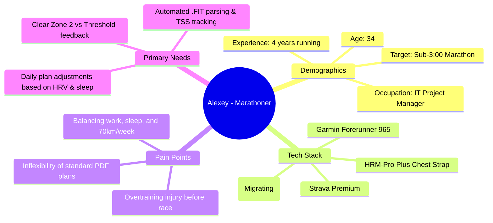
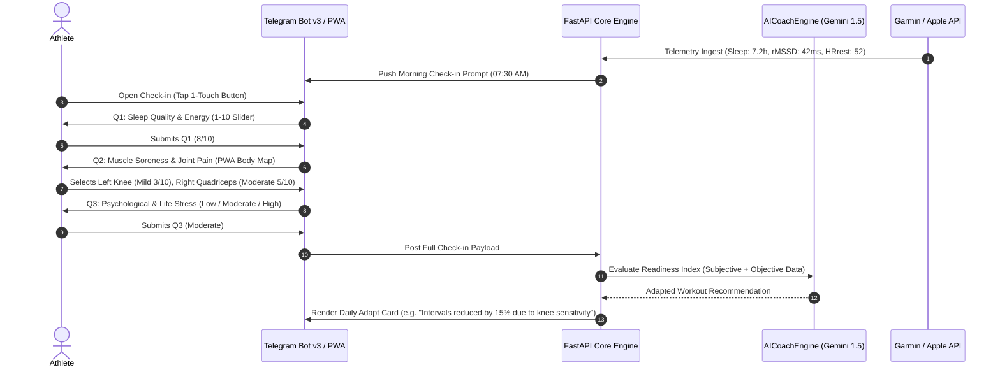
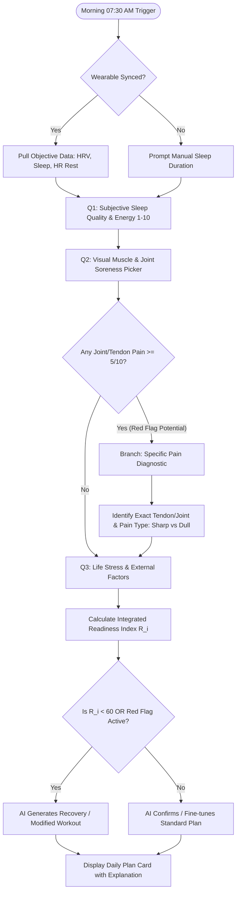
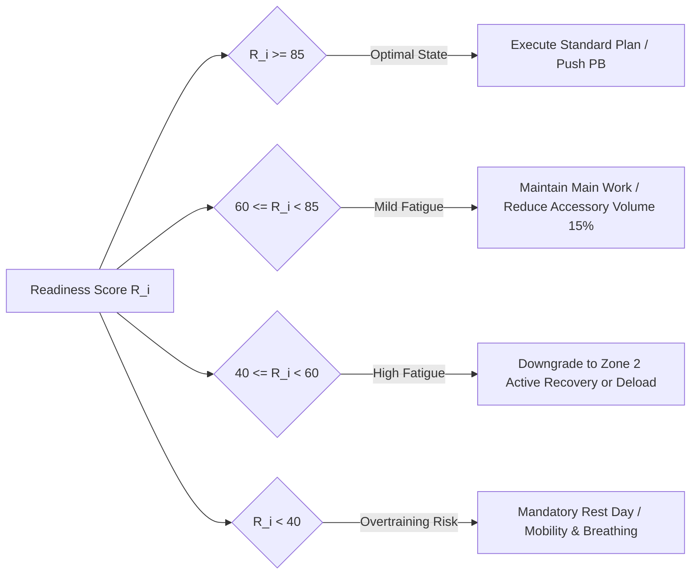
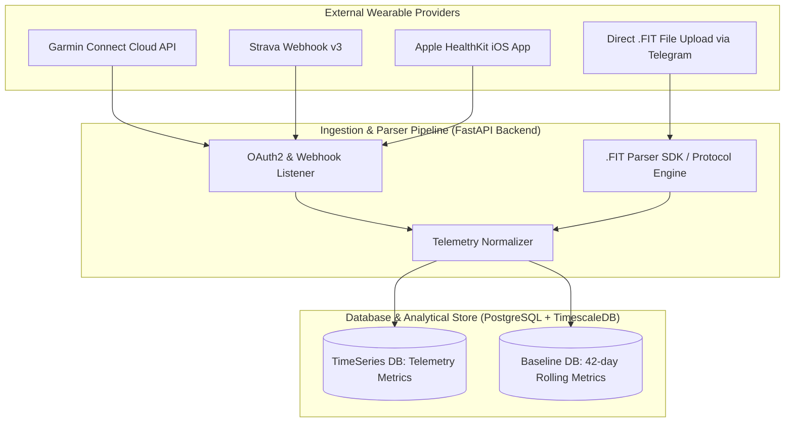
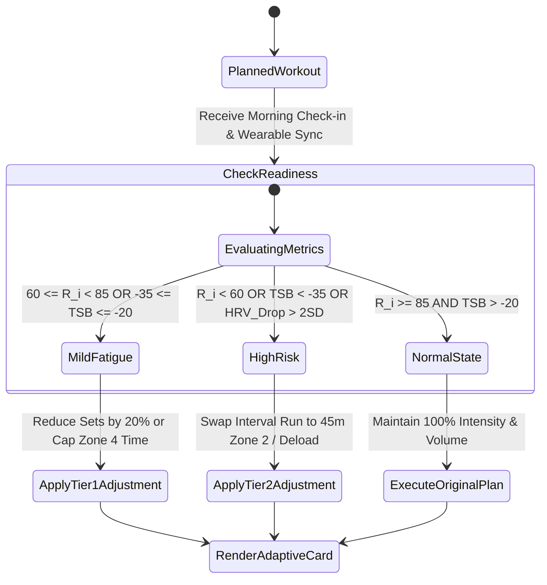

# 👤 B2C Athlete Persona & Telemetry Specification
**AI Adaptive Coach v7.0 — Product Discovery & Technical Specification**
**Document Version:** 1.0.0  
**Target Audience:** Engineering, Product, UI/UX, Sports Science & AI Teams

---

## 1. Executive Summary & Product Vision

AI Adaptive Coach v7.0 B2C layer is engineered to serve non-professional and competitive amateur athletes across **Cyclic** (Running, Triathlon, Cycling, XC Skiing) and **Strength/Hybrid** (Powerlifting, CrossFit, Hyrox, Bodybuilding) sports. The system bridges the gap between static training plans and high-cost personal human coaching by delivering **dynamic, telemetry-aware, micro-adaptive daily training plans** directly via Telegram Bot v3 and embedded PWA (Progressive Web App).

---

## 2. Target Athlete Profiles & Personas

### 2.1 Persona A: The Cyclic Endurance Athlete ("Alexey - The Data-Driven Marathoner")



* **Demographics & Lifestyle:**
  * **Age:** 28–45 years old.
  * **Income Level:** Middle to High (invests heavily in gear, watches, race entries).
  * **Weekly Commitment:** 6–14 hours/week, 4–6 training sessions.
  * **Key Goals:** Personal Best (PB) in Half Marathon/Marathon, Ironman 70.3 finish, optimizing VO2max and Lactate Threshold.
* **Pain Points & Frustrations:**
  * Rigid training plans fail when work stress, poor sleep, or travel occurs.
  * High risk of overuse injuries (e.g., Achilles tendinopathy, ITBS, shin splints) due to unadjusted high Acute Workload.
  * Information overload from Garmin/Strava without actionable daily advice.
* **Data Behavior:**
  * Syncs watch immediately after training.
  * Obsessed with HRV (Heart Rate Variability), Resting HR, Sleep Score, Pace, cadence, and TSS (Training Stress Score).

---

### 2.2 Persona B: The Strength & Hybrid Athlete ("Elena - The Hyrox / Strength Enthusiast")

```mermaid
mindmap
  root((Elena - Hybrid Athlete))
    Demographics
      Age: 29
      Occupation: Marketing Director
      Experience: 3 years Strength & Conditioning
      Target: Hyrox Pro division top-10
    Tech Stack
      Apple Watch Ultra 2
      Oura Ring Gen 3
      Hevy / Strong App
      Telegram (Primary Messenger)
    Pain Points
      Estimating RPE and RIR accurately
      CNS fatigue accumulation
      Combining heavy squats with intense S&C
    Primary Needs
      Visual muscle soreness (DOMS) picker
      Auto-calculating daily readiness score
      Intelligent deload recommendations
```

* **Demographics & Lifestyle:**
  * **Age:** 22–40 years old.
  * **Income Level:** Middle to High.
  * **Weekly Commitment:** 5–10 hours/week, 4–5 workouts (2-3 heavy strength, 2 high-intensity functional).
  * **Key Goals:** Hypertrophy, 1RM strength progression, conditioning capacity without muscle loss, fatigue management.
* **Pain Points & Frustrations:**
  * Hard to measure Central Nervous System (CNS) fatigue vs. peripheral muscle soreness.
  * Difficulty quantifying total volume load (Tonnage) combined with cardio stress.
  * Lack of real-time feedback on when to take a deload week versus pushing RPE 9–10.
* **Data Behavior:**
  * Tracks weight lifted, sets, reps, RPE (Rate of Perceived Exertion), and muscle soreness post-workout.

---

### 2.3 Comparative Persona Matrix

| Attribute | Persona A (Cyclic / Endurance) | Persona B (Strength / Hybrid) |
| :--- | :--- | :--- |
| **Primary Sport** | Running, Cycling, Triathlon, XC Skiing | Powerlifting, CrossFit, Hyrox, Bodybuilding |
| **Key Telemetry Metrics** | HRV (rMSSD), HR Rest, Pace, Power (Watts), Cadence, GAP, TSS, TSB | Barbell Velocity, Tonnage, Sets x Reps, RPE, RIR, Heart Rate Recovery |
| **Fatigue Marker** | Cardiac Drift, HRV Baseline Drop, Elevated HR Rest | CNS Dip, Grip Strength, Subjective Joint Soreness, RFD Drop |
| **Primary Input Channel** | Automatic Garmin/Strava Sync + Telegram Check-in | Telegram PWA Interactive Log + Manual Set/Rep Input |
| **AI Adaptation Trigger** | TSB < -30, HRV Drop > 2 SD, Sleep < 5.5h | RPE Spike > 2 units over plan, DOMS score ≥ 7/10 in prime movers |

---

## 3. Daily Check-in Scenario (Telegram Bot v3 & PWA WebApp)

### 3.1 UX Architecture & Time-to-Complete Target

* **Target Completion Time:** **< 45 seconds** (5 rapid interactions).
* **Delivery Schedule:** Automatically triggered every morning at user-configured local time (e.g., 07:30 AM) or upon detection of waking up from wearable sync.
* **Interaction Interfaces:**
  1. **Telegram Bot Inline Keyboards:** Quick 1-tap responses for standard parameters.
  2. **Telegram PWA (Progressive WebApp):** Opened seamlessly via WebApp Button for visual interactions (e.g., Interactive Body Soreness Map).



---

### 3.2 Micro-Survey Branching Logic



---

### 3.3 UI Component Specifications for Check-in

#### Telegram Bot Micro-Cards

```
+-------------------------------------------------------+
| 🌅 MORNING READINESS CHECK-IN                         |
| Saturday, Aug 1, 2026                                 |
|                                                       |
| ⌚ Wearable Biometrics:                                |
| • Sleep: 7h 15m (84% Score)                           |
| • HRV rMSSD: 48 ms (Baseline: 50 ms - Normal)        |
| • HR Rest: 51 bpm                                     |
|                                                       |
| How refreshed do you feel today?                      |
+-------------------------------------------------------+
|  [ 1 - Exhausted ]  [ 5 - Average ]  [ 10 - Peaking ] |
+-------------------------------------------------------+
|  [ ↗️ Open Interactive Soreness Map (PWA WebApp) ]   |
+-------------------------------------------------------+
```

#### PWA Interactive Body Soreness Map Layout

```
+-------------------------------------------------------+
| 🦵 MUSCLE & JOINT SORENESS PICKER                     |
| Select body areas and indicate intensity (1-10)       |
+-------------------------------------------------------+
|                                                       |
|       FRONT VIEW                 BACK VIEW            |
|          ( O )                     ( O )              |
|         /  |  \                   /  |  \             |
|        /   |   \                 /   |   \            |
|       [ Shoulder ]              [ Upper Back ]        |
|       [ Chest    ]              [ Lower Back ]        |
|       [ Quads    ]              [ Hamstrings ]        |
|       [ Knees🔴  ]              [ Calves     ]        |
|                                                       |
| Selected: Left Knee (5/10 - Dull Ache)                |
| Intensity: [━|━━━━━━] 5/10                           |
| Pain Type: (x) Muscle Soreness  ( ) Sharp Joint Pain  |
|                                                       |
+-------------------------------------------------------+
| [ CONFIRM & GENERATE TODAY'S PLAN ]                   |
+-------------------------------------------------------+
```

---

## 4. Context Collection Model & Data Weighting Engine

### 4.1 Taxonomy of Contextual Variables

| Category | Metric Variable | Source | Scale / Unit | Impact Weight (\(W_k\)) |
| :--- | :--- | :--- | :--- | :--- |
| **Objective Biometrics** | \(HRV_{rMSSD}\) Daily vs Baseline | Garmin / Oura / Apple | \(ms\) (Z-score deviation) | 0.25 |
| **Objective Biometrics** | Resting Heart Rate (\(RHR\)) | Garmin / Oura / Apple | \(bpm\) (Deviation from 7-d avg) | 0.15 |
| **Objective Biometrics** | Sleep Duration & REM/Deep ratio | Wearable API | Hours & Sleep Score (0-100) | 0.20 |
| **Subjective Context** | Subjective Energy / Sleep Quality | Morning Check-in | 1 to 10 Scale | 0.15 |
| **Subjective Context** | Muscle Soreness (DOMS) | Interactive PWA Map | 1 to 10 Scale per Muscle Group | 0.15 |
| **Lifestyle Context** | Life Stress & Work Strain | Morning Check-in | Low (0), Med (0.5), High (1.0) | 0.10 |
| **Lifestyle Context** | Alcohol, Travel, Illness Flags | Quick Toggle | Binary / Scale | Red Flag Modifier |

---

### 4.2 Integrated Readiness Index Calculation (\(R_i\))

The daily Readiness Index (\(R_i \in [0, 100]\)) is computed using a fuzzy normalized weighting algorithm combining subjective perception and biometric telemetry:

$$R_i = 100 \times \left( w_1 \cdot S_{HRV} + w_2 \cdot S_{RHR} + w_3 \cdot S_{Sleep} + w_4 \cdot S_{SubjEnergy} + w_5 \cdot (10 - DOMS_{max})/10 + w_6 \cdot S_{Stress} \right) \times M_{RedFlag}$$

Where:
* $S_{HRV} = \text{clamp}\left(0.5 + \frac{HRV_{today} - HRV_{baseline}}{2 \times \sigma_{HRV}}, 0, 1\right)$ (Normalized Z-Score)
* $S_{RHR} = \text{clamp}\left(0.5 - \frac{RHR_{today} - RHR_{baseline}}{2 \times \sigma_{RHR}}, 0, 1\right)$
* $S_{Sleep} = \frac{\text{SleepScore}}{100}$
* $M_{RedFlag} = 0.5$ if Sharp Joint Pain $\ge 6/10$ or Illness Flagged, else $1.0$.

#### Actionable Decision Matrix based on $R_i$:



---

## 5. Telemetry & Sensor Integration Architecture (.FIT / Garmin / Strava / Apple)

### 5.1 Telemetry Ingestion Architecture



---

### 5.2 Extracted Metrics Taxonomy & Schema

#### 1. Time Series Telemetry (Sampled at 1Hz - 10Hz):
* **Timestamp (`epoch_sec`):** UNIX UTC Timestamp.
* **Heart Rate (`hr`):** Beats per minute (BPM).
* **HRV Data (`rr_intervals`):** Inter-beat interval array in milliseconds.
* **Power (`watts`):** Cycling/Running power meter values.
* **Pace / Speed (`speed_m_s`):** Meters per second + Grade Adjusted Pace (GAP).
* **Cadence (`cadence`):** RPM for cycling, SPM (steps per minute) for running.
* **Barbell Velocity (`m_s`):** Mean & Peak velocity (for strength telemetry from devices like Output Sports/GymAware).

#### 2. Session Summary Metrics:
* **Training Stress Score (TSS):**

$$TSS = \frac{t \times NP \times IF}{FTP \times 3600} \times 100$$

* **Acute Training Load (ATL / 7-Day Exponential Moving Average):**

$$ATL_{today} = ATL_{yesterday} + (TSS_{today} - ATL_{yesterday}) \times (1 - e^{-1/7})$$

* **Chronic Training Load (CTL / 42-Day Exponential Moving Average):**

$$CTL_{today} = CTL_{yesterday} + (TSS_{today} - CTL_{yesterday}) \times (1 - e^{-1/42})$$

* **Training Stress Balance (TSB):**

$$TSB = CTL_{yesterday} - ATL_{yesterday}$$

---

### 5.3 Real-time Workout Adaptation Rules Engine



#### Detailed Rule Set Matrix

| Trigger Condition | Telemetry / Check-in Threshold | Automatic AI Workout Modification | UX Explanation to Athlete |
| :--- | :--- | :--- | :--- |
| **Rule 01: Severe TSB Strain** | $TSB < -35$ | Convert VO2max Threshold intervals to 40min Zone 1/2 Recovery Run. | "Your acute load is significantly higher than your 6-week baseline. We converted today's speedwork to Zone 2 to prevent hamstring strain." |
| **Rule 02: HRV Acute Suppression** | $HRV_{rMSSD} < \text{Baseline} - 2\sigma$ for 2 consecutive days | Cut strength volume by 40%, remove failure sets (max RPE 7). | "Your nervous system shows signs of incomplete recovery. Focus today on technique with lower load." |
| **Rule 03: Localized Joint Pain** | Tendon/Joint Soreness $\ge 6/10$ on PWA Body Map | Auto-substitute high-impact plyometrics/running with low-impact ergometer/swimming. | "Noticed knee soreness reported. Replaced running with Wattbike Zone 2 session to keep aerobic engine active without joint impact." |
| **Rule 04: Sleep Deprivation** | Sleep $< 5.0$ hours | Mandate full rest day or active mobility session. | "Sleep duration under 5 hours drastically impedes muscle repair and raises injury risk by 1.7x. Today is designated for active recovery." |

---

## 6. Verification & Data Integrity Rules

1. **Missing Data Handling:** If wearable data is unavailable (un-synced device), the system uses a fallback heuristic based solely on subjective check-in data with a 15% safety factor on intensity.
2. **Duplicate Ingestion Prevention:** Unique `session_hash` generated from (Athlete_ID + Start_Time + Duration + Total_Distance) ensures identical Strava and Garmin syncs do not double-count TSS.
3. **Data Protection & Privacy:** Telemetry files (.FIT) and HRV records are encrypted at rest using AES-256 and linked anonymously via UUID in compliance with 152-FZ / GDPR.
