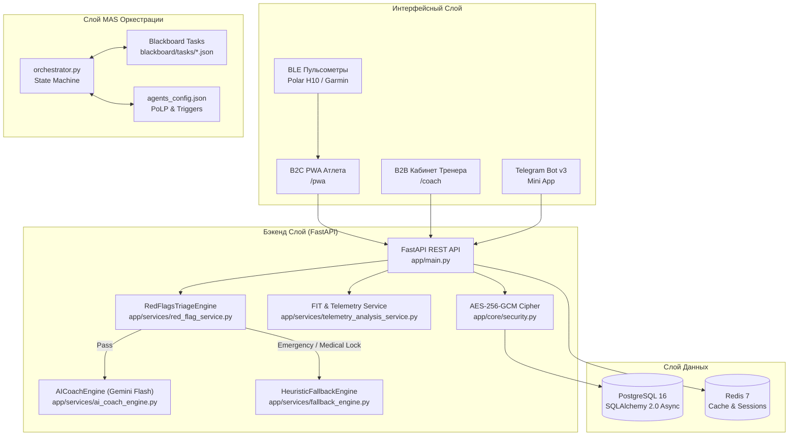

# 📋 Спецификация Требований и Архитектура Целевого Сервиса (v7.1)

> **Проект:** AI Adaptive Coach v7.1  
> **Версия:** 7.1.0 (MAS Orchestrated + On-Device AI)  
> **Дата последнего обновления:** 2026-08-02  
> **Статус:** Действующая целевая спецификация (обновлено с учётом Фаз 5.1–5.3)  
> **Контроль соответствия:** `security_policy_keeper` (P1), `legal_compliance_policy_keeper` (P2), `finance_budget_policy_keeper` (P3), `product_ux_policy_keeper` (P4)

---

## 1. Назначение и Архитектурное Видение

AI Adaptive Coach v7.0 — это экосистема адаптивного спортивного тренинга, объединяющая B2C-атлетов и B2B-тренеров. Система работает под управлением 3-слойного роя агентов (MAS) и центрального Оркестратора ([`orchestrator/orchestrator.py`](file:///D:/PyCharm_Projects/AI%20Sport/orchestrator/orchestrator.py)).

### Ключевые Подходы
- **Безопасность Превыше Всего (P1)**: 152-ФЗ локализация ПДн, AES-256-GCM шифрование PII и данных телеметрии на уровне полей БД (`app/core/security.py`).
- **Медицинский Триаж (P2 / 323-ФЗ)**: Разграничение немедицинских рекомендаций от телемедицины. Автоматическая блокировка вызовов ИИ при выявлении Red Flags Level 1/2 (`app/services/red_flag_service.py`).
- **Двухуровневый Адаптивный ИИ-Движок**: Основной генератор на базе Gemini 1.5 Flash (`app/services/ai_coach_engine.py`) + 100% оффлайн детерминированный fallback (`app/services/fallback_engine.py`).
- **Финансовая Дисциплина (P3)**: Ограничение расходов на инфраструктуру (до 15,000 ₽/мес) и контрольные ворота Unit Economics (LTV/CAC $\ge 3.5\times$).

---

## 2. Функциональные Требования к Компонентам

### 2.1 B2C PWA Атлета & Telegram Mini App ([`frontend/pwa_athlete/index.html`](file:///D:/PyCharm_Projects/AI%20Sport/frontend/pwa_athlete/index.html))
1. **Daily Check-in**: 5-шаговый экспресс-опросник (<45 секунд) на базе шкалы Hooper (Энергия, Сон, Стресс, DOMS, Боли).
2. **Visual Body Soreness Map**: Интерактивный выбор зон локализации боли (колени, плечи, поясница, квадрицепсы) с градуировкой VAS (0-10).
3. **Карточка Адаптированной Тренировки**: Вывод интервалов, пульсовых/мощностных зон и рекомендаций Gemini Flash.
4. **Интерактивный Дашборд Восстановления**: Графики $Z_{\text{HRV}}$ и индикатор нагрузки ACWR (Acute:Chronic Workload Ratio) с выделением зоны «Sweet Spot» (0.8–1.3).
5. **WebBluetooth BLE Streaming**: Подключение нагрудных пульсометров (Polar H10, Garmin HR) по BLE профилю Heart Rate Service (0x180D) со стримингом пульса в реальном времени.

### 2.2 B2B Кабинет Тренера ([`frontend/b2b_coach/index.html`](file:///D:/PyCharm_Projects/AI%20Sport/frontend/b2b_coach/index.html))
1. **Group Monitoring Matrix**: Тепловая карта (Heatmap Grid) на 100+ атлетов с фильтрацией по видам спорта, индексам готовности $R_i$, ACWR и медицинским алертам.
2. **Лента Экстренных Алертов**: Мгновенное оповещение тренера при срабатывании Red Flags Level 1 (Emergency Red), Level 2 (Medical Lock), Level 3 (Caution).
3. **Human-in-the-Loop Override**: Возможность 1-click переопределения тренировочных планов, сгенерированных ИИ.
4. **B2B SaaS Управление**: Модуль подписок тренера (Starter, Pro Coach, Club) и выплаты самозанятым/ИП.

### 2.3 Telegram Bot v3 ([`app/telegram_bot/bot.py`](file:///D:/PyCharm_Projects/AI%20Sport/app/telegram_bot/bot.py))
1. Быстрые команды: `/start`, `/checkin`, `/workout`, `/stats`, `/sync`, `/redflag`, `/help`.
2. Кнопка вызова WebApp (Telegram Mini App) для открытия PWA интерфейса прямо в Telegram.
3. Экран блокировки тренировок при активации Red Flag Level 1.

---

## 3. Нефункциональные Требования (NFR)

| Параметр | Целевой показатель | Контролирующий агент |
|---|---|---|
| **Время отклика API** | $< 200\text{ ms}$ (p95) для основных REST endpoints | `observability_sre_monitoring` |
| **Время генерации планов** | $< 1500\text{ ms}$ (Gemini Flash), $< 50\text{ ms}$ (Offline Fallback) | `sports_ai_engineer` |
| **Шифрование данных** | AES-256-GCM для PII, телефонных номеров и телеметрии | `security_policy_keeper` (P1) |
| **Локализация ПДн** | 100% данных граждан РФ в ЦОД РФ (Selectel / Yandex Cloud) | `legal_compliance_policy_keeper` (P2) |
| **Бюджет Инфраструктуры** | $\le 15,000\text{ ₽/мес}$ | `finance_budget_policy_keeper` (P3) |
| **Доступность (Uptime)** | $\ge 99.9\%$ SLA | `devops_infra` |
| **Тестовое покрытие** | 100% прохождение Pytest сюита (158 тестов) | `qa_safety_auditor` |

---

## 4. Интеграционная Архитектура Система

---

## 5. Новые Возможности (Фазы 5.1–5.3, реализованы 2026-08-01)

### 5.1 Новые Интеграции Носимых Устройств
- **Garmin Connect Webhook** `POST /api/v1/telemetry/webhooks/garmin` — авто-получение данных тренировок (ЧСС, мощность, темп, данные сна).
- **Oura Ring Webhook** `POST /api/v1/telemetry/webhooks/oura` — авто-получение HRV (rMSSD), температуры и индекса готовности.
- **Whoop Webhook** `POST /api/v1/telemetry/webhooks/whoop` — авто-получение Strain Score и Recovery Score.

### 5.2 Улучшенная Аналитика Нагрузки
- **Спортивно-специфичный ACWR**: параметр `sport_type` в расчёте нагрузки учитывает ударный стресс бега ($K=1.3$), силовых тренировок ($K=1.1$) и велоспорта ($K=1.0$).
- **Расчёт Питания и Гидратации**: метод `calculate_fueling_and_hydration()` — рекомендации по углеводам (г/час), натрию (мг/час) и жидкости (мл/час) для нагрузок от 30 минут до 5+ часов.

### 5.3 Пакетные Операции для Тренеров (B2B)
- Эндпоинт `POST /api/v1/coaches/batch-override` — тренер может переопределить тренировки сразу для группы атлетов: изменить тип сессии, нагрузку, добавить или снять тренировку у 1–N атлетов в одном запросе.

### 5.4 Гибридный ИИ (On-Device + Cloud)
- Сервис упаковки контекста для локальных моделей (`on_device_slm_service.py`): минимальный профиль атлета для Phi-3-mini / Gemma-2B ONNX.
- Движок авто-адаптации в браузере (`on_device_slm_engine.js`) с WebGPU: работает без сети, без сервера, без затрат на API-токены.
- Прогрессивный фоллбэк: **Gemini Cloud → On-Device SLM → Эвристика** — гарантия ответа в 100% случаев.
