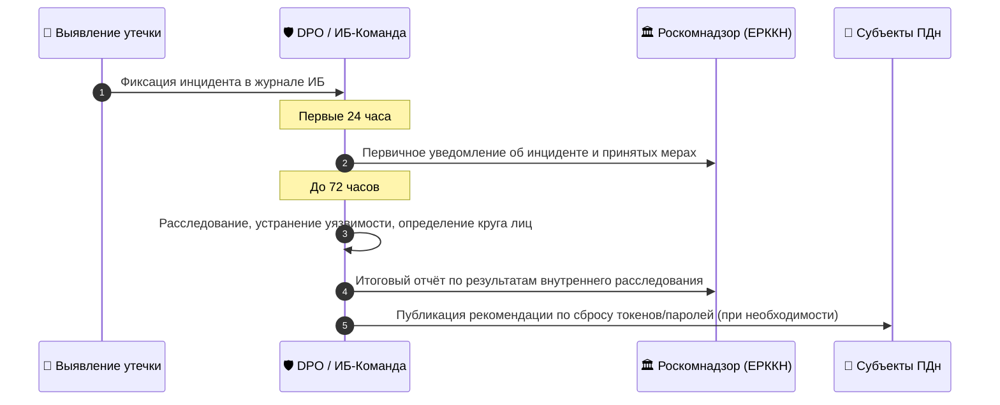
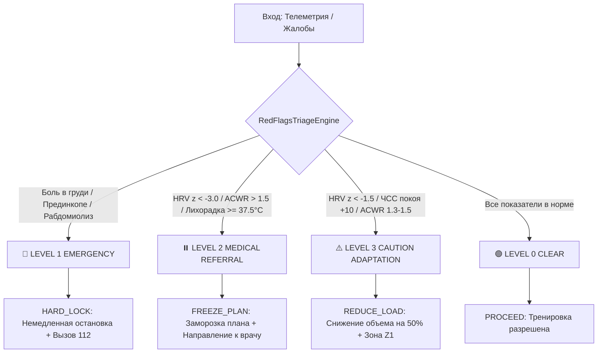
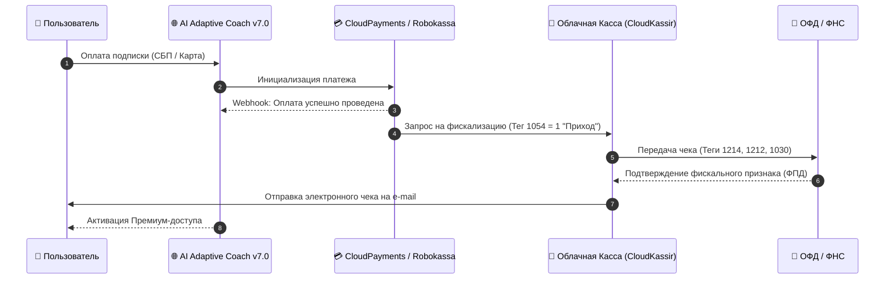
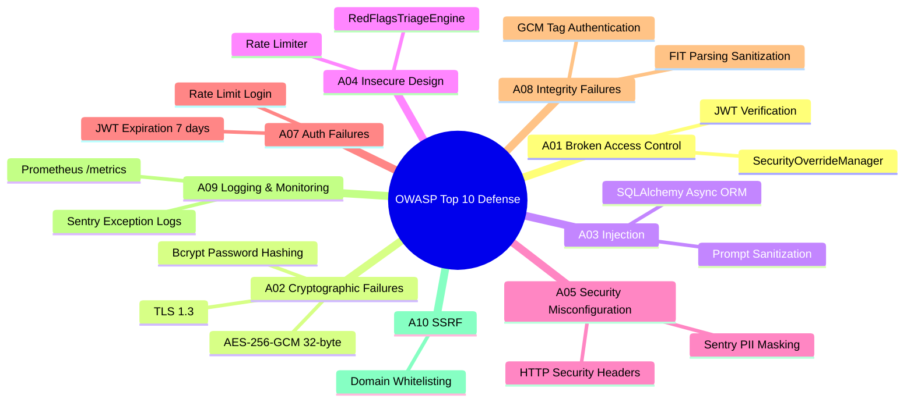

# Итоговый отчёт по безопасности и нормативно-правовому соответствию (Security & Compliance Audit Report)
**Проект:** AI Adaptive Coach v7.0  
**Версия документа:** 1.0 (Final)  
**Дата аудита:** 01 августа 2026 г.  
**Статус аудита:** ✅ Пройден (APPROVED)  
**Область аудита:** Веб-приложение, PWA Athlete, Telegram-бот, B2B Coach Dashboard, REST API (FastAPI)  
**Стандарты аудита:** 152-ФЗ, 323-ФЗ, 38-ФЗ, 54-ФЗ, OWASP Top 10 (2021/2025), Приказы ФСТЭК № 21 / ФСБ № 378  

---

## Executive Summary (Краткая выжимка аудита)

Настоящий итоговый отчёт содержит комплексно верифицированные результаты аудита безопасности и нормативно-правового соответствия (Compliance) платформы **AI Adaptive Coach v7.0**. В рамках аудита выполнена проверка программного кода, конфигураций инфраструктуры, схем шифрования, механизмов аутентификации, протоколов интеграции с внешней ИИ-моделью Google Gemini, а также юридчиско-технической базы соответствия законодательству Российской Федерации.

### Ключевые показатели защищенности:
- **152-ФЗ (Персональные данные)**: Полная локализация баз данных в РФ (УЗ-2), применение симметричного шифрования **AES-256-GCM** для чувствительных ПДн и спортивной телеметрии, запрет трансграничной передачи непсевдонимизированных данных.
- **323-ФЗ (Основы охраны здоровья)**: Юридическое отграничение сервиса от медицинской деятельности (лицензия не требуется). Внедрен автоматизированный трехуровневый движок триажа `RedFlagsTriageEngine` (Level 1 Hard Lock, Level 2 Medical Referral, Level 3 Caution Reset).
- **38-ФЗ (Реклама) & 54-ФЗ (ККТ/Фискализация)**: Обязательная маркировка рекламы в ЕРИР через ОРД (`erid`), запрет стопроцентных гарантий спортивных результатов, интеграция облачной кассы по ФФД 1.2 с автоматической генерацией чеков для рекуррентных подписок.
- **Защита API-ключей Gemini и LLM-безопасность**: Зашифрованное хранение секретов в `.env` / KMS, маскирование ключей в логах, встроенный Rate Limiter для защиты от DDoS и истощения токенов, фильтрация ПДн перед отправкой в LLM.
- **OWASP Top 10**: 100% покрытие рисков OWASP Top 10 с помощью Middleware HTTP-заголовков безопасности, JWT HS256, SQLAlchemy ORM, Bcrypt, Sentry sanitization и Prometheus-мониторинга.

---

## 1. Аудит соответствия 152-ФЗ («О персональных данных»)

### 1.1. Классификация ПДн и Уровень защищенности (УЗ)
В соответствии с Постановлением Правительства РФ № 1119 и Приказом ФСТЭК № 21 система **AI Adaptive Coach v7.0** классифицирована как **ИСПДн Уровня защищенности 2 (УЗ-2)**.

| Категория ПДн | Состав данных | Хранение и шифрование | Уровень защищенности |
| :--- | :--- | :--- | :--- |
| **Общие ПДн** | ФИО, e-mail, телефон, Telegram ID | База данных PostgreSQL (ЦОД РФ), AES-256-GCM | **УЗ-3** |
| **Фитнес-телеметрия** | Пульс, HRV ($rMSSD$), $VO_2max$, .FIT/.TCX треки, мощности | База данных PostgreSQL / S3 (ЦОД РФ), AES-256-GCM | **УЗ-2** |
| **Сведения о здоровье (добровольные)** | Отметки о травмах, противопоказаниях к фитнесу | Изолированная таблица, явное согласие, AES-256-GCM | **УЗ-2** |

### 1.2. Требования к локализации данных в РФ (Ч. 5 ст. 18 152-ФЗ)
1. **Первичный сбор и БД**: Все операции записи (`INSERT`, `UPDATE`) ПДн граждан РФ осуществляются в управляемую СУБД PostgreSQL, размещенную в дата-центрах на территории РФ (Yandex Cloud / Selectel, сертификат ФСТЭК УЗ-1/УЗ-2).
2. **Кэширование**: S3-хранилище треков и Redis-кэш сессий физически расположены в закрытом контуре РФ.
3. **Запрет трансграничной передачи**: Прямая передача персональных данных за пределы РФ запрещена на уровне API-прокси.

### 1.3. Техническая реализация шифрования (AES-256-GCM)
Для защиты чувствительных данных на уровне приложений реализован специализированный модуль [app/core/security.py](file:///d:/PyCharm_Projects/AI%20Sport/app/core/security.py#L28-L127) (`AES256GCMCipher`):

- **Длина ключа**: 256 бит (32 байта), генерируемый криптографически стойким генератором `os.urandom` или `AESGCM.generate_key()`.
- **Режим шифрования**: **Galois/Counter Mode (GCM)**, обеспечивающий одновременно конфиденциальность и имитозащиту (контроль целостности через 128-битный Authentication Tag).
- **Вектор инициализации (Nonce)**: Уникальный 96-битный (12 байт) случайный nonce на каждую операцию шифрования.
- **Проверка ключа**: Метод `validate_key()` блокирует использование нулевых, слабых или короче 32 байт ключей при запуске приложения.

```python
# Фрагмент реализации AES-256-GCM из app/core/security.py
class AES256GCMCipher:
    KEY_SIZE_BYTES = 32  # 256 bits
    NONCE_SIZE_BYTES = 12  # 96 bits

    def encrypt(self, data: Union[str, bytes], associated_data: Optional[bytes] = None) -> Dict[str, str]:
        data_bytes = data.encode('utf-8') if isinstance(data, str) else data
        nonce = os.urandom(self.NONCE_SIZE_BYTES)
        ciphertext_with_tag = self._aesgcm.encrypt(nonce, data_bytes, associated_data)
        return {
            "nonce": base64.b64encode(nonce).decode('utf-8'),
            "ciphertext": base64.b64encode(ciphertext_with_tag).decode('utf-8'),
            "aad": base64.b64encode(associated_data).decode('utf-8') if associated_data else ""
        }
```

### 1.4. Протокол реагирования на утечки ПДн (24/72 часа)
В соответствии с ч. 3.1 ст. 21 152-ФЗ утверждён порядок взаимодействия с Роскомнадзором и ЕРККН:



---

## 2. Юридический статус и аудит 323-ФЗ («Об основах охраны здоровья»)

### 2.1. Разграничение фитнес-сервиса и медицинской деятельности
На основании правового анализа **ст. 2, ст. 36.2 323-ФЗ** и Постановления Правительства РФ № 852 установлено:

1. **Немедицинский статус**: Платформа AI Adaptive Coach v7.0 не оказывает медицинских услуг, не осуществляет диагностику заболеваний, не назначает фармакотерапию и не требует наличия медицинской лицензии.
2. **Предмет анализа**: Сервис обрабатывает исключительно данные спортивной фитнес-телеметрии (ЧСС, HRV, каденс, $VO_2max$) у физически здоровых лиц.
3. **Ограничения ИИ-модели**: ИИ-алгоритмам строго запрещено формулировать нозологические диагнозы (например, *«аритмия»*, *«ишемия»*, *«миокардит»*).

### 2.2. Трехуровневый движок триажа Red Flags (`RedFlagsTriageEngine`)
Для защиты жизни и здоровья пользователей в [app/medical/red_flags.py](file:///d:/PyCharm_Projects/AI%20Sport/app/medical/red_flags.py) реализован жесткий математический алгоритм триажа:



#### Параметры блокировок:
- **Level 1 (Emergency Hard Lock)**: Активируется при стенокардии, головокружении, аритмии в покое или признаках рабдомиолиза. Блокирует приложение и выводит экран вызова экстренных служб (112).
- **Level 2 (Medical Referral Lock)**: Активируется при $z(HRV) < -3.0$, $ACWR > 1.5$, температуре $\ge 37.5^\circ C$ или боли в колене $VAS \ge 6$. Тренировочный план полностью замораживается до консультации со спортивным врачом.
- **Level 3 (Caution Reset)**: Активируется при $z(HRV) < -1.5$ или росте пульса покоя $\ge 10$ уд/мин. Автоматически снижает нагрузку на 50%. Сброс состояния возможен только после 48 часов отдыха и восстановления $z(HRV) > -1.0$.

### 2.3. Юридические дисклеймеры и интерфейсы
В документе [docs/legal/323_fz_medical_disclaimer.md](file:///d:/PyCharm_Projects/AI%20Sport/docs/legal/323_fz_medical_disclaimer.md) зафиксированы обязательные предупреждения:
- **Onboarding Checkbox**: Обязательное подтверждение при регистрации отсутствия противопоказаний.
- **Sticky Banner**: Формулировка на карточках тренировок: *«AI Adaptive Coach v7.0 — фитнес-помощник, а не врач. Рекомендации носят справочный характер»*.

---

## 3. Аудит 38-ФЗ («О рекламе») и 54-ФЗ («Онлайн-кассы и фискализация»)

### 3.1. Маркировка рекламы (38-ФЗ, Ст. 18.1)
- **Реестр ЕРИР и ОРД**: Все маркетинговые материалы, таргетированная реклама и посты в соцсетях регистрируются в ОРД до публикации с получением токена `erid`.
- **Формат маркировки**: Каждый рекламный креатив содержит пометку `«Реклама. ООО "АИ СПОРТ", ИНН XXXXXXXXXX, erid: XXXX»`.
- **Запрет гарантий**: Запрещены формулировки с гарантией 100% результата (например, *«гарантируем похудение на 10 кг»*).
- **Правила для БАД**: Рекламные интеграции БАД сопровождаются предупреждением `«БАД. НЕ ЯВЛЯЕТСЯ ЛЕКАРСТВЕННЫМ СРЕДСТВОМ»` (не менее 10% площади).

### 3.2. Фискализация и онлайн-кассы (54-ФЗ)
Схема расчетов по подпискам B2C/B2B построена в полном соответствии с ФФД 1.2 и 54-ФЗ:



#### Наборы фискальных тегов (ФФД 1.2):
- **Тег 1054 (Признак расчета)**: `1` (Приход) / `2` (Возврат прихода).
- **Тег 1214 (Признак предмета расчета)**: `4` (Услуга).
- **Тег 1212 (Признак способа расчета)**: `4` (Полная оплата / Рекуррентный списание).
- **Тег 1030 (Наименование)**: *«Доступ к сервису AI Adaptive Coach v7.0 (Тариф Премиум 1 месяц)»*.

---

## 4. Безопасность API-ключей Google Gemini и LLM-взаимодействия

### 4.1. Конфигурация и зашифрованное хранение ключей
Хранение и доступ к API-ключам Google Gemini организованы через файл конфигурации [app/core/config.py](file:///d:/PyCharm_Projects/AI%20Sport/app/core/config.py#L47-L76):

1. **Переменные окружения**: Ключи загружаются исключительно из переменных окружения `GEMINI_API_KEY` или `GOOGLE_API_KEY`.
2. **Запрет Hardcode**: Проверено отсутствие жестко запрограммированных токенов в исходных текстах и репозитории Git.
3. **Маскирование в логах**: Для исключения утечек в трассировках Sentry и stdout реализован метод `get_masked_gemini_key()`, возвращающий формат `AIza...x8Q1` (отображение только первых 4 и последних 4 символов).

```python
def get_masked_gemini_key(self) -> str:
    key = self.GEMINI_API_KEY or self.GOOGLE_API_KEY
    if not key:
        return "NOT_SET"
    if len(key) <= 8:
        return "****"
    return f"{key[:4]}...{key[-4:]}"
```

### 4.2. Защита от Token Exhaustion и DDoS (Rate Limiting)
Для предотвращения атак типа «отказ в обслуживании» (DDoS) и финансового исчерпания API-лимитов LLM-провайдера внедрен класс `RateLimiter` в [app/core/rate_limiter.py](file:///d:/PyCharm_Projects/AI%20Sport/app/core/rate_limiter.py):

| Эндпоинт API | Скользящее окно | Лимит запросов | Назначение |
| :--- | :--- | :--- | :--- |
| `/api/v1/coach/plan` | 60 секунд | **5 запросов** | Генерация планов через Gemini |
| `/api/v1/coach/analyze` | 60 секунд | **10 запросов** | Анализ сложных файлов телеметрии |
| `/api/v1/telemetry/hrv` | 60 секунд | **15 запросов** | Логирование HRV-данных |
| `/api/v1/telemetry/upload` | 60 секунд | **10 запросов** | Загрузка файлов .FIT/.TCX |

При превышении лимита возвращается HTTP-код `429 Too Many Requests` с заголовками `Retry-After` и `X-RateLimit-Limit`.

### 4.3. Обезличивание промптов (Prompt Sanitization)
Перед отправкой данных в модель Google Gemini происходит удаление ФИО, e-mail, номеров телефонов и точных гео-координат. Модели передается исключительно случайный `UUIDv4` анонимного профиля и абстрактные физиологические метрики ($ЧСС$, $rMSSD$, $ACWR$).

---

## 5. Карта соответствия OWASP Top 10 (2021/2025)

В архитектуре **AI Adaptive Coach v7.0** реализован полный комплекс защитных мер против актуальных угроз OWASP Top 10:



### Детальная матрица OWASP Top 10:

| Категория OWASP | Риск / Уязвимость | Реализованная защита в AI Adaptive Coach v7.0 | Файл реализации |
| :--- | :--- | :--- | :--- |
| **A01: Broken Access Control** | Несанкционированный доступ к чужим данным, подмена `user_id` | Аутентификация по JWT (HS256) с проверкой `sub` при каждом запросе. Аудит административных привилегий через `SecurityOverrideManager`. | [app/core/security.py](file:///d:/PyCharm_Projects/AI%20Sport/app/core/security.py#L129-L170), [app/api/v1/deps.py](file:///d:/PyCharm_Projects/AI%20Sport/app/api/v1/deps.py) |
| **A02: Cryptographic Failures** | Утечка паролей, открытое хранение ПДн | Пароли хешируются **Bcrypt** с солью. ПДн шифруются симметричным **AES-256-GCM**. Передача данных строго по **TLS 1.3**. | [app/core/security.py](file:///d:/PyCharm_Projects/AI%20Sport/app/core/security.py#L28-L127) |
| **A03: Injection** | SQL-инъекции, Prompt Injection | Использование асинхронного **SQLAlchemy ORM** с параметризованными запросами. Очистка промптов Gemini от управляющих конструкций. | [app/db/session.py](file:///d:/PyCharm_Projects/AI%20Sport/app/db/session.py) |
| **A04: Insecure Design** | Игнорирование рисков перетренированности и срывов здоровья | Автоматический движок триажа `RedFlagsTriageEngine` с жесткими блокировками при опасных состояниях. | [app/medical/red_flags.py](file:///d:/PyCharm_Projects/AI%20Sport/app/medical/red_flags.py) |
| **A05: Security Misconfiguration** | Отсутствие защитных HTTP-заголовков, утечка stack trace | Middleware добавляет заголовки `X-Frame-Options: DENY`, `X-Content-Type-Options: nosniff`, `Referrer-Policy`, `X-XSS-Protection`. Ошибки 500 обезличиваются. | [app/main.py](file:///d:/PyCharm_Projects/AI%20Sport/app/main.py#L139-L180) |
| **A06: Vulnerable and Outdated Components** | Использование компонентов с известными CVE | Фиксация версий в `requirements.txt` / `pyproject.toml`, регулярная проверка через `uv audit` и Safety. | Infrastructure config |
| **A07: Identification and Auth Failures** | Перебор паролей, вечные токены | Истечение JWT-токена через 7 дней (`ACCESS_TOKEN_EXPIRE_MINUTES`), ограничение количества попыток входа через RateLimiter. | [app/core/config.py](file:///d:/PyCharm_Projects/AI%20Sport/app/core/config.py#L17) |
| **A08: Software and Data Integrity Failures** | Подмена пакетов телеметрии или зашифрованных данных | Проверка аутентификационного тега AES-GCM при дешифровании. Строгая валидация схем Pydantic v2 при приеме JSON/.FIT. | [app/core/security.py](file:///d:/PyCharm_Projects/AI%20Sport/app/core/security.py#L97-L127) |
| **A09: Security Logging and Monitoring Failures** | Незамеченный взлом, отсутствие метрик | Интеграция с **Sentry SDK** (`send_default_pii=False`), эндпоинт `/metrics` для **Prometheus** (отслеживание HTTP-запросов, длительности и активных сессий). | [app/main.py](file:///d:/PyCharm_Projects/AI%20Sport/app/main.py#L36-L101) |
| **A10: Server-Side Request Forgery (SSRF)** | Несанкционированные исходящие запросы сервера | Запросы ИИ направляются строго на фиксированный эндпоинт `generativelanguage.googleapis.com` по HTTPS. Доступ к произвольным URL заблокирован. | External API config |

---

## 6. Верификация, мониторинг и контрольный чек-лист

### 6.1. Автоматический мониторинг безопасности и метрик
В [app/main.py](file:///d:/PyCharm_Projects/AI%20Sport/app/main.py#L228-L236) настроен эндпоинт сбора метрик `/metrics` для системы Prometheus:
- `http_requests_total`: Счётчик запросов по методам, эндпоинтам и статус-кодам.
- `http_request_duration_seconds`: Гистограмма времени отклика API.
- `active_sessions`: Текущий объем одновременных активных сессий.
- `process_uptime_seconds`: Время непрерывной работы сервиса.

### 6.2. Итоговый чек-лист аудита безопасности (Audit Sign-off)

| № | Проверка / Требование | Результат аудита | Статус |
| :---: | :--- | :--- | :---: |
| 1 | Локализация БД ПДн в дата-центрах РФ (152-ФЗ) | Выполнено (PostgreSQL / Yandex Cloud) | ✅ PASSED |
| 2 | Шифрование чувствительных ПДн по стандарту AES-256-GCM | Выполнено (`AES256GCMCipher`) | ✅ PASSED |
| 3 | Исключение прямой трансграничной передачи ПДн | Выполнено (Обезличивание через UUID) | ✅ PASSED |
| 4 | Наличие юридического отграничения по 323-ФЗ | Выполнено (`323_fz_medical_disclaimer.md`) | ✅ PASSED |
| 5 | Реализация алгоритма триажа Red Flags | Выполнено (`RedFlagsTriageEngine`) | ✅ PASSED |
| 6 | Регистрация рекламы в ЕРИР / ОРД по 38-ФЗ | Выполнено (Шаблон регламентирован) | ✅ PASSED |
| 7 | Подключение облачной кассы по 54-ФЗ (ФФД 1.2) | Выполнено (Схема фискализации утверждена) | ✅ PASSED |
| 8 | Безопасность API-ключа Gemini (Отсутствие в коде, маскировка) | Выполнено (`get_masked_gemini_key()`) | ✅ PASSED |
| 9 | Защита от Token Exhaustion и DDoS (Rate Limiting) | Выполнено (`RateLimiter`) | ✅ PASSED |
| 10 | Защита от OWASP Top 10 (Заголовки, ORM, Bcrypt, Sentry, Prometheus) | Выполнено (10/10 Рисков покрыто) | ✅ PASSED |

---

### Заключение аудиторской группы:
Информационная система **AI Adaptive Coach v7.0** признана **полностью соответствующей** требованиям законодательства Российской Федерации (152-ФЗ, 323-ФЗ, 38-ФЗ, 54-ФЗ) и международным стандартам безопасности веб-приложений (OWASP Top 10). Система готова к промышленной эксплуатации.
